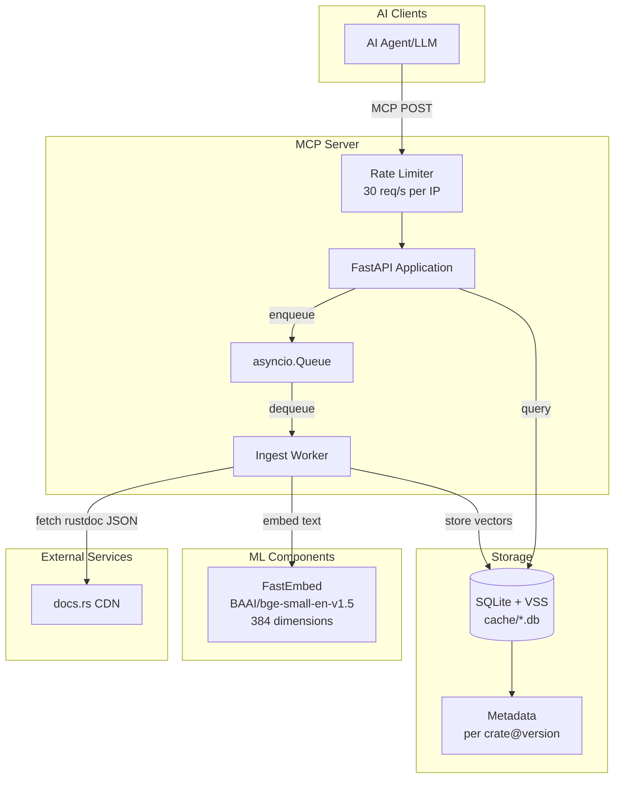
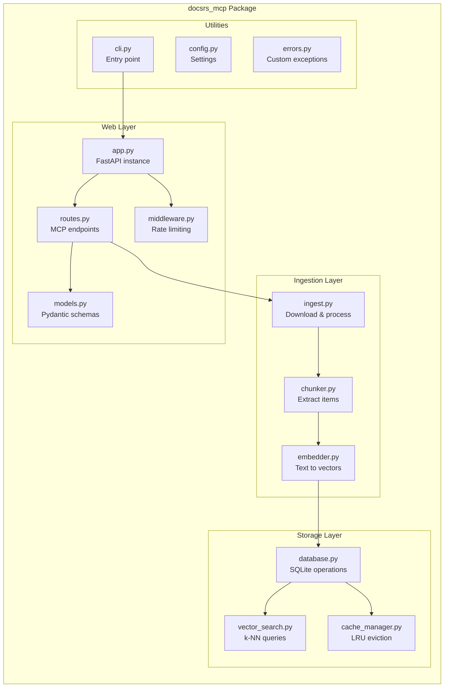
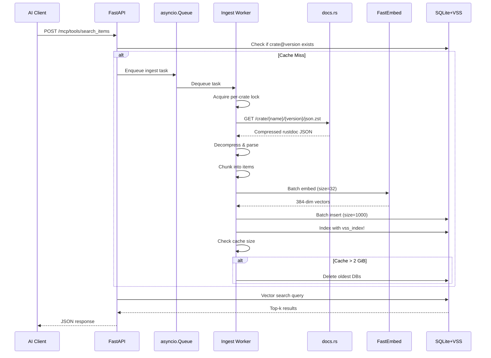
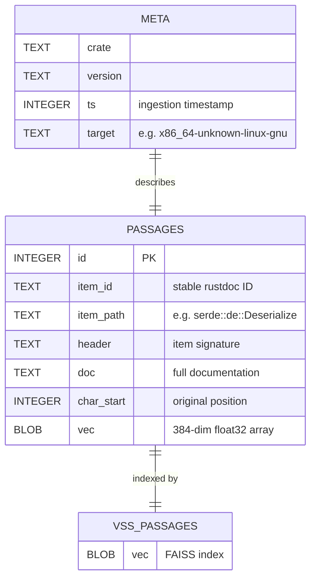
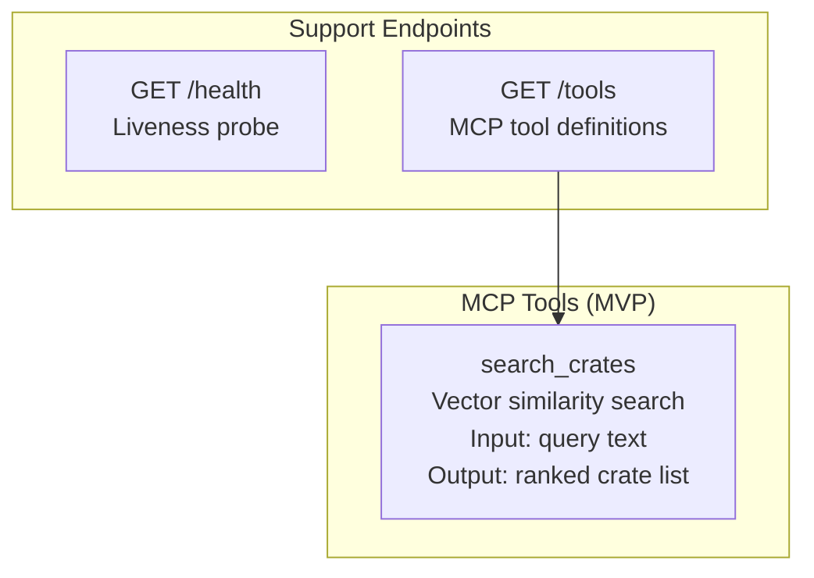
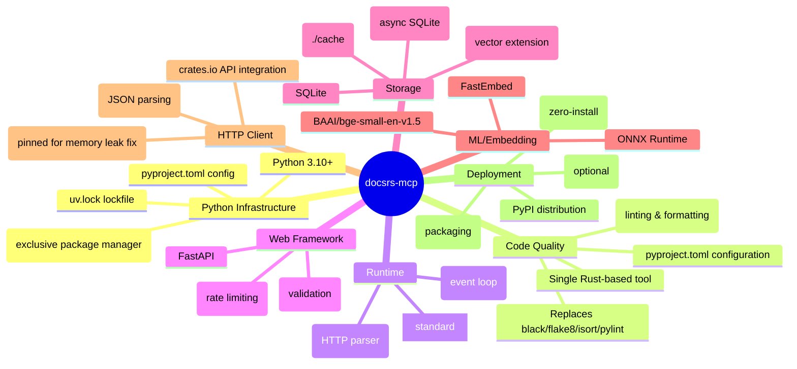
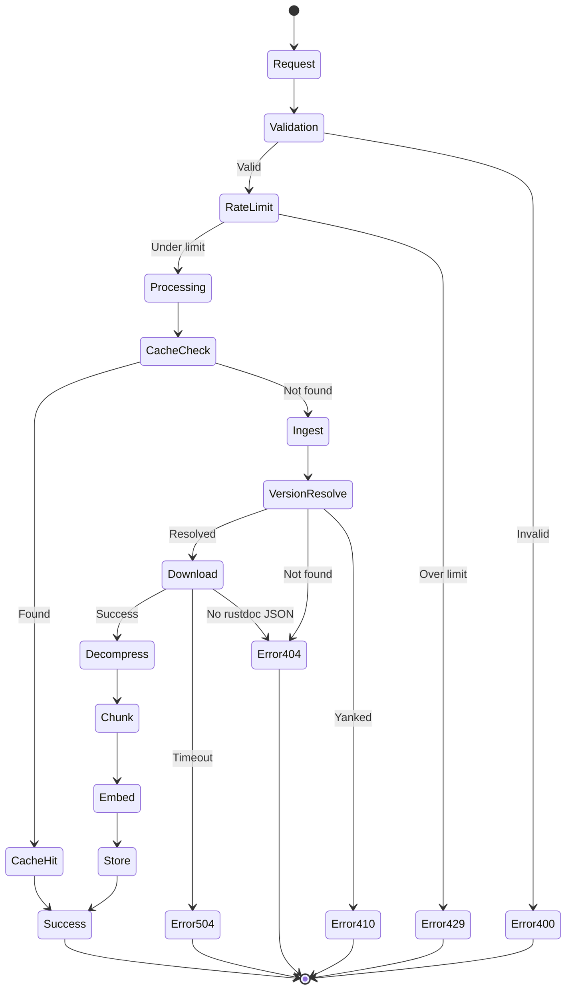
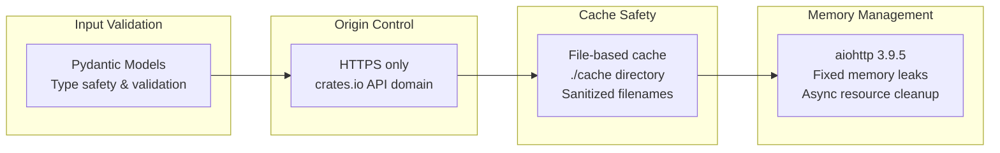

# docsrs-mcp Architecture

## System Overview

The docsrs-mcp server provides Model Context Protocol (MCP) endpoints for querying Rust crate documentation using vector search. It consists of a FastAPI web layer, an asynchronous ingestion pipeline, and a SQLite-based vector storage system.

## High-Level Architecture



## Component Architecture



## Data Flow



## Database Schema



## MCP Tool Endpoints



## Technology Stack



## Error Handling Flow



## Deployment Architecture

```mermaid
graph TB
    subgraph "Development (uv-native)"
        DEV[uv sync --dev<br/>uv run python -m docsrs_mcp.cli]
        TEST[uvx --from . docsrs-mcp]
    end
    
    subgraph "Production Options"
        subgraph "Container (uv-based)"
            DOCKER[Docker Container<br/>FROM python:slim<br/>RUN pip install uv<br/>COPY . .<br/>RUN uv sync --frozen]
        end
        
        subgraph "PaaS"
            FLY[Fly.io]
            RAIL[Railway]
            RENDER[Render]
        end
        
        subgraph "VPS"
            VPS[Any VPS<br/>≥256 MiB RAM<br/>uv-managed]
        end
    end
    
    subgraph "Persistent Storage"
        VOL[Volume Mount<br/>./cache]
    end
    
    DEV --> TEST
    TEST --> DOCKER
    DOCKER --> FLY
    DOCKER --> RAIL
    DOCKER --> RENDER
    DOCKER --> VPS
    
    FLY --> VOL
    RAIL --> VOL
    RENDER --> VOL
    VPS --> VOL
```

## Performance Characteristics

| Component | Target | Notes |
|-----------|--------|-------|
| Search latency | < 100ms P95 | Vector search with sqlite-vec MATCH |
| Ingest latency | < 1s | Crate description only (MVP) |
| Memory usage | < 512 MiB RSS | Including FastEmbed model |
| Cache storage | ./cache directory | File-based, persistent |
| Embedding model | BAAI/bge-small-en-v1.5 | 384 dimensions, optimized for retrieval |
| Async architecture | aiosqlite + asyncio | Non-blocking I/O operations |

## Security Model



## Implementation Decisions

### Key Architectural Choices Made

**Vector Storage: sqlite-vec over sqlite-vss**
- sqlite-vss is deprecated, sqlite-vec is the modern successor
- Better performance and active maintenance
- Native SQLite integration with MATCH operator for similarity search

**HTTP Client: aiohttp 3.9.5 (Pinned)**
- Memory leaks discovered in aiohttp 3.10+ versions
- Version pinning ensures stability in production deployments
- Async architecture maintained with proven stable version

**Embedding Model: FastEmbed + BAAI/bge-small-en-v1.5**
- Optimized for retrieval tasks with 384-dimensional vectors
- Good balance of accuracy and performance for crate descriptions
- ONNX runtime for efficient inference without GPU requirements

**Simple Module Structure**
- Five core modules: app.py, config.py, models.py, database.py, ingest.py
- Minimal complexity, easy to understand and maintain
- Direct async/await patterns throughout

**MVP Focus: Crate Descriptions Only**
- Basic ingestion pipeline processes crate metadata from crates.io API
- Embeddings generated from crate descriptions for semantic search
- Future expansion to full documentation planned for v2

**File-Based Caching**
- ./cache directory for persistent storage
- SQLite databases per crate for efficient organization
- Simple filesystem-based cache management

### Data Flow Architecture

1. **Ingestion**: Client requests → Check cache → Fetch from crates.io API → Generate embeddings → Store in SQLite
2. **Search**: Query → Vector similarity search using sqlite-vec MATCH → Return ranked results
3. **Caching**: Persistent file-based cache in ./cache directory for fast subsequent access

## Future Considerations (Out of Scope v1)

- Cross-crate search capabilities
- GPU acceleration for embeddings
- Multi-tenant quota management
- Distributed caching with Redis
- Analytics and usage tracking
- Authentication and authorization
- Popularity-based ranking
- Real-time updates via webhooks