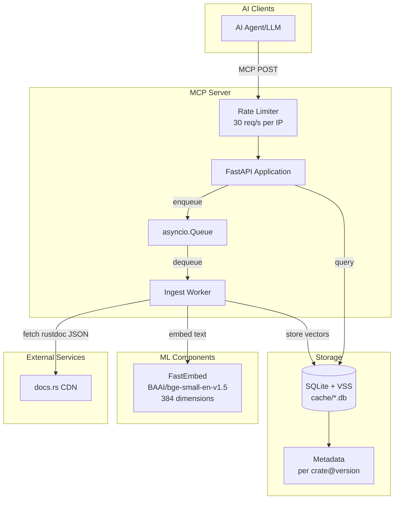
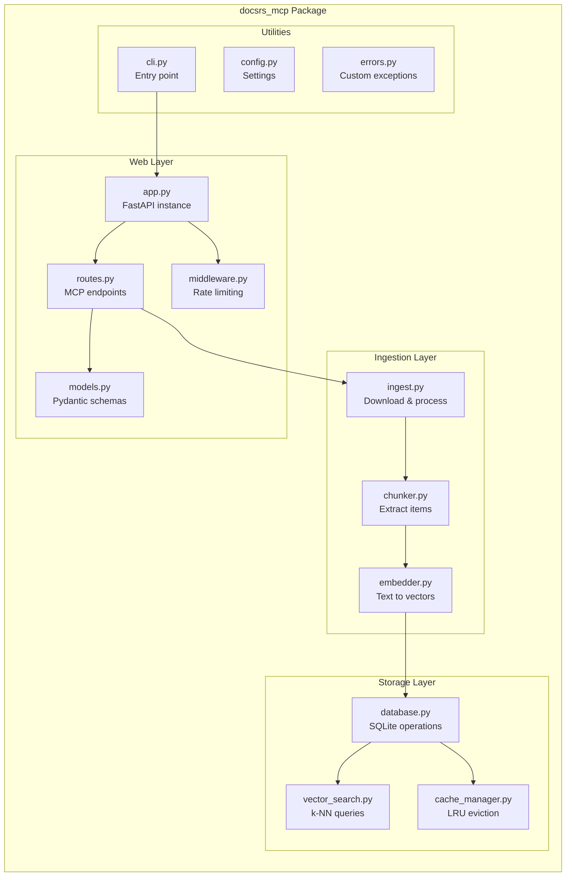
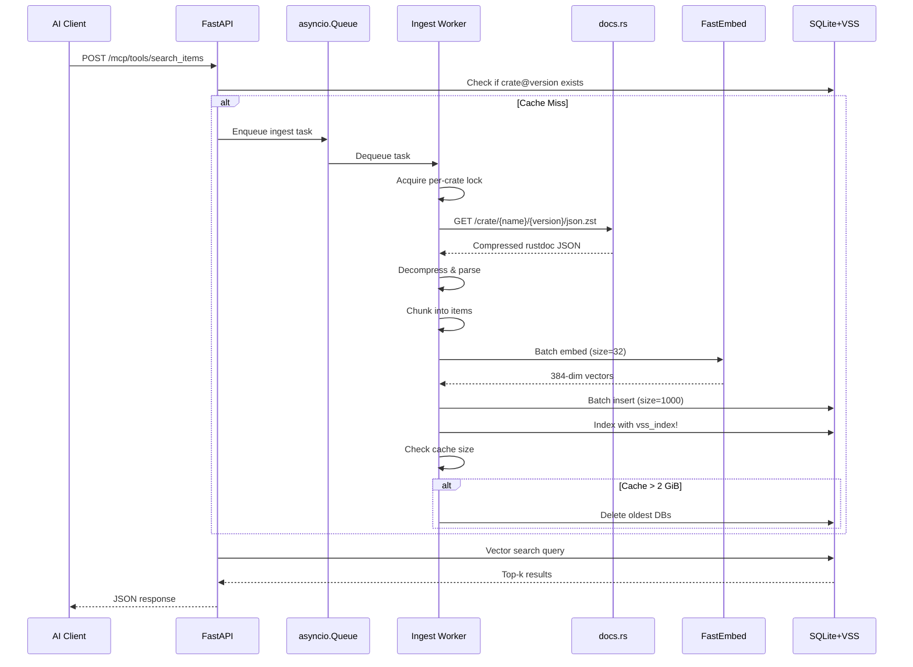
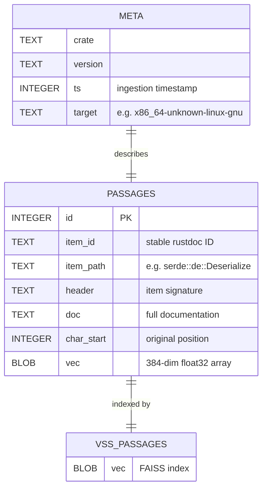
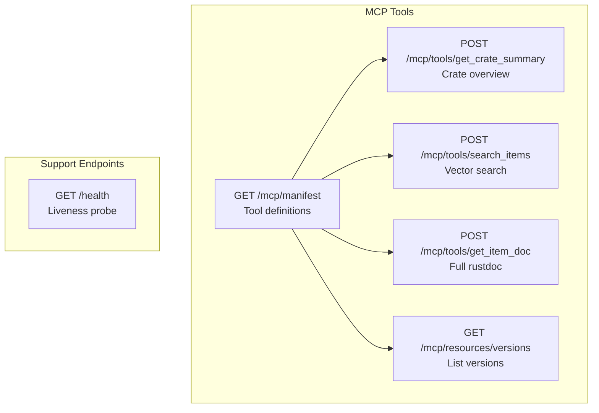
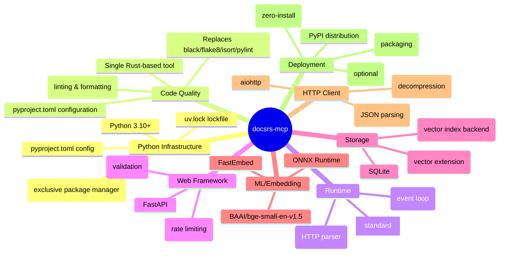
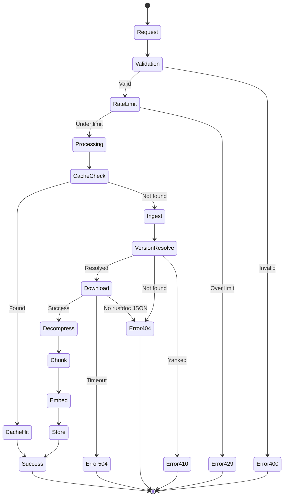

# docsrs-mcp Architecture

## System Overview

The docsrs-mcp server provides Model Context Protocol (MCP) endpoints for querying Rust crate documentation using vector search. It consists of a FastAPI web layer, an asynchronous ingestion pipeline, and a SQLite-based vector storage system.

## High-Level Architecture



## Component Architecture



## Data Flow



## Database Schema



## MCP Tool Endpoints



## Technology Stack



## Error Handling Flow



## Deployment Architecture

```mermaid
graph TB
    subgraph "Development (uv-native)"
        DEV[uv sync --dev<br/>uv run python -m docsrs_mcp.cli]
        TEST[uvx --from . docsrs-mcp]
    end
    
    subgraph "Production Options"
        subgraph "Container (uv-based)"
            DOCKER[Docker Container<br/>FROM python:slim<br/>RUN pip install uv<br/>COPY . .<br/>RUN uv sync --frozen]
        end
        
        subgraph "PaaS"
            FLY[Fly.io]
            RAIL[Railway]
            RENDER[Render]
        end
        
        subgraph "VPS"
            VPS[Any VPS<br/>≥256 MiB RAM<br/>uv-managed]
        end
    end
    
    subgraph "Persistent Storage"
        VOL[Volume Mount<br/>./cache]
    end
    
    DEV --> TEST
    TEST --> DOCKER
    DOCKER --> FLY
    DOCKER --> RAIL
    DOCKER --> RENDER
    DOCKER --> VPS
    
    FLY --> VOL
    RAIL --> VOL
    RENDER --> VOL
    VPS --> VOL
```

## Performance Characteristics

| Component | Target | Notes |
|-----------|--------|-------|
| Warm search latency | < 500ms P95 | Vector search + result formatting |
| Cold ingest | < 3s | For crates up to 10 MiB compressed |
| Memory usage | < 1 GiB RSS | Including ONNX model + FAISS indices |
| Cache size | < 2 GiB | Auto-evicted LRU |
| Rate limit | 30 req/s per IP | Via slowapi middleware |
| Concurrent ingests | 1 per crate@version | asyncio.Lock prevents duplicates |

## Security Model

```mermaid
graph LR
    subgraph "Input Validation"
        IV[Pydantic Models<br/>extra=forbid]
    end
    
    subgraph "Origin Control"
        OC[HTTPS only<br/>docs.rs domain]
    end
    
    subgraph "Size Limits"
        SL[30 MiB compressed<br/>100 MiB decompressed]
    end
    
    subgraph "Path Safety"
        PS[Sanitized filenames<br/>cache/{crate}/{version}.db]
    end
    
    subgraph "Rate Limiting"
        RL[30 req/s per IP<br/>slowapi middleware]
    end
    
    IV --> OC
    OC --> SL
    SL --> PS
    PS --> RL
```

## Future Considerations (Out of Scope v1)

- Cross-crate search capabilities
- GPU acceleration for embeddings
- Multi-tenant quota management
- Distributed caching with Redis
- Analytics and usage tracking
- Authentication and authorization
- Popularity-based ranking
- Real-time updates via webhooks