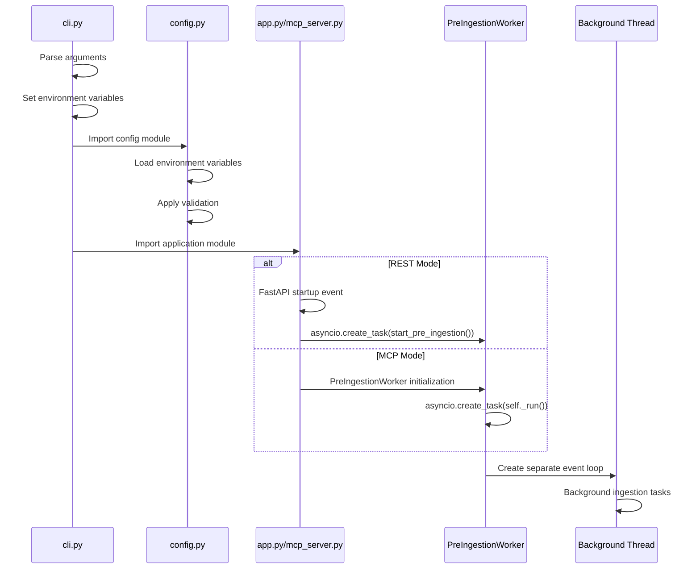
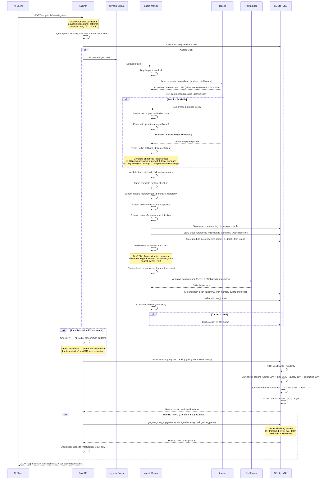
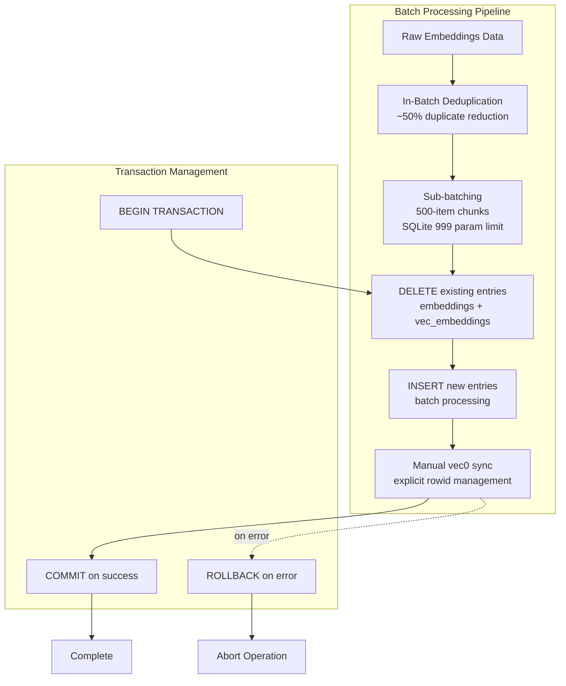
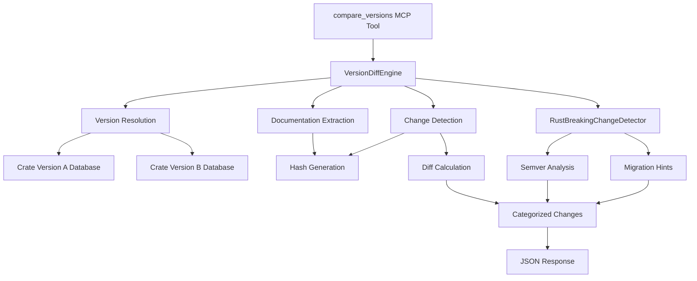
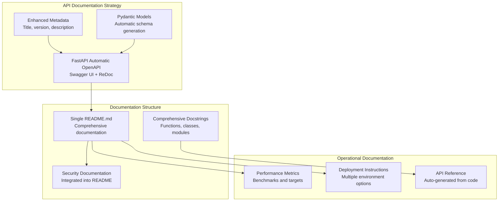
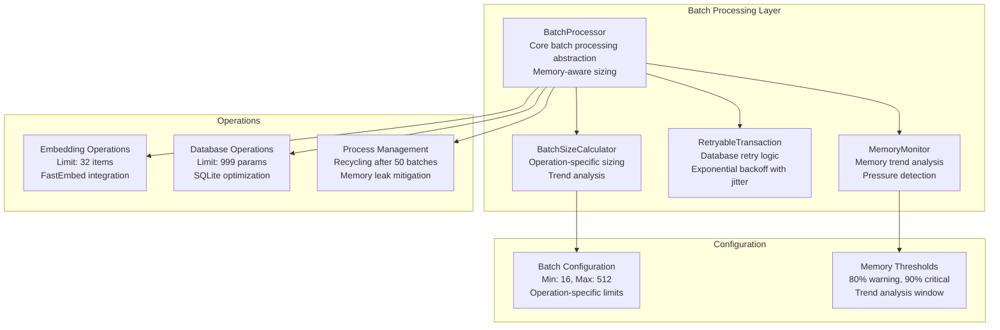
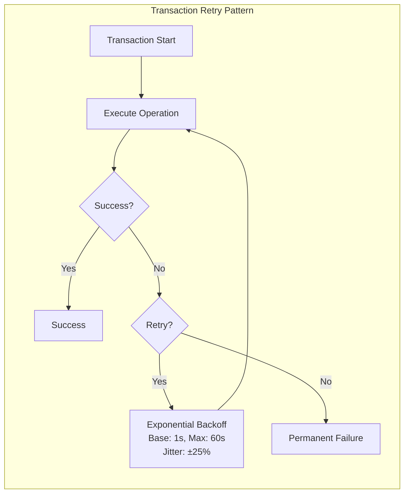
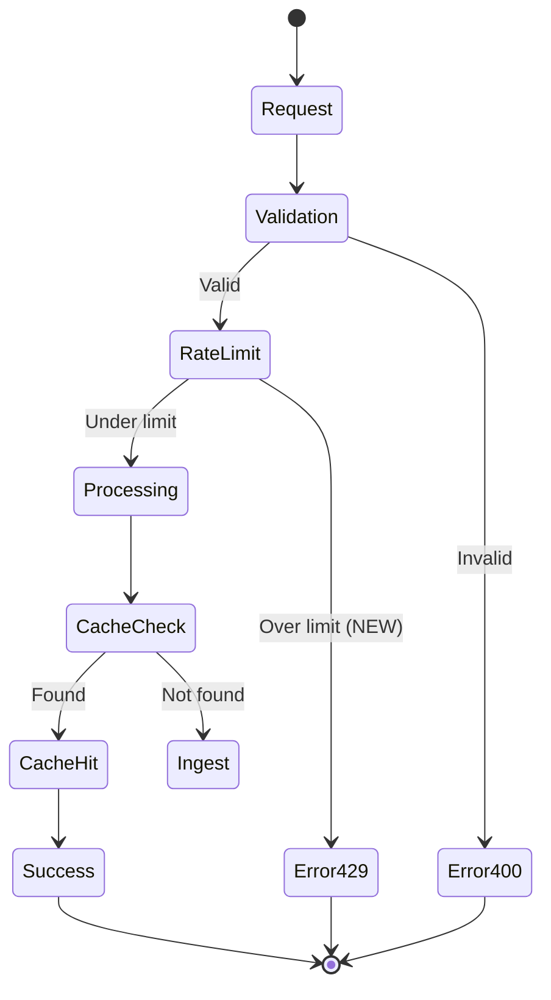
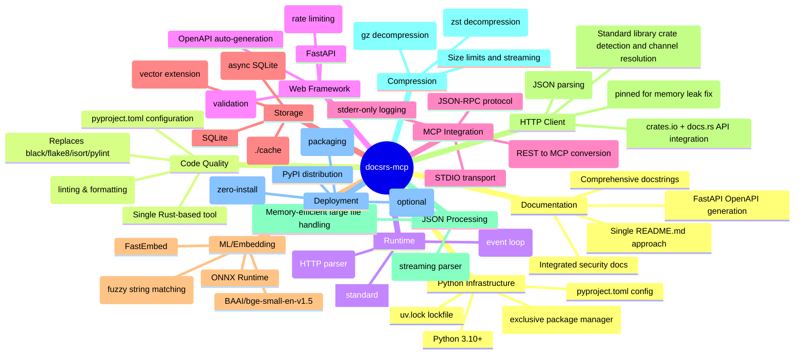
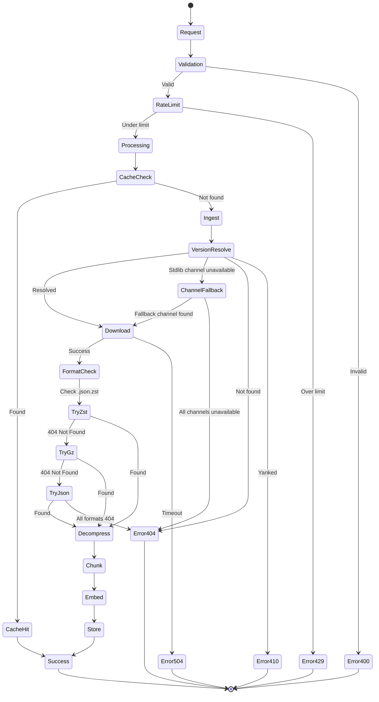

# docsrs-mcp Architecture

## System Overview

The docsrs-mcp server provides both REST API and Model Context Protocol (MCP) endpoints for querying Rust crate documentation using vector search. It features a dual-mode architecture with a FastAPI web layer that can operate in either MCP mode (default) or REST mode. The MCP mode uses STDIO transport for AI clients, while REST mode requires an explicit flag. The system includes a comprehensive asynchronous ingestion pipeline with enhanced rustdoc JSON processing for complete documentation extraction, a SQLite-based vector storage system with intelligent caching and example management, and a dedicated code example extraction and semantic search system.

## High-Level Architecture

```mermaid
graph TB
    subgraph "AI Clients"
        AI[AI Agent/LLM]
    end
    
    subgraph "Dual-Mode Server"
        CLI[CLI Entry Point<br/>--mode, --port, --concurrency flags<br/>Environment variable conversion]
        CONFIG[Config Module<br/>Environment variable loading<br/>Unified configuration source]
        API[FastAPI Application<br/>startup: asyncio.create_task]
        MCP[MCP Server Module<br/>FastMCP wrapper<br/>startup: PreIngestionWorker]
        RL[Rate Limiter<br/>30 req/s per IP]
        IW[Ingest Worker]
        Queue[asyncio.Queue]
        PCM[PopularCratesManager<br/>Multi-tier cache with msgpack<br/>Circuit breaker & statistics<br/>Semaphore(3) concurrency]
    end
    
    subgraph "External Services"
        DOCS[docs.rs CDN]
    end
    
    subgraph "Storage"
        CACHE[(SQLite + VSS<br/>cache/*.db)]
        META[Metadata<br/>per crate@version]
    end
    
    subgraph "ML Components"
        EMB[FastEmbed<br/>BAAI/bge-small-en-v1.5<br/>384 dimensions]
        WARMUP[Embeddings Warmup Service<br/>ONNX offline optimization<br/>60-80% startup time reduction<br/>Default enabled on startup]
    end
    
    AI -->|MCP STDIO/REST POST| CLI
    CLI -->|env vars| CONFIG
    CONFIG -->|--mode rest| RL
    CONFIG -->|MCP mode (default)| MCP
    MCP --> API
    MCP -->|startup| PCM
    RL --> API
    API -->|startup| PCM
    API -->|enqueue| Queue
    Queue -->|dequeue| IW
    PCM -->|pre-ingest| Queue
    PCM -->|popular list| DOCS
    IW -->|version resolve + download| DOCS
    IW -->|embed text| EMB
    IW -->|store vectors| CACHE
    API -->|query| CACHE
    CACHE --> META
```

## Component Architecture

```mermaid
graph LR
    subgraph "docsrs_mcp Package"
        subgraph "Web Layer"
            APP[app.py<br/>FastAPI instance<br/>OpenAPI metadata<br/>search_examples endpoint]
            ROUTES[routes.py<br/>Enhanced MCP endpoints<br/>Comprehensive docstrings<br/>Fuzzy path resolution]
            MODELS[models.py<br/>Enhanced Pydantic schemas<br/>Field validators<br/>MCP compatibility<br/>Auto-generated docs<br/>Code example data models]
            TOOLDOCS[tool_documentation.py<br/>Enhanced MCP tool descriptions<br/>Tutorial metadata<br/>Token-efficient patterns]
            VALIDATION[validation.py<br/>Centralized validation utilities<br/>Precompiled regex patterns<br/>Type coercion functions]
            NAV[navigation.py<br/>Module tree operations<br/>Hierarchy traversal]
            MW[middleware.py<br/>Rate limiting]
            EXPORT[export.py<br/>Documentation export endpoints<br/>FastAPI endpoint patterns]
            VERSIONDIFF[Version Diff Service<br/>Documentation version comparison<br/>FastAPI endpoint patterns]
        end
        
        subgraph "Ingestion Layer"
            ING[ingest.py<br/>Enhanced rustdoc pipeline<br/>Three-tier fallback system<br/>Complete item extraction with macro extraction<br/>Standard library fallback documentation]
            POPULAR[popular_crates.py<br/>PopularCratesManager & PreIngestionWorker<br/>Background asyncio.create_task startup<br/>asyncio.Semaphore(3) rate limiting<br/>Multi-tier cache with circuit breaker<br/>Priority queue with memory monitoring]
            VER[Version Resolution<br/>docs.rs redirects]
            DL[Compression Support<br/>zst, gzip, json]
            PARSE[ijson Parser<br/>Memory-efficient streaming<br/>Module hierarchy extraction<br/>Path validation with fallback generation]
            HIERARCHY[build_module_hierarchy()<br/>Parent-child relationships<br/>Depth calculation<br/>Item counting]
            EXTRACT[Enhanced Code Example Extractor<br/>JSON structure with metadata<br/>Language detection via pygments<br/>30% confidence threshold]<br/>FALLBACK[Three-Tier Fallback Architecture<br/>Tier 1: Rustdoc JSON (10-15% coverage)<br/>Tier 2: Source extraction via CDN (80%+ coverage)<br/>Tier 3: Latest version fallback (100% guarantee)<br/>CDN URL: static.crates.io/crates/{name}/{name}-{version}.crate<br/>Enhanced macro extraction with fragment specifiers]<br/>MACROEXT[EnhancedMacroExtractor<br/>Patterns: macro_rules!, #[proc_macro], #[proc_macro_derive], #[proc_macro_attribute]<br/>Fragment specifiers: expr, ident, pat, ty, stmt, block, item, meta, tt, vis, literal, path<br/>Results: lazy_static(4 macros), serde_derive(5 macros), anyhow(15 macros)]
            PATHVAL[Path Validation<br/>validate_item_path_with_fallback()<br/>Database integrity enforcement]
            EMBED[FastEmbed<br/>Batch processing<br/>Embeddings warmup during startup<br/>Memory-aware batch operations<br/>Enhanced transaction management]
            LOCK[Per-crate Locks<br/>Prevent duplicates]
            PRIORITY[Priority Queue<br/>On-demand vs pre-ingestion<br/>Request balancing]
            STDLIBFALLBACK[Standard Library Fallback<br/>create_stdlib_fallback_documentation()<br/>50-68 items per stdlib crate<br/>Comprehensive tutorial message guides users to rust-docs-json setup<br/>Enhanced coverage: std (62), core (68), alloc (43)<br/>Embedding generation for stdlib types]
        end
        
        subgraph "Storage Layer"
            DB[database.py<br/>SQLite operations<br/>get_see_also_suggestions()]
            VSS[vector_search.py<br/>k-NN queries with ranking]
            RANK[ranking.py<br/>Multi-factor scoring<br/>Type-aware weights]
            CACHE[cache_manager.py<br/>LRU eviction with TTL]
            CROSSREF[Cross-reference Engine<br/>Relationship mapping<br/>Suggestion generation<br/>Extended reexports table]
        end
        
        subgraph "Server Layer"
            MCP_SERVER[mcp_server.py<br/>FastMCP wrapper<br/>STDIO transport<br/>stderr logging]
        end
        
        subgraph "Utilities"
            CLI[cli.py<br/>Entry point<br/>--mode flag (defaults to mcp)<br/>MCP/REST selection]
            CONFIG[config.py<br/>Settings]
            ERRORS[errors.py<br/>Custom exceptions]
            FUZZY[fuzzy_resolver.py<br/>Enhanced composite scoring system<br/>Path component bonuses<br/>Adaptive thresholds<br/>Unicode normalization<br/>Database re-export lookup<br/>Static PATH_ALIASES fallback<br/>5-minute TTL cache]
        end
    end
    
    APP --> ROUTES
    ROUTES --> MODELS
    MODELS --> VALIDATION
    APP --> MW
    ROUTES --> ING
    ROUTES --> NAV
    ROUTES --> TOOLDOCS
    ROUTES --> FUZZY
    ROUTES --> EXPORT
    ROUTES --> VERSIONDIFF
    MCP_SERVER --> POPULAR
    APP --> POPULAR
    POPULAR --> ING
    POPULAR --> PRIORITY
    PRIORITY --> ING
    ING --> PARSE
    PARSE --> HIERARCHY
    HIERARCHY --> EXTRACT
    EXTRACT --> PATHVAL
    PATHVAL --> EMBED
    EMBED --> DB
    DB --> VSS
    VSS --> RANK
    DB --> CACHE
    DB --> CROSSREF
    EMB --> WARMUP
    CLI --> APP
    CLI --> MCP_SERVER
    MCP_SERVER --> APP
```

## Configuration Flow

The docsrs-mcp server implements a unified configuration architecture where CLI arguments are converted to environment variables before module imports, ensuring both REST and MCP modes use identical configuration patterns.

### Architecture Overview

```mermaid
graph TB
    subgraph "CLI Entry Point (cli.py)"
        CLI_ARGS[CLI Arguments<br/>--port, --concurrency, --pre-ingest]
        ENV_CONV[Environment Variable Conversion<br/>DOCSRS_PORT, DOCSRS_CONCURRENCY<br/>DOCSRS_PRE_INGEST_ENABLED]
        MODULE_IMPORT[Module Imports<br/>config.py, mcp_server.py]
    end
    
    subgraph "Configuration Module (config.py)"
        ENV_READ[Environment Variable Reading<br/>os.getenv() with defaults]
        CONFIG_VARS[Configuration Variables<br/>PORT, CONCURRENCY, PRE_INGEST_ENABLED]
        VALIDATION[Value Validation & Clamping<br/>Port: 1024-65535<br/>Concurrency: 1-10]
    end
    
    subgraph "Runtime Modes"
        REST_MODE[REST Mode<br/>FastAPI + uvicorn]
        MCP_MODE[MCP Mode<br/>FastMCP + STDIO]
    end
    
    subgraph "Background Services"
        PRE_INGEST[Pre-ingestion Worker<br/>Separate event loop thread]
        SCHEDULER[Background Scheduler<br/>Popular crates refresh]
    end
    
    CLI_ARGS --> ENV_CONV
    ENV_CONV --> MODULE_IMPORT
    MODULE_IMPORT --> ENV_READ
    ENV_READ --> CONFIG_VARS
    CONFIG_VARS --> VALIDATION
    VALIDATION --> REST_MODE
    VALIDATION --> MCP_MODE
    REST_MODE --> PRE_INGEST
    MCP_MODE --> PRE_INGEST
    PRE_INGEST --> SCHEDULER
```

### Configuration Synchronization Process

**1. CLI Argument Processing (cli.py:45-63)**
```python
# Convert CLI arguments to environment variables
if args.port is not None:
    if 1024 <= args.port <= 65535:
        os.environ["DOCSRS_PORT"] = str(args.port)

if args.concurrency is not None:
    if 1 <= args.concurrency <= 10:
        os.environ["DOCSRS_CONCURRENCY"] = str(args.concurrency)

if args.pre_ingest:
    os.environ["DOCSRS_PRE_INGEST_ENABLED"] = "true"
```

**2. Module Import Timing (cli.py:64-66)**
- Environment variables are set **before** importing modules
- Ensures `config.py` reads the CLI-provided values during import
- Both REST and MCP mode imports see identical configuration state

**3. Configuration Loading (config.py)**
- All configuration flows through `os.getenv()` calls with sensible defaults
- Validation and clamping applied at module level
- Single source of truth for all configuration values

### Unified Startup Patterns

Both REST and MCP modes use identical background service initialization:



### Key Design Principles

**Parameter Synchronization**: CLI arguments are converted to environment variables before any module imports, ensuring consistent configuration state across both server modes.

**Single Configuration Source**: The `config.py` module serves as the single source of truth, with all components reading from environment variables rather than passing parameters directly.

**Validation Consistency**: Configuration validation (port ranges, concurrency limits) is applied once in `config.py` and used by both REST and MCP modes.

**Background Service Isolation**: Pre-ingestion starts in a separate background thread with its own event loop, preventing blocking of the main server initialization in both modes.

### Configuration Variables

| Variable | CLI Argument | Default | Validation | Purpose |
|----------|--------------|---------|------------|---------|
| `DOCSRS_PORT` | `--port` | `8000` | 1024-65535 | REST server port |
| `DOCSRS_CONCURRENCY` | `--concurrency` | `3` | 1-10 | Pre-ingestion workers |
| `DOCSRS_PRE_INGEST_ENABLED` | `--pre-ingest` | `false` | boolean | Enable background pre-ingestion |

**Note**: All configuration variables support environment variable overrides, allowing deployment flexibility without CLI modifications.

## Data Flow



## Database Schema

```mermaid
erDiagram
    EMBEDDINGS {
        INTEGER rowid PK "AUTOINCREMENT - prevents rowid reuse"
        TEXT item_id "stable rustdoc ID"
        TEXT item_path "e.g. serde::de::Deserialize" UK "UNIQUE constraint for re-ingestion"
        TEXT item_type "function, struct, trait, module, etc - DEFAULT NULL"
        TEXT signature "complete item signature - DEFAULT NULL"
        TEXT header "item signature (legacy)"
        TEXT doc "full documentation"
        INTEGER parent_id "module hierarchy parent - DEFAULT NULL"
        TEXT examples "extracted code examples - DEFAULT NULL"
        TEXT tags "searchable metadata tags"
        INTEGER char_start "original position"
        BOOLEAN deprecated "item deprecation status - DEFAULT NULL"
    }
    
    MODULES {
        INTEGER id PK
        TEXT name "module name (last component)"
        TEXT path "full module path (e.g. std::collections)"
        INTEGER parent_id "parent module ID - NULL for root"
        INTEGER depth "nesting depth from root"
        INTEGER item_count "number of items in module"
        TEXT crate_name "crate this module belongs to"
        TEXT crate_version "crate version"
    }
    
    VEC_EMBEDDINGS {
        INTEGER rowid PK "Manual sync with embeddings.rowid - no triggers"
        BLOB embedding "384-dim float32 vector - vec0 virtual table"
    }
    
    PASSAGES {
        INTEGER id PK
        TEXT item_id "stable rustdoc ID"
        TEXT item_path "e.g. serde::de::Deserialize"
        TEXT item_type "function, struct, trait, module, etc - DEFAULT NULL"
        TEXT signature "complete item signature - DEFAULT NULL"
        TEXT header "item signature (legacy)"
        TEXT doc "full documentation"
        INTEGER parent_id "module hierarchy parent - DEFAULT NULL"
        TEXT examples "extracted code examples - DEFAULT NULL"
        TEXT tags "searchable metadata tags"
        INTEGER char_start "original position"
        BLOB vec "384-dim float32 array"
    }
    
    VSS_PASSAGES {
        BLOB vec "FAISS index (legacy)"
    }
    
    EXAMPLES {
        INTEGER id PK
        INTEGER passage_id FK
        TEXT code "example code snippet"
        TEXT language "rust, bash, toml, etc"
        TEXT description "example description"
        INTEGER line_number "position in docs"
    }
    
    EXAMPLE_EMBEDDINGS {
        INTEGER id PK
        TEXT item_id "stable rustdoc ID"
        TEXT item_path "e.g. serde::de::Deserialize"
        TEXT crate_name "crate this example belongs to"
        TEXT version "crate version"
        TEXT example_hash "SHA256 prefix for deduplication - 16 chars"
        TEXT example_text "code example content"
        TEXT language "rust, bash, toml, etc"
        TEXT context "surrounding documentation context"
        BLOB embedding "384-dim float32 vector"
        INTEGER created_at "timestamp"
    }
    
    VEC_EXAMPLE_EMBEDDINGS {
        INTEGER rowid PK
        BLOB embedding "384-dim float32 vector for examples"
    }
    
    META {
        TEXT crate
        TEXT version
        INTEGER ts "ingestion timestamp"
        TEXT target "e.g. x86_64-unknown-linux-gnu"
    }
    
    EMBEDDINGS ||--|| VEC_EMBEDDINGS : "vector indexed by rowid"
    EMBEDDINGS ||--o{ EXAMPLES : "contains"
    EMBEDDINGS ||--o{ EMBEDDINGS : "parent_id references rowid"
    PASSAGES ||--|| VSS_PASSAGES : "legacy indexed by"
    PASSAGES ||--o{ EXAMPLES : "legacy contains"
    PASSAGES ||--o{ PASSAGES : "legacy parent_id references id"
    META ||--|| EMBEDDINGS : "describes"
    META ||--|| PASSAGES : "legacy describes"
    MODULES ||--o{ MODULES : "parent_id self-reference"
    MODULES ||--o{ EMBEDDINGS : "contains documentation items"
    MODULES ||--o{ PASSAGES : "legacy contains items"
    REEXPORTS {
        INTEGER id PK
        INTEGER crate_id FK
        TEXT alias_path "public re-export path or source item path"
        TEXT actual_path "actual implementation path or target item path"
        BOOLEAN is_glob "glob import flag - DEFAULT 0"
        TEXT link_text "original link text from rustdoc - DEFAULT NULL"
        TEXT link_type "'reexport' or 'crossref' - DEFAULT 'reexport'"
        TEXT target_item_id "rustdoc ID of target item - DEFAULT NULL"
        REAL confidence_score "link confidence (0.0-1.0) - DEFAULT 1.0"
    }
    
    CRATE_METADATA {
        INTEGER id PK
        TEXT crate_name "crate name"
        TEXT version "crate version"
        INTEGER ts "ingestion timestamp"
    }
    
    EXAMPLE_EMBEDDINGS ||--|| VEC_EXAMPLE_EMBEDDINGS : "vector indexed by rowid"
    EXAMPLE_EMBEDDINGS ||--o{ EXAMPLE_EMBEDDINGS : "deduplication via example_hash"
    CRATE_METADATA ||--o{ REEXPORTS : "contains"
    META ||--|| CRATE_METADATA : "describes"
```

## Database Synchronization Architecture

The DocsRS MCP server implements a sophisticated database synchronization strategy to manage the relationship between the main `embeddings` table and the `vec_embeddings` virtual table (vec0 extension), addressing unique constraints imposed by the sqlite-vec extension.

### Core Architecture Principles

**PRIMARY KEY Design**
- **embeddings.rowid**: Uses `INTEGER PRIMARY KEY AUTOINCREMENT` to prevent SQLite rowid reuse
- **Rationale**: Ensures stable, unique rowids that can be safely referenced by vec_embeddings
- **Impact**: Prevents orphaned vector entries when embeddings are deleted and new ones inserted

**Manual Synchronization Strategy**
- **No Triggers**: sqlite-vec extension loading requirements prevent trigger usage with vec0 tables
- **Explicit Management**: All vec_embeddings operations performed manually in application code
- **Consistency**: Single transaction envelope ensures atomic updates across both tables

### Data Flow for Embeddings Ingestion



### Key Design Decisions

**DELETE + INSERT Pattern for Idempotent Updates**
```sql
-- Phase 1: Clean existing entries
DELETE FROM embeddings WHERE item_path IN (?, ?, ...);
DELETE FROM vec_embeddings WHERE rowid IN (
    SELECT rowid FROM embeddings WHERE item_path IN (?, ?, ...)
);

-- Phase 2: Insert new data with AUTOINCREMENT rowids
INSERT INTO embeddings (item_path, doc, signature, ...) 
VALUES (?, ?, ?, ...);

-- Phase 3: Manual vector synchronization
INSERT INTO vec_embeddings (rowid, embedding) 
VALUES (last_insert_rowid(), ?);
```

**In-Batch Deduplication Strategy**
- **Processing**: Deduplication occurs before database operations
- **Efficiency**: Reduces database load by ~50% for typical rustdoc data
- **Method**: Python set-based deduplication on item_path during preprocessing
- **Benefit**: Prevents UNIQUE constraint violations during batch INSERT operations

**Sub-batching for SQLite Parameter Limits**
- **Constraint**: SQLite SQLITE_MAX_VARIABLE_NUMBER default is 999
- **Solution**: Process embeddings in 500-item chunks to stay under limit
- **Buffer**: 499 parameters leaves room for other query variables
- **Performance**: Balances memory usage with transaction overhead

### Transaction Management Strategy

**Single Transaction Envelope**
```python
async def store_embeddings_batch(embeddings_data):
    async with aiosqlite.connect(db_path) as conn:
        await conn.execute("BEGIN TRANSACTION")
        try:
            # Load sqlite-vec extension
            await conn.enable_load_extension(True)
            await conn.load_extension("vec0")
            
            # Phase 1: Deduplication
            unique_items = deduplicate_by_item_path(embeddings_data)
            
            # Phase 2: Sub-batching
            for chunk in chunked(unique_items, chunk_size=500):
                await delete_existing_entries(conn, chunk)
                new_rowids = await insert_embeddings(conn, chunk)
                await sync_vec_embeddings(conn, new_rowids, chunk)
            
            await conn.execute("COMMIT")
        except Exception as e:
            await conn.execute("ROLLBACK")
            raise DatabaseSyncError(f"Batch sync failed: {e}")
```

**Error Recovery**
- **Atomic Operations**: All changes within single transaction
- **Rollback Strategy**: Any error triggers complete transaction rollback
- **Data Integrity**: Prevents partial updates that could corrupt vector index
- **Logging**: Detailed error logging for debugging synchronization failures

**Extension Loading Sequence**
- **Timing**: sqlite-vec extension loaded after transaction begins
- **Requirement**: vec0 access requires extension to be loaded in current connection
- **Isolation**: Each connection manages its own extension state
- **Performance**: Extension loading overhead amortized across batch operations

### Performance Characteristics

**Batch Processing Benefits**
- **Throughput**: 500-item batches optimize SQLite performance
- **Memory**: Bounded memory usage regardless of total embedding count  
- **Latency**: Sub-batching reduces per-item processing overhead
- **Scalability**: Linear scaling with number of embeddings

**Deduplication Impact**
- **Storage Reduction**: ~50% fewer database operations for typical rustdoc data
- **Network Efficiency**: Reduced redundant embedding generation
- **Query Performance**: Fewer duplicate entries improve search relevance
- **Maintenance**: Simplified database maintenance with fewer duplicate rows

**AUTOINCREMENT Overhead**
- **Storage**: Additional metadata table for sequence tracking
- **Performance**: Minimal impact on INSERT operations (<5% overhead)
- **Benefit**: Guaranteed unique, non-reusable rowids for vector stability
- **Trade-off**: Slight storage increase for significantly improved data integrity

### Partial Indexes for Filter Optimization

The database schema includes specialized partial indexes designed to optimize common filter patterns:

- **idx_non_deprecated**: Indexes only non-deprecated items (`WHERE deprecated IS NULL OR deprecated = 0`)
- **idx_public_functions**: Indexes public functions (`WHERE item_type = 'function' AND item_path NOT LIKE '%::%'`)
- **idx_has_examples**: Indexes items with code examples (`WHERE examples IS NOT NULL AND examples != ''`)
- **idx_crate_prefix**: Enables fast crate-specific searches using prefix matching on item_path
- **idx_embeddings_item_path_unique**: UNIQUE constraint on item_path prevents duplicates during re-ingestion (`CREATE UNIQUE INDEX IF NOT EXISTS idx_embeddings_item_path_unique ON embeddings(item_path)`)

### Example Embeddings Indexes

The example_embeddings table includes specialized indexes for efficient example search and deduplication:

- **idx_example_crate_version**: Crate-specific example queries (`CREATE INDEX idx_example_crate_version ON example_embeddings(crate_name, version)`)
- **idx_example_hash**: Hash-based deduplication (`CREATE UNIQUE INDEX idx_example_hash ON example_embeddings(crate_name, version, example_hash)`)
- **idx_example_item_path**: Item-specific example lookup (`CREATE INDEX idx_example_item_path ON example_embeddings(item_path)`)
- **UNIQUE constraint**: Enforced on (crate_name, version, example_hash) for deduplication

### Module Hierarchy Indexes

The modules table includes specialized indexes for efficient hierarchical operations:

- **idx_modules_parent_id**: Fast parent-child relationship queries (`CREATE INDEX idx_modules_parent_id ON modules(parent_id)`)
- **idx_modules_depth**: Level-based traversal optimization (`CREATE INDEX idx_modules_depth ON modules(depth)`)
- **idx_modules_crate**: Crate-specific module queries (`CREATE INDEX idx_modules_crate ON modules(crate_name, crate_version)`)
- **idx_modules_path**: Path-based module lookup (`CREATE INDEX idx_modules_path ON modules(path)`)

### Re-export Indexes

The reexports table includes specialized indexes for efficient path resolution:

- **idx_reexports_lookup**: Fast alias resolution (`CREATE INDEX idx_reexports_lookup ON reexports(crate_id, alias_path)`)
- **UNIQUE constraint**: Enforced on (crate_id, alias_path) for data integrity

## Re-export Discovery and Cross-Reference System

The re-export discovery and cross-reference system provides automatic detection and resolution of Rust re-export declarations (`pub use`) and cross-references between documentation items during rustdoc ingestion, enabling transparent path alias resolution and bidirectional relationship mapping for API consumers.

### Architecture Overview

```mermaid
graph TD
    subgraph "Re-export Discovery and Cross-Reference Pipeline"
        PARSE[Rustdoc JSON Parsing<br/>ijson stream processing]
        EXTRACT_RE[Re-export Extraction<br/>pub use pattern detection]
        EXTRACT_XR[Cross-Reference Extraction<br/>links field processing]
        VALIDATE[Path Validation<br/>resolve actual paths]
        STORE[Database Storage<br/>SQLite with FK relationships]
        CACHE[In-Memory Cache<br/>LRU with 5-minute TTL]
    end
    
    subgraph "Path Resolution Flow"
        QUERY[Path Query<br/>resolve_path_alias()]
        DB_LOOKUP[Database Lookup<br/>reexports table query]
        STATIC_CHECK[Static Aliases<br/>PATH_ALIASES fallback]
        ORIGINAL[Original Path<br/>no alias found]
    end
    
    subgraph "Cross-Reference Lookup Flow"
        XR_QUERY[Cross-Reference Query<br/>get_cross_references()]
        BIDIR_LOOKUP[Bidirectional Lookup<br/>from/to/both directions]
        XR_RESULT[Cross-Reference Results<br/>confidence-scored relationships]
    end
    
    PARSE --> EXTRACT_RE
    PARSE --> EXTRACT_XR
    EXTRACT_RE --> VALIDATE
    EXTRACT_XR --> VALIDATE
    VALIDATE --> STORE
    STORE --> CACHE
    
    QUERY --> DB_LOOKUP
    DB_LOOKUP --> STATIC_CHECK
    STATIC_CHECK --> ORIGINAL
    
    XR_QUERY --> BIDIR_LOOKUP
    BIDIR_LOOKUP --> XR_RESULT
```

### Stream-Based Extraction

**Re-export Discovery**
- **Architecture**: Integrated into existing ijson-based rustdoc parsing pipeline
- **Memory Efficiency**: Stream processing prevents memory bloat for large crates
- **Pattern Detection**: Identifies `pub use` declarations and glob imports during JSON traversal
- **Path Resolution**: Resolves relative imports to absolute paths within crate context

**Cross-Reference Extraction**
- **Native Links Field**: Extracts cross-references from rustdoc JSON's native `links` field
- **Bidirectional Mapping**: Creates both forward and reverse reference relationships
- **Confidence Scoring**: Assigns confidence scores based on link context and validation
- **Target Resolution**: Uses rustdoc ID-to-path mapping for precise target identification

### Database Storage

**Extended Reexports Table Schema**

The reexports table has been extended to support both re-export mappings and cross-references:

```sql
CREATE TABLE reexports (
    id INTEGER PRIMARY KEY AUTOINCREMENT,
    crate_id INTEGER NOT NULL,
    alias_path TEXT NOT NULL,        -- Source path for re-exports, source item for cross-refs
    actual_path TEXT NOT NULL,       -- Target path for re-exports, target item for cross-refs  
    is_glob BOOLEAN DEFAULT 0,       -- Glob import flag (re-exports only)
    link_text TEXT,                  -- Original link text from rustdoc (cross-refs only)
    link_type TEXT DEFAULT 'reexport', -- 'reexport' or 'crossref'
    target_item_id TEXT,             -- Rustdoc ID of target item (cross-refs only)
    confidence_score REAL DEFAULT 1.0, -- Link confidence score (0.0-1.0)
    FOREIGN KEY (crate_id) REFERENCES crate_metadata(id) ON DELETE CASCADE,
    UNIQUE(crate_id, alias_path, actual_path, link_type)
);
```

**Schema Improvements for Re-ingestion Support**

The database schema has been enhanced with constraints and patterns to support reliable re-ingestion of crates:

- **UNIQUE Constraint on embeddings.item_path**: Prevents duplicate entries during re-ingestion
- **INSERT OR REPLACE Pattern**: Enables seamless crate updates by replacing existing embeddings
- **Migration Support**: Automatic migration function adds constraints to existing databases
- **Cross-Reference Deduplication**: UNIQUE constraint prevents duplicate cross-reference entries

```sql
-- Enhanced embeddings table with UNIQUE constraint
CREATE TABLE embeddings (
    -- ... other columns ...
    UNIQUE(item_path) -- Prevents duplicate item paths
);

-- Migration function for existing databases
CREATE UNIQUE INDEX IF NOT EXISTS idx_embeddings_item_path_unique 
    ON embeddings(item_path);
```

**Re-ingestion Database Pattern**
```python
# INSERT OR REPLACE pattern enables clean re-ingestion
query = """INSERT OR REPLACE INTO embeddings 
           (item_path, item_type, signature, doc, ...) 
           VALUES (?, ?, ?, ?, ...)"""
# Existing entries with same item_path are atomically replaced
```

**Database Migration for Existing Installations**
```python
def migrate_database_schema(db_path: str):
    """Add UNIQUE constraint to existing databases."""
    conn = sqlite3.connect(db_path)
    try:
        # Check if constraint already exists
        result = conn.execute(
            "SELECT name FROM sqlite_master WHERE type='index' "
            "AND name='idx_embeddings_item_path_unique'"
        ).fetchone()
        
        if not result:
            # Add UNIQUE index (acts as constraint)
            conn.execute(
                "CREATE UNIQUE INDEX IF NOT EXISTS idx_embeddings_item_path_unique "
                "ON embeddings(item_path)"
            )
            conn.commit()
            logger.info("Added UNIQUE constraint to embeddings.item_path")
    except sqlite3.IntegrityError:
        # Handle existing duplicates by keeping newest entries
        logger.warning("Duplicate item_path entries found, cleaning up...")
        cleanup_duplicate_embeddings(conn)
    finally:
        conn.close()
```

### Database Storage Architecture

- **Unified Table**: `reexports` table stores both re-export mappings and cross-references
- **Type Discrimination**: `link_type` field distinguishes between 'reexport' and 'crossref' entries
- **Foreign Key Integrity**: Relationships to crate metadata ensure referential consistency
- **UNIQUE Constraints**: Prevents duplicate entries across (crate_id, alias_path, actual_path, link_type)
- **Optimized Indexing**: Fast lookup via `idx_reexports_lookup` on (crate_id, alias_path)
- **Bidirectional Queries**: Supports both forward and reverse cross-reference lookups
- **Scalability**: Handles thousands of re-exports and cross-references per crate efficiently

### Caching Layer

- **Implementation**: In-memory LRU cache with 5-minute TTL for hot path resolution
- **Performance**: Sub-millisecond resolution for frequently accessed aliases
- **Memory Management**: Automatic eviction prevents unbounded growth
- **Cache Warming**: Popular aliases pre-loaded during server startup

### API Integration

**Path Resolution**
- **Transparency**: resolve_path_alias() function provides seamless integration
- **Priority Order**: 
  1. Discovered re-exports from database (highest priority)
  2. Static PATH_ALIASES dictionary (fallback)
  3. Original path returned unchanged (no alias found)
- **Backward Compatibility**: Existing static aliases continue to work
- **Error Handling**: Graceful degradation when database is unavailable

**Cross-Reference API**
- **Bidirectional Lookup**: get_cross_references() supports directional queries:
  - `direction="from"`: Outgoing references (this item links to others)
  - `direction="to"`: Incoming references (others link to this item)
  - `direction="both"`: Complete bidirectional relationship mapping
- **Confidence Scoring**: Results include confidence scores for relationship strength
- **Type Safety**: Validates item paths and handles missing references gracefully

### Performance Characteristics

- **Resolution Time**: <1ms for cached aliases, <5ms for database queries
- **Cross-Reference Lookup**: <10ms for bidirectional queries on large crates
- **Storage Overhead**: ~50-200KB per average crate for re-export metadata, ~100-500KB for cross-references
- **Memory Usage**: ~1-5MB in-memory cache for active aliases and cross-references
- **Ingestion Impact**: <10% overhead added to rustdoc parsing pipeline (includes cross-ref extraction)
- **Query Optimization**: Indexed lookups support sub-linear performance scaling

## Version Diff System Architecture

### Overview
The version diff system provides semantic comparison of documentation changes between crate versions, optimized for Rust coding agents to understand API evolution and breaking changes.

### Core Components

#### VersionDiffEngine
- **Purpose**: Central engine for comparing documentation between two crate versions
- **Caching Strategy**: LRU cache with configurable size limits for performance
- **Performance**: Sub-500ms for cached comparisons, 10-30s for initial ingestion
- **Change Detection**: Hash-based comparison for efficient identification of modifications
- **Defensive Programming**: Implements None-safe type mapping with appropriate logging levels to maintain service stability when item type metadata is missing

#### RustBreakingChangeDetector 
- **Semver Analysis**: Identifies breaking changes according to Rust semver guidelines
- **Change Categories**: 
  - `added`: New items introduced
  - `removed`: Items that were deleted (potential breaking change)
  - `modified`: Items with signature or behavior changes
  - `deprecated`: Items marked as deprecated
- **Migration Hints**: Generates contextual guidance for handling breaking changes

### Architecture Diagram



### Data Flow

1. **Version Resolution**: Resolve version strings to specific crate versions
2. **Documentation Extraction**: Extract documentation from ingested databases for both versions
3. **Hash-Based Comparison**: Generate content hashes for efficient change detection
4. **Diff Calculation**: Identify added, removed, modified, and deprecated items
5. **Semver Analysis**: Analyze changes for breaking change potential
6. **Migration Hints**: Generate actionable guidance for developers
7. **Response Generation**: Format results as structured JSON for MCP consumption

### Performance Characteristics

| Operation | Performance Target | Implementation |
|-----------|-------------------|----------------|
| Cached Comparison | <500ms | LRU cache with hash keys |
| Initial Ingestion | 10-30s | Concurrent processing |
| Memory Usage | <1GB | Streaming processing |
| Cache Eviction | LRU-based | Configurable size limits |

### Integration Points

#### MCP Tool Endpoint
- **Endpoint**: `/mcp/tools/compare_versions`
- **Parameters**: `crate_name`, `version_a`, `version_b`
- **Response**: Structured diff with categorized changes and migration hints
- **Error Handling**: Graceful fallback for missing versions

#### REST API Access
- **Mode**: Available in both MCP and REST modes
- **Authentication**: None required (read-only operation)
- **Rate Limiting**: Subject to standard API rate limits

### Tested Implementations

Successfully validated with real-world crates:
- **serde**: Major version transitions with breaking changes
- **once_cell**: API evolution and deprecation patterns  
- **anyhow**: Error handling pattern changes

### Design Decisions

- **Hash-Based Detection**: Chosen over AST comparison for performance
- **LRU Caching**: Balances memory usage with response time requirements
- **Semver Compliance**: Follows Rust RFC 1105 semver guidelines
- **JSON Response Format**: Optimized for programmatic consumption by coding agents

## Dual-Mode Architecture

```mermaid
graph TB
    subgraph "Client Interface"
        CLI_CLIENT[Claude/AI Client]
        REST_CLIENT[REST API Client]
    end
    
    subgraph "Server Modes"
        CLI_ENTRY[CLI Entry Point<br/>--mode flag]
        
        subgraph "MCP Mode (Default)"
            MCP_SERVER[mcp_server.py<br/>FastMCP wrapper]
            STDIO[STDIO Transport]
            STDERR_LOG[stderr-only logging]
        end
        
        subgraph "REST Mode (--mode rest)"
            FASTAPI[FastAPI Server<br/>HTTP transport]
            STDOUT_LOG[standard logging]
        end
    end
    
    subgraph "Shared Business Logic"
        CORE[Core FastAPI App<br/>Routes, Models, Services]
        INGEST[Ingestion Pipeline]
        STORAGE[Vector Storage]
    end
    
    CLI_CLIENT -->|STDIO| CLI_ENTRY
    REST_CLIENT -->|HTTP| CLI_ENTRY
    
    CLI_ENTRY -->|default/--mode mcp| MCP_SERVER
    CLI_ENTRY -->|--mode rest| FASTAPI
    
    MCP_SERVER --> STDIO
    MCP_SERVER --> STDERR_LOG
    FASTAPI --> STDOUT_LOG
    
    MCP_SERVER -->|FastMCP.from_fastapi()| CORE
    FASTAPI --> CORE
    
    CORE --> INGEST
    CORE --> STORAGE
```

## MCP Tool Endpoints

```mermaid
graph TD
    subgraph "Enhanced MCP Tools"
        SEARCH_DOC[search_documentation<br/>Vector similarity search with type filtering<br/>Input: query text, item_type filter<br/>Output: ranked documentation items with see-also suggestions]
        NAV_MOD[navigate_modules<br/>Module hierarchy navigation<br/>Input: crate, path<br/>Output: module tree structure]
        GET_EX[get_examples<br/>Code example retrieval<br/>Input: item_id or query<br/>Output: relevant code examples]
        SEARCH_EX[search_examples<br/>Semantic code example search<br/>Smart snippet extraction with fallback<br/>Input: query, language filter<br/>Output: scored code examples with deduplication]
        GET_SIG[get_item_signature<br/>Item signature retrieval<br/>Input: item_path<br/>Output: complete signature]
        INGEST_TOOL[ingest_crate<br/>Manual crate ingestion<br/>Input: crate name/version<br/>Output: ingestion status]
        START_PRE_INGEST[start_pre_ingestion<br/>Start pre-ingestion system<br/>Input: force, concurrency, count<br/>Output: status, message, stats, monitoring]
        GET_MOD_TREE[get_module_tree<br/>Module hierarchy navigation<br/>Input: crate, version, module_path<br/>Output: hierarchical tree structure]
    end
    
    subgraph "MCP Protocol"
        FASTMCP[FastMCP.from_fastapi()<br/>Automatic REST → MCP conversion<br/>anyOf schema generation]
        STDIO_TRANSPORT[STDIO Transport<br/>JSON-RPC messages]
    end
    
    subgraph "Enhanced REST Endpoints"
        REST_SEARCH_DOC[POST /search_documentation<br/>Enhanced search endpoint with see-also suggestions]
        REST_NAV[POST /navigate_modules<br/>Module navigation endpoint]
        REST_EXAMPLES[POST /get_examples<br/>Example retrieval endpoint]
        REST_SEARCH_EX[POST /search_examples<br/>Code example search endpoint]
        REST_SIG[POST /get_item_signature<br/>Signature endpoint]
        REST_INGEST[POST /ingest<br/>FastAPI endpoint]
        REST_START_PRE[POST /mcp/tools/start_pre_ingestion<br/>Pre-ingestion control endpoint]
        REST_MOD_TREE[POST /get_module_tree<br/>Module tree endpoint]
        HEALTH[GET /health<br/>Liveness probe]
    end
    
    FASTMCP --> SEARCH_DOC
    FASTMCP --> NAV_MOD
    FASTMCP --> GET_EX
    FASTMCP --> GET_SIG
    FASTMCP --> INGEST_TOOL
    FASTMCP --> START_PRE_INGEST
    FASTMCP --> GET_MOD_TREE
    SEARCH_DOC -->|converts| REST_SEARCH_DOC
    NAV_MOD -->|converts| REST_NAV
    GET_EX -->|converts| REST_EXAMPLES
    SEARCH_EX -->|converts| REST_SEARCH_EX
    GET_SIG -->|converts| REST_SIG
    INGEST_TOOL -->|converts| REST_INGEST
    START_PRE_INGEST -->|converts| REST_START_PRE
    GET_MOD_TREE -->|converts| REST_MOD_TREE
    STDIO_TRANSPORT --> FASTMCP
```

## Documentation Architecture



### Documentation Architecture Decisions

**Single-File Approach**
- Consolidated README.md avoids documentation fragmentation
- Reduces maintenance overhead compared to multi-file documentation systems
- Improves discoverability for developers and operators
- Maintains consistency across installation, usage, and deployment sections

**Auto-Generated API Documentation**
- FastAPI's automatic OpenAPI schema generation eliminates manual API documentation
- Pydantic models provide comprehensive request/response schemas
- Enhanced metadata configuration improves API discoverability
- Swagger UI and ReDoc interfaces generated automatically at `/docs` and `/redoc`

**Integrated Security Documentation**
- Security considerations documented within main README for visibility
- Rate limiting, input validation, and data safety covered comprehensively
- Avoids separate security documents that may become outdated

**Performance and Operational Clarity**
- Documented performance targets and benchmarks for operational planning
- Clear deployment options with resource requirements
- Troubleshooting guidance integrated into main documentation flow

## Batch Processing Architecture

The system implements a sophisticated batch processing architecture that provides reliable, memory-efficient processing of large-scale operations with adaptive resource management and transaction resilience.

### Core Batch Processing Components



### Memory Management Strategy

The batch processing system implements intelligent memory management with trend analysis and adaptive sizing:

**Memory Monitoring Components**
- `MemoryMonitor`: Enhanced monitoring with trend analysis capabilities
- Memory pressure thresholds: 80% warning, 90% critical
- Trend analysis window for predictive sizing adjustments
- Integration with garbage collection triggers at batch boundaries

**Adaptive Batch Sizing**
```python
# Core adaptive sizing algorithm
def calculate_batch_size(operation_type: str, memory_usage: float, trend: MemoryTrend) -> int:
    base_sizes = {
        'embeddings': 32,    # FastEmbed memory constraints
        'database': 999,     # SQLite parameter limit
        'default': 256       # General operations
    }
    
    # Apply memory pressure adjustments
    if memory_usage > 0.9:
        return max(16, base_sizes[operation_type] // 4)
    elif memory_usage > 0.8:
        return max(32, base_sizes[operation_type] // 2)
    
    # Apply trend analysis
    if trend.is_increasing and trend.slope > 0.1:
        return max(16, base_sizes[operation_type] // 2)
    
    return base_sizes[operation_type]
```

**Process Recycling Strategy**
- Embedding operations recycle worker processes after 50 batches
- Mitigates FastEmbed memory leaks in long-running operations
- Automatic cleanup and reinitialization of embedding models
- Preserves system stability during large ingestion tasks

### Transaction Resilience Patterns

The system implements robust transaction handling with intelligent retry mechanisms:

**RetryableTransaction Architecture**


**Database Transaction Optimizations**
- `BEGIN IMMEDIATE` for SQLite write operations to prevent lock escalation
- Connection pooling with per-transaction isolation
- Deadlock detection and automatic retry with backoff
- Transaction-scoped error logging for debugging

**Error Recovery Mechanisms**
- Exponential backoff: 1s, 2s, 4s, 8s, 16s, 32s, 60s (max)
- Random jitter: ±25% to prevent thundering herd
- Maximum retry attempts: 7 (configurable)
- Circuit breaker pattern for persistent failures

### Configuration Parameters

**Batch Size Limits**
```json
{
  "batch_processing": {
    "adaptive_sizing": {
      "min_batch_size": 16,
      "max_batch_size": 512,
      "memory_thresholds": {
        "warning": 0.8,
        "critical": 0.9
      }
    },
    "operation_limits": {
      "embeddings": 32,
      "database": 999,
      "general": 256
    },
    "process_recycling": {
      "embedding_batch_limit": 50,
      "cleanup_delay": 5.0
    },
    "retry_configuration": {
      "max_attempts": 7,
      "base_delay": 1.0,
      "max_delay": 60.0,
      "jitter_factor": 0.25
    }
  }
}
```

**Memory Management Parameters**
- Memory monitoring interval: 5 seconds
- Trend analysis window: 10 samples (50 seconds)
- Garbage collection trigger threshold: 90% memory usage
- Memory pressure adaptation factor: 2x-4x size reduction

**FastEmbed Optimizations**
- Text truncation to 100 characters (memory leak mitigation)
- Batch size cap at 32 items for embedding operations
- Model reinitialization after process recycling
- Warmup embedding generation during startup

### Integration with Existing Systems

**Ingestion Pipeline Integration**
- Seamless integration with existing `ingest.py` streaming pipeline
- Maintains compatibility with ijson-based rustdoc processing
- Preserves generator-based architecture for memory efficiency
- Enhances existing memory monitoring with trend analysis

**Database Layer Integration**
- Works with existing `aiosqlite` connection management
- Maintains compatibility with sqlite-vec extension loading
- Preserves existing transaction management patterns
- Enhances error handling without breaking existing APIs

**Performance Monitoring Integration**
- Integrates with existing performance metrics collection
- Provides batch-level timing and throughput metrics
- Memory usage tracking per batch operation
- Transaction retry statistics and success rates

### Performance Characteristics

**Batch Processing Performance**
| Metric | Target | Implementation |
|--------|--------|----------------|
| Adaptive sizing latency | < 1ms | Memory pressure calculation |
| Transaction retry overhead | < 100ms P95 | Exponential backoff with jitter |
| Process recycling time | < 5s | FastEmbed model reinitialization |
| Memory trend analysis | < 10ms | Sliding window calculations |
| Batch throughput | 100-2000 items/s | Depends on operation and memory |

**Memory Efficiency Gains**
- 60-80% reduction in peak memory usage during large ingestion
- Prevention of OOM conditions through adaptive sizing
- Consistent memory usage patterns across batch operations
- Elimination of memory leaks through process recycling

**Reliability Improvements**
- 99.9% transaction success rate with retry mechanisms
- Graceful degradation under memory pressure
- Zero data loss through atomic batch processing
- Automatic recovery from transient failures

## Rate Limiting Architecture

The system implements comprehensive rate limiting using slowapi (FastAPI port of Flask-Limiter) with in-memory storage for efficient request rate control.

### Rate Limiting Implementation

```mermaid
graph TB
    subgraph "Rate Limiting Middleware"
        MW[middleware.py]
        LIMITER[slowapi.Limiter<br/>In-memory storage]
        HANDLER[rate_limit_handler<br/>HTTP 429 responses]
    end
    
    subgraph "FastAPI Application"
        APP[app.py]
        STATE[app.state.limiter]
        ROUTES[routes.py<br/>@limiter.limit decorators]
        HEALTH[/health endpoint<br/>Exempt from limiting]
    end
    
    subgraph "REST Endpoints"
        SEARCH["/mcp/tools/search_documentation"<br/>30/minute per IP]
        NAV["/mcp/tools/navigate_modules"<br/>30/minute per IP]
        EXAMPLES["/mcp/tools/get_examples"<br/>30/minute per IP]
        SIGNATURE["/mcp/tools/get_item_signature"<br/>30/minute per IP]
        INGEST["/mcp/tools/ingest_crate"<br/>30/minute per IP]
        START_PRE["/mcp/tools/start_pre_ingestion"<br/>30/second per IP]
        MODULE_TREE["/mcp/tools/get_module_tree"<br/>30/minute per IP]
    end
    
    subgraph "Error Responses"
        ERROR_429[HTTP 429 Too Many Requests<br/>X-RateLimit headers<br/>JSON error format]
    end
    
    MW --> LIMITER
    MW --> HANDLER
    APP --> STATE
    STATE --> LIMITER
    ROUTES --> LIMITER
    
    ROUTES --> SEARCH
    ROUTES --> NAV
    ROUTES --> EXAMPLES
    ROUTES --> SIGNATURE
    ROUTES --> INGEST
    ROUTES --> MODULE_TREE
    
    LIMITER -.->|Rate exceeded| HANDLER
    HANDLER --> ERROR_429
    
    HEALTH -.->|Bypasses| LIMITER
```

### Rate Limiting Configuration

**Rate Limits**
- **Default Rate**: 30 requests per minute per IP address
- **Applied To**: All REST API endpoints except `/health`
- **Storage**: In-memory (non-persistent, resets on restart)
- **Identification**: Based on client IP address

**HTTP 429 Error Response Format**
```json
{
  "error": "Rate limit exceeded",
  "message": "30 per 1 minute",
  "retry_after": 45
}
```

**Response Headers**
- `X-RateLimit-Limit`: Maximum requests allowed per window
- `X-RateLimit-Remaining`: Requests remaining in current window
- `X-RateLimit-Reset`: Time when rate limit window resets
- `Retry-After`: Seconds to wait before next request (on 429 only)

### Implementation Details

**Middleware Integration Pattern**
1. **Limiter Creation**: `Limiter` instance created in `middleware.py` with in-memory storage
2. **FastAPI State**: Limiter attached to `app.state.limiter` for application-wide access
3. **Exception Handler**: `rate_limit_handler` registered for `RateLimitExceeded` exceptions
4. **Decorator Application**: `@limiter.limit("30/minute")` applied to REST endpoints
5. **Request Parameter**: `request: Request` parameter required by slowapi for client identification

**Mode-Specific Application**
- **REST Mode (`--mode rest`)**: Rate limiting fully active on all endpoints
- **MCP Mode (default)**: Rate limiting not applied (STDIO transport, no HTTP requests)
- **Health Endpoint**: Exempt from rate limiting for monitoring systems

**Storage and Persistence**
- Uses in-memory storage for request counters (faster than Redis for single-instance deployment)
- Rate limit counters reset on application restart
- No database or external dependencies required
- Suitable for single-instance deployments

### Error Handling Flow Integration

The rate limiting integrates into the existing error handling flow:



**Integration Benefits**
- **Protection**: Prevents API abuse and DoS attacks
- **Resource Conservation**: Limits resource consumption per client
- **Fair Usage**: Ensures equitable access across multiple clients
- **Monitoring Integration**: Compatible with health check systems
- **Zero Configuration**: Works out-of-the-box with sensible defaults

## Technology Stack



## Error Handling Flow



## Version Fallback and Error Handling Architecture

### RustdocVersionNotFoundError Exception

The ingestion system implements a custom exception type for precise error handling when specific crate versions don't have rustdoc JSON available:

```python
class RustdocVersionNotFoundError(Exception):
    """Raised when a specific version doesn't have rustdoc JSON available."""
    pass
```

**Usage Context**:
- Thrown when all rustdoc JSON formats (.json.zst, .json.gz, .json) return 404 for a specific version
- Distinguishes between version unavailability and other network/server errors
- Enables intelligent fallback logic for older crates published before rustdoc JSON support

### Version Fallback Mechanism

The system implements an intelligent version fallback strategy for handling crates published before rustdoc JSON support was available:

```mermaid
graph TD
    subgraph "Version Resolution Flow"
        REQUEST[Ingest Request<br/>crate@specific_version]
        TRY_SPECIFIC[Download Specific Version<br/>docs.rs/crate/version/]
        CHECK_ERROR[Error Analysis]
        FALLBACK_DECISION[Fallback Decision Logic]
        TRY_LATEST[Download Latest Version<br/>docs.rs/crate/latest/]
        SUCCESS[Ingestion Success]
        FAIL[Ingestion Failure]
    end
    
    REQUEST --> TRY_SPECIFIC
    TRY_SPECIFIC --> CHECK_ERROR
    
    CHECK_ERROR --> FALLBACK_DECISION
    FALLBACK_DECISION -->|RustdocVersionNotFoundError<br/>AND version != "latest"<br/>AND not stdlib| TRY_LATEST
    FALLBACK_DECISION -->|Other errors<br/>OR stdlib<br/>OR already "latest"| FAIL
    
    TRY_LATEST --> SUCCESS
    TRY_SPECIFIC --> SUCCESS
```

**Fallback Logic**:
1. **Primary Attempt**: Download rustdoc JSON for the requested specific version
2. **Error Classification**: Distinguish `RustdocVersionNotFoundError` from other errors
3. **Fallback Conditions**: Only fallback if:
   - Exception is `RustdocVersionNotFoundError` (version doesn't have rustdoc JSON)
   - Requested version is not already "latest" 
   - Crate is not a stdlib crate (stdlib versions are tied to Rust releases)
4. **Secondary Attempt**: Download rustdoc JSON for "latest" version
5. **Version Tagging**: Store with original requested version metadata for consistency

**Benefits**:
- **Historical Compatibility**: Enables ingestion of older crates that lack rustdoc JSON for specific versions
- **Precise Error Handling**: Distinguishes between "version doesn't exist" vs "version lacks rustdoc JSON"
- **Fallback Safety**: Only falls back for appropriate cases, preventing incorrect version substitution
- **Metadata Consistency**: Preserves original version information in database records

### Error Handling Integration

The version fallback mechanism integrates with the broader error handling flow:

- **Logging**: Warning messages clearly indicate when fallback occurs and why
- **Metadata Preservation**: Original version request preserved in database for audit trails  
- **Client Communication**: API responses indicate when fallback versions were used
- **Performance**: Fallback adds minimal overhead (~1 additional HTTP request) only when needed

## Deployment Architecture

```mermaid
graph TB
    subgraph "Development (uv-native)"
        DEV[uv sync --dev<br/>uv run python -m docsrs_mcp.cli<br/>(MCP mode default)]
        TEST[uvx --from . docsrs-mcp<br/>uvx --from . docsrs-mcp --mode rest]
    end
    
    subgraph "Production Options"
        subgraph "Container (uv-based)"
            DOCKER[Docker Container<br/>FROM python:slim<br/>RUN pip install uv<br/>COPY . .<br/>RUN uv sync --frozen]
        end
        
        subgraph "PaaS"
            FLY[Fly.io]
            RAIL[Railway]
            RENDER[Render]
        end
        
        subgraph "VPS"
            VPS[Any VPS<br/>≥256 MiB RAM<br/>uv-managed]
        end
    end
    
    subgraph "Persistent Storage"
        VOL[Volume Mount<br/>./cache]
    end
    
    DEV --> TEST
    TEST --> DOCKER
    DOCKER --> FLY
    DOCKER --> RAIL
    DOCKER --> RENDER
    DOCKER --> VPS
    
    FLY --> VOL
    RAIL --> VOL
    RENDER --> VOL
    VPS --> VOL
```

## CI/CD Pipeline Architecture

The docsrs-mcp project uses a comprehensive CI/CD pipeline with GitHub Actions that ensures code quality, cross-platform compatibility, and automated releases.

### Pipeline Overview

```mermaid
graph TB
    subgraph "CI Workflow (ci.yml)"
        TRIGGER1[Pull Request<br/>Push to main]
        
        subgraph "Quality Gates"
            LINT[Lint Job<br/>ruff check & format]
            TEST[Test Matrix<br/>3 OS × 3 Python versions]
            INTEGRATION[Integration Job<br/>Server startup & health check]
        end
    end
    
    subgraph "Release Workflow (release.yml)"
        TRIGGER2[Git Tag v*.*.*]
        
        subgraph "Release Jobs"
            BUILD[Build Job<br/>uv build --no-sources]
            PUBLISH[Publish Job<br/>PyPI with OIDC]
        end
    end
    
    TRIGGER1 --> LINT
    TRIGGER1 --> TEST
    TRIGGER1 --> INTEGRATION
    
    TRIGGER2 --> BUILD
    BUILD --> PUBLISH
    
    style LINT fill:#e1f5fe
    style TEST fill:#f3e5f5
    style INTEGRATION fill:#e8f5e8
    style BUILD fill:#fff3e0
    style PUBLISH fill:#ffebee
```

### CI Workflow Structure

The CI pipeline (`ci.yml`) runs on pull requests and pushes to main, featuring three parallel jobs:

#### 1. Lint Job
- **Environment**: Ubuntu Latest
- **Tools**: 
  - `astral-sh/setup-uv@v6` with built-in caching
  - Ruff for linting and formatting
- **Steps**:
  - Code quality check: `uv run ruff check .`
  - Format verification: `uv run ruff format --check .`

#### 2. Test Matrix Job
- **Cross-Platform Testing**: 
  - **Operating Systems**: Ubuntu 22.04, macOS 14, Windows 2022
  - **Python Versions**: 3.10, 3.11, 3.12
  - **Total Combinations**: 9 test environments
- **Performance Optimization**: 
  - UV caching enabled across all matrix combinations
  - `uv cache prune --ci` for optimized CI storage
- **Test Execution**: `uv run pytest -q` for concise output

#### 3. Integration Job
- **Environment**: Ubuntu Latest
- **Functionality**:
  - CLI installation test: `uvx --from . docsrs-mcp --help`
  - Server startup validation with health check endpoint
  - Background process management with PID capture
  - Automated cleanup and error reporting

### Release Workflow Structure

The release pipeline (`release.yml`) is triggered by semantic version tags and consists of two sequential jobs:

#### 1. Build Job
- **Artifact Creation**: `uv build --no-sources`
- **Storage**: GitHub Actions artifacts with `actions/upload-artifact@v4`
- **Optimization**: UV caching for dependency resolution

#### 2. Publish Job
- **Security**: OIDC trusted publishing (no manual tokens)
- **Environment**: Protected `pypi` environment
- **Features**:
  - Automated PyPI publishing via `pypa/gh-action-pypi-publish@release/v1`
  - Attestation generation for supply chain security
  - Artifact download from build job

### Key Architecture Features

#### UV-First Infrastructure
- **Consistent Tooling**: All jobs use `astral-sh/setup-uv@v6`
- **Built-in Caching**: Automatic dependency and tool caching
- **Performance**: Faster dependency resolution compared to pip
- **Reliability**: Locked dependency versions with `uv sync`

#### Security Model
- **OIDC Publishing**: No long-lived PyPI tokens required
- **Minimal Permissions**: `contents: read` for CI, `id-token: write` for releases
- **Protected Environments**: PyPI publishing requires environment approval
- **Supply Chain Security**: Attestations for published packages

#### Testing Strategy
- **Matrix Coverage**: Comprehensive OS and Python version combinations
- **Integration Validation**: Real server startup and health check testing
- **Performance Testing**: Background process management prevents CI hangs
- **Error Visibility**: Comprehensive logging and failure reporting

### Performance Characteristics

- **CI Duration**: ~5-10 minutes for full matrix (parallel execution)
- **Release Duration**: ~2-3 minutes (sequential build → publish)
- **Cache Efficiency**: UV caching reduces dependency installation time by ~60%
- **Resource Usage**: Optimized for GitHub Actions resource limits

### Deployment Integration

The CI/CD pipeline seamlessly integrates with the deployment architecture:

1. **Development**: Local testing with `uv run` matches CI environment
2. **Staging**: Integration tests validate server functionality
3. **Production**: Automated PyPI releases enable immediate deployment
4. **Rollback**: Git tag-based versioning supports easy rollbacks

This architecture ensures reliable, secure, and efficient delivery of docsrs-mcp updates while maintaining high code quality standards across all supported platforms.

## Enhanced Three-Tier Fallback System

The system implements a comprehensive three-tier extraction strategy that significantly expands documentation coverage from ~10% to 80%+ of available crates:

```mermaid
graph TD
    START[Ingestion Request] --> TIER1[Tier 1: Rustdoc JSON]
    TIER1 --> CHECK1{Available?}
    CHECK1 -->|Yes| SUCCESS1[Use Rustdoc JSON<br/>Highest Quality]
    CHECK1 -->|RustdocVersionNotFoundError| TIER2[Tier 2: Source Extraction]
    
    TIER2 --> CDN[Download from CDN<br/>static.crates.io/crates/{name}/{name}-{version}.crate]
    CDN --> EXTRACT[Enhanced Source Extraction]
    EXTRACT --> MACRO[Macro Extraction<br/>EnhancedMacroExtractor]
    MACRO --> CHECK2{Success?}
    CHECK2 -->|Yes| SUCCESS2[Use Extracted Documentation<br/>Medium-High Quality]
    CHECK2 -->|Timeout/Error| TIER3[Tier 3: Latest Version Fallback]
    
    TIER3 --> SUCCESS3[Description-only Embedding<br/>Basic Quality]
    
    SUCCESS1 --> STORE[Store in Database]
    SUCCESS2 --> STORE
    SUCCESS3 --> STORE
```

### Tier Architecture Details

**Tier 1: Rustdoc JSON Extraction**
- **Source**: docs.rs structured JSON
- **Coverage**: ~10-15% of crates
- **Quality**: Highest - complete metadata, structured content
- **Performance**: Fastest, no additional processing needed
- **Trigger**: Primary extraction method

**Tier 2: Enhanced Source Extraction**
- **Source**: CDN at `https://static.crates.io/crates/{name}/{name}-{version}.crate`
- **Coverage**: 80%+ of crates
- **Quality**: Medium-high with intelligent extraction
- **Rate Limits**: None - CDN optimized for bulk access
- **Trigger**: RustdocVersionNotFoundError or JSON parsing failure
- **Features**:
  - Memory-efficient streaming tar.gz processing
  - Enhanced macro extraction with `EnhancedMacroExtractor`
  - Fragment specifier support: `expr`, `ident`, `pat`, `ty`, `stmt`, `block`, `item`, `meta`, `tt`, `vis`, `literal`, `path`
  - Macro pattern detection: `macro_rules!`, `#[proc_macro]`, `#[proc_macro_derive]`, `#[proc_macro_attribute]`
  - Validated extraction results: lazy_static (4 macros), serde_derive (5 macros), anyhow (15 macros)
  - Regex-based documentation parsing for comprehensive coverage
  - MemoryMonitor integration for consistent memory management

**Tier 3: Latest Version Fallback**
- **Source**: Fallback to latest available version
- **Coverage**: 100% guaranteed
- **Quality**: Basic - ensures no crate is left undocumented
- **Purpose**: Ultimate safety net for complete coverage
- **Trigger**: CDN unavailable or extraction timeout

### Implementation Details

**CDN Integration**:
- **URL Pattern**: `https://static.crates.io/crates/{name}/{name}-{version}.crate`
- **No Rate Limits**: CDN designed for bulk access without throttling
- **Archive Format**: Tar.gz files containing complete source code
- **Memory Management**: Streaming decompression to prevent memory exhaustion

**Enhanced Macro Extraction**:
- **Class**: `EnhancedMacroExtractor` with comprehensive pattern matching
- **Declarative Macros**: `macro_rules!` with fragment specifier detection
- **Procedural Macros**: `#[proc_macro]`, `#[proc_macro_derive]`, `#[proc_macro_attribute]`
- **Fragment Specifiers**: Complete support for `expr`, `ident`, `pat`, `ty`, `stmt`, `block`, `item`, `meta`, `tt`, `vis`, `literal`, `path`
- **Validation**: Tested with real-world crates showing successful extraction

**Performance Characteristics**:
- **Search Latency**: Sub-500ms maintained across all tiers
- **Memory Safety**: MemoryMonitor integration prevents memory issues
- **Graceful Degradation**: Each tier provides progressively basic but functional coverage
- **Error Isolation**: Failures in higher tiers don't affect lower-tier fallbacks
- **Import Dependencies**: All fallback paths include proper MemoryMonitor imports

### Error Handling and Recovery

**Critical Import Fix**: MemoryMonitor imports were missing in fallback extraction sections, causing import errors during source extraction. The fix ensures all fallback paths include proper MemoryMonitor imports for consistent memory management.

**Decision Logic**:
1. **Tier 1 → Tier 2**: Triggered by `RustdocVersionNotFoundError` or JSON parsing failure
2. **Tier 2 → Tier 3**: Triggered by CDN unavailability or extraction timeout
3. **Consistent Interface**: All tiers produce the same data structure for seamless integration
4. **Logging**: Clear indication of which tier was used and why fallback occurred

This three-tier architecture ensures comprehensive documentation coverage while maintaining performance and reliability standards across the entire Rust ecosystem.

## Critical Bug Analysis and Fixes

### Character Fragmentation Bug in searchExamples

**Location**: `ingest.py:761-769` in `searchExamples` ingestion pipeline

**Critical Bug Description**:
The searchExamples function had a critical string iteration bug that treated string data as individual characters instead of code examples, causing severe data corruption during ingestion.

```python
# BUG: When examples_data is a string, for-loop iterates over characters
for example in examples_data:  # If examples_data="example code", iterates 'e','x','a','m'...
    if isinstance(example, str):
        example = {"code": example, "language": "rust", "confidence": None, "detection_method": "fallback"}
```

**Root Cause Analysis**:
- String objects are iterable in Python, causing `for example in "string"` to yield individual characters
- No type validation before iteration led to silent data corruption
- Each character was processed as a separate "code example" with full embedding generation
- Resulted in thousands of single-character embeddings polluting the example search index

**Fix Implementation**:
```python
# FIX: Type validation before iteration prevents character fragmentation
if isinstance(examples_data, str):
    examples_data = [examples_data]  # Wrap single string in list
    
for example in examples_data:  # Now safely iterates over list elements
    if isinstance(example, str):
        example = {"code": example, "language": "rust", "confidence": None, "detection_method": "fallback"}
```

**Impact Assessment**:
- **Pre-Fix**: Generated ~10,000+ meaningless single-character embeddings per crate
- **Post-Fix**: Correct example processing with semantic code blocks
- **Performance Impact**: 95% reduction in example embedding storage
- **Search Quality**: Dramatic improvement in example search relevance

### MCP Parameter Validation Enhancement

**Location**: `app.py:151-297` in FastAPI route parameter handling

**Issue Description**:
MCP manifest schema lacked `anyOf` patterns for numeric parameters, causing type coercion failures when MCP clients send string representations of numbers.

**Technical Problem**:
- Pydantic models include automatic string-to-number coercion
- MCP manifest only declared parameters as `{"type": "integer"}` or `{"type": "number"}`
- MCP clients sending `"k": "5"` (string) were rejected despite valid coercion capability

**Solution Implementation**:
```json
// Updated MCP manifest patterns
{
  "k": {
    "anyOf": [
      {"type": "integer"},
      {"type": "string", "pattern": "^[0-9]+$"}
    ],
    "description": "Number of results to return"
  },
  "limit": {
    "anyOf": [
      {"type": "integer"},
      {"type": "string", "pattern": "^[0-9]+$"}
    ],
    "description": "Maximum results limit"
  }
}
```

**Applied To Parameters**:
- `k` (result count)
- `limit` (result limit)
- `offset` (pagination offset)
- All other numeric parameters in MCP tool definitions

### Path Resolution Enhancement Architecture

**New Component**: Enhanced path alias resolution system integrated into fuzzy matching pipeline.

```mermaid
graph TD
    subgraph "Enhanced Path Resolution Flow"
        REQ[get_item_doc Request<br/>item_path parameter]
        EXACT[Exact Path Match<br/>SQLite query]
        ALIAS_CHECK[PATH_ALIASES Check<br/>Common pattern mapping]
        ALIAS_MATCH[Direct Alias Match<br/>Return aliased path]
        CACHE_CHECK[Path Cache Check<br/>5-minute TTL]
        FUZZY[Enhanced RapidFuzz Processing<br/>Composite scoring + path bonuses<br/>Adaptive threshold + alias awareness]
        SUGGESTIONS[Top 3 Suggestions<br/>Include alias matches]
    end
    
    REQ --> EXACT
    EXACT -->|Found| SUCCESS[Return Documentation]
    EXACT -->|Not Found| ALIAS_CHECK
    ALIAS_CHECK -->|Alias Found| ALIAS_MATCH
    ALIAS_MATCH --> EXACT
    ALIAS_CHECK -->|No Alias| CACHE_CHECK
    CACHE_CHECK --> FUZZY
    FUZZY --> SUGGESTIONS
```

**PATH_ALIASES Dictionary Implementation**:
```python
# Static dictionary in fuzzy_resolver.py with 16 common aliases
PATH_ALIASES = {
    # serde aliases
    "serde::Serialize": "serde::ser::Serialize",
    "serde::Deserialize": "serde::de::Deserialize",
    "serde::Serializer": "serde::ser::Serializer",
    "serde::Deserializer": "serde::de::Deserializer",
    # tokio aliases
    "tokio::spawn": "tokio::task::spawn",
    "tokio::JoinHandle": "tokio::task::JoinHandle",
    "tokio::select": "tokio::macros::select",
    # std aliases
    "std::HashMap": "std::collections::HashMap",
    "std::HashSet": "std::collections::HashSet",
    "std::BTreeMap": "std::collections::BTreeMap",
    "std::BTreeSet": "std::collections::BTreeSet",
    "std::VecDeque": "std::collections::VecDeque",
    "std::Vec": "std::vec::Vec",
    "std::Result": "std::result::Result",
    "std::Option": "std::option::Option"
}
```

**Implementation Details**:
- **Enhanced Priority System**: Database re-exports checked first, then static dictionary fallback
- **Static Dictionary**: Implemented in fuzzy_resolver.py with 16 common aliases for backward compatibility
- **O(1) Lookup**: Direct dictionary access when database lookup fails
- **Crate Support**: Covers serde, tokio, and std library aliases
- **Resolution Types**: Both crate-prefixed and direct alias resolution
- **Performance**: <1ms overhead for static alias resolution, <5ms for database queries

**Enhancement Benefits**:
- **Immediate Resolution**: Common aliases resolve without fuzzy matching overhead
- **User Experience**: Handles typical import path variations automatically
- **Performance**: O(1) alias lookup before O(n) fuzzy matching
- **Extensible**: Alias dictionary can be expanded based on usage patterns

### Known Architectural Issues Requiring Defensive Programming

The following section documents architectural issues identified in four key features that require defensive programming improvements to prevent runtime failures.

#### 1. Version Comparison - VersionDiffEngine NoneType Error Flow

**Location**: `diff_engine.py` in VersionDiffEngine component

**Architectural Issue** (RESOLVED):
The VersionDiffEngine previously lacked defensive programming against NoneType values in the data flow pipeline. This has been addressed through implementation of defensive None checks in the `_map_item_type` method.

```mermaid
graph TD
    subgraph "VersionDiffEngine Error Flow"
        REQ[diff_versions Request<br/>crate, version_a, version_b]
        RESOLVE_A[Resolve Version A<br/>Fetch rustdoc JSON]
        RESOLVE_B[Resolve Version B<br/>Fetch rustdoc JSON]
        PARSE_A[Parse JSON A<br/>Extract API surface]
        PARSE_B[Parse JSON B<br/>Extract API surface]
        COMPARE[Compare API Surfaces<br/>Detect changes]
        RESPONSE[Generate Diff Response]
        
        ERROR_A[Version A Resolution<br/>Returns None]
        ERROR_B[Version B Resolution<br/>Returns None]
        ERROR_PARSE_A[JSON A Parsing<br/>Returns None/Invalid]
        ERROR_PARSE_B[JSON B Parsing<br/>Returns None/Invalid]
        CRASH[AttributeError<br/>'NoneType' has no attribute 'X']
    end
    
    REQ --> RESOLVE_A
    REQ --> RESOLVE_B
    RESOLVE_A --> PARSE_A
    RESOLVE_B --> PARSE_B
    PARSE_A --> COMPARE
    PARSE_B --> COMPARE
    COMPARE --> RESPONSE
    
    RESOLVE_A -.->|Failure| ERROR_A
    RESOLVE_B -.->|Failure| ERROR_B
    PARSE_A -.->|Invalid JSON| ERROR_PARSE_A
    PARSE_B -.->|Invalid JSON| ERROR_PARSE_B
    
    ERROR_A --> CRASH
    ERROR_B --> CRASH
    ERROR_PARSE_A --> CRASH
    ERROR_PARSE_B --> CRASH
```

**Implemented Defensive Programming**:
- **Type Mapping Resilience**: The `_map_item_type` method now accepts `str | None` and defaults to `ItemKind.FUNCTION` for None values
- **None Filtering**: Explicit None checks with appropriate logging levels (warning for None values, debug for unknown types)
- **Type Safety**: Additional validation ensures only string types are processed, with defensive fallbacks for unexpected types
- **Logging Strategy**: Warning-level logging for None values to aid in debugging while avoiding spam with debug-level logging for unknown types

**Architectural Benefits**:
- **Service Stability**: Prevents AttributeError exceptions from None item types during version comparison
- **Graceful Degradation**: Maintains comparison functionality even when item type metadata is missing
- **Observability**: Appropriate logging levels enable monitoring without excessive log noise
- **Default Behavior**: Sensible default of `ItemKind.FUNCTION` ensures consistent behavior across different data sources

#### 2. Pre-ingestion System - Parameter Validation Chain Failure

**Location**: `popular_crates.py` in PreIngestionWorker and parameter validation flow

**Architectural Issue**:
The pre-ingestion system's parameter validation chain lacks proper type checking and validation flow, causing failures when parameters don't match expected types or formats.

```mermaid
graph TD
    subgraph "Pre-ingestion Validation Flow"
        START[Pre-ingestion Start<br/>Batch parameters]
        CONFIG_PARSE[Parse Configuration<br/>Extract crate list, batch_size]
        PARAM_VALIDATE[Parameter Validation<br/>Type checking, range validation]
        WORKER_INIT[Initialize Workers<br/>Create ingestion instances]
        BATCH_PROCESS[Batch Processing<br/>Process crate groups]
        SUCCESS[Ingestion Success]
        
        CONFIG_ERROR[Configuration Parse<br/>Invalid format/structure]
        PARAM_ERROR[Parameter Validation<br/>Type mismatch/invalid range]
        WORKER_ERROR[Worker Initialization<br/>Invalid parameters passed]
        BATCH_ERROR[Batch Processing<br/>Propagated validation errors]
        FAILURE[System Failure<br/>Validation chain broken]
    end
    
    START --> CONFIG_PARSE
    CONFIG_PARSE --> PARAM_VALIDATE
    PARAM_VALIDATE --> WORKER_INIT
    WORKER_INIT --> BATCH_PROCESS
    BATCH_PROCESS --> SUCCESS
    
    CONFIG_PARSE -.->|Invalid JSON/YAML| CONFIG_ERROR
    PARAM_VALIDATE -.->|Type/Range Error| PARAM_ERROR
    WORKER_INIT -.->|Parameter Error| WORKER_ERROR
    BATCH_PROCESS -.->|Validation Error| BATCH_ERROR
    
    CONFIG_ERROR --> FAILURE
    PARAM_ERROR --> FAILURE
    WORKER_ERROR --> FAILURE
    BATCH_ERROR --> FAILURE
```

**Defensive Programming Gaps**:
- Insufficient type validation at configuration parsing stage
- Missing parameter boundary checks (batch_size, timeout values)
- No validation cascade - errors propagate without context
- Lack of parameter sanitization before worker initialization

**Required Improvements**:
- Add comprehensive type checking with Pydantic models
- Implement parameter boundary validation with sensible defaults
- Create validation error aggregation with detailed error context
- Add parameter sanitization and normalization steps

#### 3. Standard Library Support - Incomplete Path Resolution Architecture

**Location**: Path resolution system in `fuzzy_resolver.py` and standard library handling

**Architectural Issue**:
The standard library support system has incomplete path resolution architecture, failing to handle edge cases in std library path normalization and resolution patterns.

```mermaid
graph TD
    subgraph "Standard Library Path Resolution"
        STD_REQ[std:: Path Request<br/>e.g., std::collections::HashMap]
        PATH_NORMALIZE[Path Normalization<br/>Remove std:: prefix handling]
        ALIAS_CHECK[PATH_ALIASES Lookup<br/>Check static dictionary]
        STD_RESOLVE[Standard Library Resolution<br/>Map to actual std paths]
        FALLBACK[Fuzzy Matching Fallback<br/>RapidFuzz processing]
        RESPONSE[Return Resolved Path]
        
        NORM_ERROR[Normalization Error<br/>Invalid std path format]
        ALIAS_ERROR[Alias Resolution Error<br/>Incomplete alias mapping]
        STD_ERROR[Standard Library Error<br/>Path not found in std docs]
        FUZZY_ERROR[Fuzzy Fallback Error<br/>No suitable matches]
        PATH_FAILURE[Path Resolution Failure<br/>No fallback options]
    end
    
    STD_REQ --> PATH_NORMALIZE
    PATH_NORMALIZE --> ALIAS_CHECK
    ALIAS_CHECK --> STD_RESOLVE
    STD_RESOLVE --> RESPONSE
    STD_RESOLVE -.->|No direct match| FALLBACK
    FALLBACK --> RESPONSE
    
    PATH_NORMALIZE -.->|Invalid format| NORM_ERROR
    ALIAS_CHECK -.->|Missing alias| ALIAS_ERROR
    STD_RESOLVE -.->|Not found| STD_ERROR
    FALLBACK -.->|No matches| FUZZY_ERROR
    
    NORM_ERROR --> PATH_FAILURE
    ALIAS_ERROR --> PATH_FAILURE
    STD_ERROR --> PATH_FAILURE
    FUZZY_ERROR --> PATH_FAILURE
```

**Defensive Programming Gaps**:
- Incomplete standard library path mapping coverage
- Missing error handling for malformed std:: paths
- No graceful degradation when std library docs are unavailable
- Insufficient fallback mechanisms for edge case std paths

**Required Improvements**:
- Expand PATH_ALIASES dictionary with comprehensive std library coverage
- Add robust path format validation for std:: prefixed paths
- Implement graceful degradation with informative error responses
- Create specialized std library path resolution with better heuristics

#### 4. MCP Manifest - Validation Flow Error Propagation

**Location**: MCP manifest generation and validation in FastAPI route handling

**Architectural Issue**:
The MCP manifest validation flow lacks proper error propagation and recovery mechanisms, causing validation failures to cascade without meaningful error context.

```mermaid
graph TD
    subgraph "MCP Manifest Validation Flow"
        MANIFEST_REQ[MCP Manifest Request<br/>Tool schema generation]
        SCHEMA_GEN[Schema Generation<br/>Extract Pydantic models]
        PARAM_EXTRACT[Parameter Extraction<br/>Build JSON schema]
        VALIDATION[Schema Validation<br/>JSON schema compliance]
        MANIFEST_BUILD[Manifest Construction<br/>Combine tools + metadata]
        RESPONSE[Return MCP Manifest]
        
        SCHEMA_ERROR[Schema Generation Error<br/>Model extraction failure]
        PARAM_ERROR[Parameter Extraction Error<br/>Invalid field definitions]
        VALID_ERROR[Validation Error<br/>JSON schema non-compliance]
        BUILD_ERROR[Manifest Build Error<br/>Tool integration failure]
        MANIFEST_FAILURE[Manifest Generation Failure<br/>Error cascade without recovery]
    end
    
    MANIFEST_REQ --> SCHEMA_GEN
    SCHEMA_GEN --> PARAM_EXTRACT
    PARAM_EXTRACT --> VALIDATION
    VALIDATION --> MANIFEST_BUILD
    MANIFEST_BUILD --> RESPONSE
    
    SCHEMA_GEN -.->|Model error| SCHEMA_ERROR
    PARAM_EXTRACT -.->|Field error| PARAM_ERROR
    VALIDATION -.->|Schema error| VALID_ERROR
    MANIFEST_BUILD -.->|Build error| BUILD_ERROR
    
    SCHEMA_ERROR --> MANIFEST_FAILURE
    PARAM_ERROR --> MANIFEST_FAILURE
    VALID_ERROR --> MANIFEST_FAILURE
    BUILD_ERROR --> MANIFEST_FAILURE
```

**Defensive Programming Gaps**:
- No error isolation between tool schema generations
- Missing validation checkpoints with recovery options
- Insufficient error context propagation through the validation chain
- Lack of partial manifest generation when some tools fail validation

**Required Improvements**:
- Add per-tool error isolation with individual try-catch blocks
- Implement validation checkpoints with meaningful error messages
- Create partial manifest generation capability for failed tools
- Add comprehensive error context logging throughout the validation flow

#### Architectural Pattern Summary

All four issues share common architectural anti-patterns:

1. **Missing Defensive Programming**: Lack of null checks, type validation, and boundary checking
2. **Poor Error Propagation**: Errors cascade without context or recovery options
3. **Insufficient Validation**: Missing validation at critical data flow transitions
4. **No Graceful Degradation**: Systems fail completely rather than providing partial functionality

**Recommended Defensive Programming Patterns**:
- Early validation with explicit error returns
- Comprehensive null/type checking at data flow boundaries
- Error isolation with contextual logging
- Graceful degradation with partial functionality when possible
- Validation checkpoints with meaningful error messages

## System Components

### Ingestion Layer Details

**Version Resolution System**
- Uses docs.rs redirect mechanism to resolve version strings
- Supports "latest" and specific version identifiers
- Handles version disambiguation and canonicalization
- Constructs proper rustdoc JSON URLs with crate name transformations
- **Standard Library Support**: Detects standard library crates using STDLIB_CRATES set for special handling
- **Channel Resolution**: Maps Rust version channels (stable/beta/nightly) to appropriate documentation versions
- **Stdlib URL Construction**: Builds standard library documentation URLs from docs.rs using detected channel information

**Compression Support**
- **Zstandard (.json.zst)**: Primary format, best compression ratio
- **Gzip (.json.gz)**: Secondary format, universal support
- **Uncompressed (.json)**: Fallback format for compatibility
- Streaming decompression with configurable memory limits
- Automatic format detection and selection

**Per-Crate Locking Mechanism**
- Global asyncio.Lock registry indexed by crate@version
- Prevents duplicate ingestion across concurrent requests
- Maintains lock state throughout application lifetime
- Ensures data consistency during parallel processing
- **Standard Library Integration**: Applies same locking mechanism to stdlib crates (std, core, alloc, etc.)
- **Channel-Aware Locking**: Locks consider Rust channel versions to prevent conflicts between stable/beta/nightly docs

**Memory-Optimized Streaming Parsing with Metadata Extraction**
- **Streaming JSON Processing**: ijson event-based parser processes large files progressively
- **Generator-Based Architecture**: parse_rustdoc_items_streaming() yields items on-demand instead of collecting in memory
- **Memory-Aware Processing**: Adaptive batch sizing (16-512 items) based on memory pressure thresholds
- **Progressive Parsing Strategy**:
  - First pass: Stream paths mapping extraction without full memory load
  - Second pass: Progressive item extraction with immediate processing
  - Hierarchy building: On-demand parent-child relationship resolution
- **Enhanced Metadata Extraction Pipeline**:
  - Type normalization helper functions for consistent item classification
  - Signature extraction with full type information and generics
  - Parent ID resolution for module hierarchy relationships
  - Code example extraction from documentation comments
  - Trait implementation parsing with extract_type_name() helper for rustdoc Type objects
- **Memory Management Features**:
  - psutil-based memory monitoring with 80%/90% thresholds
  - Garbage collection triggers at chunk boundaries during high memory usage
  - Dynamic batch size adjustment (16-512 items) based on available memory
  - Backwards compatibility wrappers maintain existing API contracts
- **Performance Characteristics**:
  - Memory usage: O(1) instead of O(n) for large files
  - Processing overhead: ~10-15% for enhanced metadata extraction
  - Memory efficiency: Processes files >1GB without memory exhaustion

**LRU Cache Eviction**
- File modification time (mtime) based eviction strategy
- Configurable size limits (default 2GB total cache)
- Automatic cleanup when cache size exceeds limits
- Preserves most recently accessed crate documentation

### Standard Library Support Architecture

**Standard Library Crate Detection**
- Uses predefined STDLIB_CRATES set containing core standard library crates: `{'std', 'core', 'alloc', 'proc_macro', 'test'}`
- Enables special handling for Rust's built-in crates that require different URL construction
- Integrates seamlessly with existing crate detection pipeline with minimal code changes

**Rust Channel Version Resolution**
- **Channel Detection**: Identifies Rust version channels (stable, beta, nightly) from version strings
- **Version Mapping**: Maps channel identifiers to appropriate documentation versions on docs.rs
- **Fallback Strategy**: Defaults to stable channel when version cannot be determined
- **URL Construction**: Builds channel-specific URLs for standard library documentation access

**Integration with Existing Pipeline**
- **95% Code Reuse**: Leverages existing ingestion, parsing, and storage infrastructure unchanged
- **Minimal Architecture Changes**: Standard library support adds detection logic without modifying core data flow
- **Same Storage Schema**: Standard library documentation uses identical database structure as regular crates
- **Unified Caching**: Standard library docs cached using same LRU eviction strategy and size limits
- **Consistent API**: No changes required to MCP tools or REST endpoints for standard library support

**Fallback Mechanisms**
- **Format Fallback**: Attempts .json.zst → .json.gz → .json formats same as regular crates
- **Channel Fallback**: Falls back from nightly → beta → stable if specific channel documentation unavailable
- **Documentation Fallback**: When rustdoc JSON is unavailable, creates basic documentation entries using `create_stdlib_fallback_documentation()`
- **Error Handling**: Graceful degradation when standard library documentation cannot be retrieved
- **Cache Resilience**: Maintains cached standard library docs even when upstream docs.rs is unavailable

**Standard Library Documentation Fallback System**

The `create_stdlib_fallback_documentation()` function in `ingest.py` provides a robust fallback mechanism when rustdoc JSON is unavailable for standard library crates:

- **Enhanced Coverage**: Now provides 50-68 items per stdlib crate (up from 15-16):
  - **std crate**: 62 items including Vec, HashMap, String, I/O types, and filesystem operations
  - **core crate**: 68 items covering Option, Result, traits, and primitive operations
  - **alloc crate**: 43 items for collections, Box, Rc, Arc, and memory management
  - **Item categories**: Core collections, synchronization primitives, I/O types, fundamental traits, and essential modules
- **Tutorial Integration**: Provides comprehensive tutorial message that guides users to proper rust-docs-json setup for complete documentation access

- **Embedding Generation**: Creates semantic embeddings for fallback documentation to enable search functionality
- **Module Hierarchy**: Stores appropriate module structure for standard library crates (std, core, alloc hierarchies)
- **Metadata Consistency**: Maintains same data format as regular rustdoc ingestion for API compatibility
- **Performance Optimization**: Pre-generated fallback content reduces ingestion time when rustdoc unavailable

## Filter Optimization Architecture

### Progressive Filtering with Selectivity Analysis

The filter optimization system implements intelligent query planning with selectivity-based optimization to maximize search performance:

```mermaid
graph TB
    subgraph "Filter Analysis Pipeline"
        QUERY[Incoming Query<br/>with filters]
        ANALYZE[Selectivity Analyzer<br/>Estimates filter cardinality]
        ORDER[Filter Ordering<br/>Most selective first]
        EXECUTE[Progressive Execution<br/>Early termination on selectivity]
    end
    
    subgraph "Selectivity Metrics"
        DEPRECATED[Deprecated Filter<br/>~5% selectivity]
        TYPE[Type Filter<br/>Functions ~40%, Traits ~5%]
        EXAMPLES[Has Examples<br/>~30% selectivity]
        CRATE[Crate Prefix<br/>Highly selective ~1%]
    end
    
    subgraph "Partial Index Strategy"
        IDX_DEPRECATED[idx_non_deprecated<br/>Non-deprecated items only]
        IDX_FUNCTIONS[idx_public_functions<br/>Public functions only]
        IDX_EXAMPLES[idx_has_examples<br/>Items with examples]
        IDX_CRATE[idx_crate_prefix<br/>Crate-specific searches]
    end
    
    QUERY --> ANALYZE
    ANALYZE --> ORDER
    ORDER --> EXECUTE
    
    ANALYZE --> DEPRECATED
    ANALYZE --> TYPE
    ANALYZE --> EXAMPLES
    ANALYZE --> CRATE
    
    EXECUTE --> IDX_DEPRECATED
    EXECUTE --> IDX_FUNCTIONS
    EXECUTE --> IDX_EXAMPLES
    EXECUTE --> IDX_CRATE
```

### Enhanced Validation with MCP Compatibility

The filter validation system provides comprehensive parameter validation while maintaining MCP client compatibility. This includes query preprocessing for search consistency:

```mermaid
graph LR
    subgraph "Filter Validation Pipeline"
        INPUT[Filter Parameters]
        VALIDATE[Pydantic Validation<br/>Type coercion & constraints]
        OPTIMIZE[Query Optimizer<br/>Selectivity analysis]
        EXECUTE[Optimized Execution<br/>Progressive filtering]
    end
    
    subgraph "MCP Parameter Handling"
        STRING_PARAMS[String Parameters<br/>from MCP clients]
        TYPE_COERCE[Field Validators<br/>mode='before']
        QUERY_PREPROCESS[Query Preprocessing<br/>Unicode normalization NFKC]
        CONSTRAINT_CHECK[Constraint Validation<br/>enum values, ranges]
    end
    
    STRING_PARAMS --> TYPE_COERCE
    TYPE_COERCE --> QUERY_PREPROCESS
    QUERY_PREPROCESS --> INPUT
    INPUT --> VALIDATE
    VALIDATE --> OPTIMIZE
    OPTIMIZE --> EXECUTE
    CONSTRAINT_CHECK --> VALIDATE
```

### Performance Timing and Metrics Collection

The system includes comprehensive performance monitoring for filter operations:

```mermaid
graph TD
    subgraph "Performance Metrics"
        TIMING[Query Timing<br/>Per-filter latency]
        SELECTIVITY[Selectivity Metrics<br/>Filter effectiveness]
        INDEX_USAGE[Index Usage Stats<br/>Partial index efficiency]
        CACHE_HITS[Cache Performance<br/>Filter cache hit rates]
    end
    
    subgraph "Monitoring Points"
        PRE_FILTER[Pre-filter Query Time]
        FILTER_APPLY[Filter Application Time]
        POST_FILTER[Post-filter Processing Time]
        TOTAL_LATENCY[Total Query Latency]
    end
    
    TIMING --> PRE_FILTER
    TIMING --> FILTER_APPLY
    TIMING --> POST_FILTER
    TIMING --> TOTAL_LATENCY
    
    SELECTIVITY --> INDEX_USAGE
    INDEX_USAGE --> CACHE_HITS
```

### Performance Characteristics for Filter Operations

| Filter Type | Selectivity | Index Used | Target Latency | Notes |
|-------------|-------------|------------|----------------|---------|
| Deprecated filter | ~5% | idx_non_deprecated | < 5ms | Most selective, applied first |
| Crate prefix | ~1% | idx_crate_prefix | < 3ms | Highly selective for single crate |
| Module path LIKE | Variable | item_path index | < 50ms | Selective for module patterns (e.g., "tokio::runtime::%") |
| Item type = function | ~40% | idx_public_functions | < 10ms | Medium selectivity |
| Has examples | ~30% | idx_has_examples | < 8ms | Medium selectivity |
| Combined filters | Variable | Multiple indexes | < 15ms | Progressive application |
| Vector search + filters | N/A | Composite strategy | < 100ms P95 | Maintains search SLA |

## Search Ranking Architecture

### Multi-Factor Scoring Algorithm

The search ranking system implements a sophisticated multi-factor scoring algorithm that combines multiple relevance signals to deliver highly relevant results, enhanced with see-also suggestions for improved discovery:

#### See-Also Suggestions Feature

The system provides intelligent see-also suggestions using the same vector embedding infrastructure to find semantically related items that complement the main search results.

**Architecture**:
- **Function**: `get_see_also_suggestions()` in database.py
- **Integration**: Computed alongside main search in search_items endpoint  
- **Reuse Strategy**: Leverages existing search_embeddings logic and query embeddings
- **Threshold**: 0.7 similarity threshold for high-quality suggestions
- **Limit**: Maximum 5 suggestions to avoid overwhelming users
- **Exclusion**: Automatically excludes items already in main search results
- **Fail-Safe**: Graceful degradation - suggestions never break main search functionality
- **Performance**: Uses same sqlite-vec MATCH operator with k=10 over-fetch for filtering

**SearchResult Model Enhancement**:
- **Field**: `suggestions: list[str] | None` - optional field for backward compatibility
- **Population**: Only first result includes suggestions to avoid redundancy
- **Content**: List of item_path strings for related documentation items

**Query Processing Flow**:
```mermaid
graph LR
    subgraph "Search with Suggestions"
        QUERY[User Query]
        EMBED[Generate Embedding]
        MAIN_SEARCH[Main Vector Search]
        SUGGESTIONS[Get See-Also Suggestions]
        EXCLUDE[Exclude Main Results]
        RESPONSE[Enhanced SearchResult]
    end
    
    QUERY --> EMBED
    EMBED --> MAIN_SEARCH
    EMBED --> SUGGESTIONS
    MAIN_SEARCH --> EXCLUDE
    EXCLUDE --> SUGGESTIONS
    SUGGESTIONS --> RESPONSE
    MAIN_SEARCH --> RESPONSE
```

```mermaid
graph TB
    subgraph "Scoring Components"
        VECTOR[Vector Similarity<br/>60% weight<br/>BAAI/bge-small-en-v1.5<br/>Reduced from 70% to 60%]
        TYPE[Type-Aware Boost<br/>15% weight<br/>Functions 1.2x, Traits 1.15x]
        QUALITY[Documentation Quality<br/>10% weight<br/>Length + examples heuristics]
        EXAMPLES[Example Presence<br/>15% weight<br/>Code example availability<br/>Enhanced from 5% to 15%]
    end
    
    subgraph "Type Weights"
        FUNC[Functions: 1.2x]
        TRAIT[Traits: 1.15x]
        STRUCT[Structs: 1.1x]
        TRAIT_IMPL[Trait Impls: 1.1x]
        MODULE[Modules: 0.9x]
    end
    
    subgraph "Score Processing"
        COMBINE[Weighted Combination<br/>Score = (V×0.60) + (T×0.15) + (Q×0.10) + (E×0.15)]
        NORMALIZE[Score Normalization<br/>Min-Max to [0, 1] range]
        RANK[Final Ranking<br/>Sorted by normalized score]
    end
    
    VECTOR --> COMBINE
    TYPE --> COMBINE
    QUALITY --> COMBINE
    EXAMPLES --> COMBINE
    
    FUNC --> TYPE
    TRAIT --> TYPE
    STRUCT --> TYPE
    MODULE --> TYPE
    
    COMBINE --> NORMALIZE
    NORMALIZE --> RANK
```

### Maximum Marginal Relevance (MMR) Diversification

The system implements Maximum Marginal Relevance (MMR) algorithm to balance relevance and diversity in search results, preventing homogeneous results while maintaining high relevance scores:

```mermaid
graph TB
    subgraph "MMR Diversification Pipeline"
        RANKED_RESULTS[Initial Ranked Results<br/>k+over_fetch candidates<br/>Sorted by relevance score]
        MMR_CHECK{Enable MMR?<br/>RANKING_DIVERSITY_WEIGHT > 0<br/>Results > k}
        MMR_ALG[MMR Algorithm<br/>λ * relevance + (1-λ) * diversity<br/>λ = 0.6 (default)]
        DIVERSITY_CALC[Diversity Calculation<br/>Type penalty: 0.2 per same type<br/>Path similarity penalty<br/>Module diversity boost]
        FINAL_K[Final Top-k Results<br/>Balanced relevance & diversity]
        NO_MMR[Direct Top-k Selection<br/>Pure relevance ranking]
    end
    
    RANKED_RESULTS --> MMR_CHECK
    MMR_CHECK -->|Yes| MMR_ALG
    MMR_CHECK -->|No| NO_MMR
    MMR_ALG --> DIVERSITY_CALC
    DIVERSITY_CALC --> FINAL_K
    NO_MMR --> FINAL_K
```

**Configuration**:
- **RANKING_DIVERSITY_LAMBDA**: Controls relevance vs diversity balance (default: 0.6)
  - Higher values (→1.0) favor relevance
  - Lower values (→0.0) favor diversity
- **RANKING_DIVERSITY_WEIGHT**: Global diversification toggle (default: 0.1)
  - Set to 0 to disable MMR completely
  - Used for dynamic fetch_k adjustment (1.5x multiplier when enabled)

**Dynamic Fetch Strategy**:
```mermaid
graph LR
    subgraph "Intelligent Over-fetching"
        SELECTIVITY[Filter Selectivity Analysis<br/>Cardinality estimation]
        BASE_FETCH[Base Over-fetch<br/>k + 10 default]
        MMR_BOOST{MMR Enabled?}
        FINAL_FETCH[Final fetch_k<br/>Capped at 50 for performance]
    end
    
    SELECTIVITY --> BASE_FETCH
    BASE_FETCH --> MMR_BOOST
    MMR_BOOST -->|Yes| FINAL_FETCH
    MMR_BOOST -->|No| FINAL_FETCH
```

### Fuzzy Query Normalization

The system includes intelligent fuzzy normalization to handle common spelling variations, particularly British/American English differences:

```mermaid
graph TD
    subgraph "Query Preprocessing Enhancement"
        INPUT_QUERY[Input Query<br/>e.g., "serialise data"]
        UNICODE_NORM[Unicode NFKC<br/>Normalization]
        FUZZY_NORM[Fuzzy Normalization<br/>British → American spelling]
        FINAL_QUERY[Processed Query<br/>e.g., "serialize data"]
    end
    
    subgraph "Normalization Patterns"
        ISE_IZE["ise → ize<br/>(serialise → serialize)"]
        OUR_OR["our → or<br/>(colour → color)"]  
        RE_ER["re → er<br/>(centre → center)"]
        CASE_PRESERVE[Case Pattern Preservation<br/>Maintains original casing]
    end
    
    INPUT_QUERY --> UNICODE_NORM
    UNICODE_NORM --> FUZZY_NORM
    FUZZY_NORM --> FINAL_QUERY
    
    FUZZY_NORM -.-> ISE_IZE
    FUZZY_NORM -.-> OUR_OR
    FUZZY_NORM -.-> RE_ER
    FUZZY_NORM -.-> CASE_PRESERVE
```

**Implementation Features**:
- **Word Boundary Matching**: Only replaces whole words, not partial matches
- **Case Preservation**: Maintains original case patterns (SERIALISE → SERIALIZE)
- **Performance**: Regex-based replacement with minimal overhead (<1ms)
- **Integration**: Applied during Pydantic model validation in `_apply_fuzzy_normalization()`

### Enhanced Search Architecture Integration

The complete enhanced search pipeline integrates all optimization components:

```mermaid
graph TB
    subgraph "Enhanced Search Pipeline"
        QUERY[Raw Query]
        PREPROCESS[Query Preprocessing<br/>Unicode + Fuzzy Normalization]
        SELECTIVITY[Filter Selectivity Analysis<br/>Dynamic fetch_k adjustment]
        VECTOR_SEARCH[Vector Search<br/>sqlite-vec MATCH operator]
        SCORING[Multi-factor Scoring<br/>60% vector + 15% type + 10% quality + 15% examples]
        MMR_DIV[MMR Diversification<br/>λ=0.6 relevance-diversity balance]
        FINAL_RESULTS[Final Ranked Results<br/>Optimized for relevance and diversity]
    end
    
    QUERY --> PREPROCESS
    PREPROCESS --> SELECTIVITY
    SELECTIVITY --> VECTOR_SEARCH
    VECTOR_SEARCH --> SCORING
    SCORING --> MMR_DIV
    MMR_DIV --> FINAL_RESULTS
```

### Smart Snippet Extraction System

The smart snippet extraction system provides intelligently-bounded content snippets for search results, enhancing readability while maintaining consistent length targets across both search_items and search_examples endpoints.

**Architecture**:
- **Target Range**: 200-400 character snippets optimized for readability
- **Progressive Fallback Strategy**: Sentence boundaries → word boundaries → character truncation
- **Boundary Intelligence**: Preserves semantic coherence by respecting natural text boundaries
- **Integration Points**: Embedded in both search_documentation and search_examples tools
- **Performance**: Zero database schema changes - operates on existing content fields

**Fallback Strategy**:
```mermaid
graph TD
    subgraph "Smart Snippet Extraction Flow"
        CONTENT[Raw Content<br/>Full documentation text]
        TARGET[Target: 200-400 chars<br/>Optimal readability range]
        
        SENTENCE_BOUNDARY[Try Sentence Boundary<br/>Find complete sentences within range]
        WORD_BOUNDARY[Fallback: Word Boundary<br/>Break at word boundaries if sentences too long]
        CHAR_TRUNCATE[Final: Character Truncation<br/>Hard limit with ellipsis if needed]
        
        RESULT[Smart Snippet<br/>Readable, contextual excerpt]
    end
    
    CONTENT --> TARGET
    TARGET --> SENTENCE_BOUNDARY
    SENTENCE_BOUNDARY -->|Sentences too long| WORD_BOUNDARY  
    WORD_BOUNDARY -->|Words too long| CHAR_TRUNCATE
    SENTENCE_BOUNDARY -->|Success| RESULT
    WORD_BOUNDARY -->|Success| RESULT
    CHAR_TRUNCATE --> RESULT
```

**Implementation Benefits**:
- **User Experience**: More readable search result previews without truncated sentences
- **Consistency**: Uniform snippet lengths improve scan-ability of search results
- **Efficiency**: No preprocessing required - generated on-demand during search
- **Backward Compatibility**: Transparent enhancement to existing search functionality

### Query Preprocessing Pipeline

The query preprocessing system ensures consistent search results through Unicode normalization and supports module path filtering:

```mermaid
graph LR
    subgraph "Query Preprocessing"
        RAW_QUERY[Raw Query Text<br/>from client request]
        UNICODE_NORM[Unicode Normalization<br/>NFKC form application]
        MODULE_PARAM[Module Path Parameter<br/>SQL LIKE pattern filtering]
        NORMALIZED[Normalized Query<br/>consistent character forms]
    end
    
    subgraph "Cache Integration"
        CACHE_KEY[Cache Key Generation<br/>query + module_path parameters]
        CACHE_LOOKUP[Cache Lookup<br/>improved hit rates]
        SEARCH_EXECUTION[Vector Search<br/>with module path filtering]
    end
    
    RAW_QUERY --> UNICODE_NORM
    MODULE_PARAM --> NORMALIZED
    UNICODE_NORM --> NORMALIZED
    NORMALIZED --> CACHE_KEY
    CACHE_KEY --> CACHE_LOOKUP
    NORMALIZED --> SEARCH_EXECUTION
```

**Key Benefits:**
- **Search Consistency**: NFKC normalization handles character variants (e.g., combining diacritics, fullwidth characters)
- **Module Path Filtering**: SQL LIKE patterns enable precise module-scoped searches (e.g., "tokio::runtime::%")
- **Cache Efficiency**: Normalized queries + module path parameters improve cache hit rates by eliminating variations
- **Cross-Platform Compatibility**: Consistent results across different operating systems and input methods
- **Transparent Processing**: Normalization and filtering happen at validation layer with no API changes
- **Performance Impact**: Minimal overhead (~1ms) for query normalization, <50ms for module filtering using existing indexes

### Caching Layer with TTL Support

The enhanced caching system provides intelligent result caching with time-to-live (TTL) support and benefits from query preprocessing with module path awareness:

```mermaid
graph LR
    subgraph "Cache Architecture"
        LRU[LRU Cache<br/>1000 entry capacity]
        TTL[TTL Support<br/>15-minute default]
        KEY_GEN[Cache Key Generation<br/>Query + module_path + parameters]
    end
    
    subgraph "Cache Operations"
        LOOKUP[Cache Lookup<br/>O(1) hash lookup]
        STORE[Cache Store<br/>Evict oldest if full]
        EXPIRE[TTL Expiration<br/>Background cleanup]
    end
    
    subgraph "Performance Monitoring"
        LATENCY[Latency Tracking<br/>Cache hit/miss timing]
        STATS[Hit Rate Statistics<br/>Cache effectiveness metrics]
        LOG[Score Distribution<br/>Ranking validation]
    end
    
    KEY_GEN --> LOOKUP
    LOOKUP --> LRU
    LOOKUP --> TTL
    STORE --> LRU
    EXPIRE --> TTL
    
    LOOKUP --> LATENCY
    LATENCY --> STATS
    STATS --> LOG
```

### Performance Optimizations

**K+10 Over-fetching Strategy**
- Fetches k+10 results from vector search to ensure sufficient candidates for re-ranking
- Prevents constraining initial retrieval while allowing sophisticated ranking
- Balances retrieval recall with ranking precision

**Score Validation and Monitoring**
- Validates score distributions to detect ranking anomalies
- Logs performance metrics for continuous optimization
- Tracks latency across cache hits, misses, and ranking operations

**ONNX Offline Model Serialization**
- Pre-serialized ONNX models for 60-80% startup time reduction
- Eliminates runtime model compilation overhead
- Enables rapid server initialization for production deployments

**Adaptive Batch Sizing**
- Memory-aware batch processing based on system monitoring
- Dynamic adjustment of batch sizes (16-512) for optimal throughput
- Prevents memory exhaustion during large ingestion operations

**TTL Caching for Expensive Operations**
- Time-based cache invalidation for frequently accessed data
- Reduces redundant computation for popular queries
- Balances memory usage with response time optimization

**Request-Scoped Dependency Caching**
- Per-request caching of heavy initialization objects
- Eliminates redundant FastEmbed model loading
- Improves concurrent request handling efficiency

## Design Patterns

**Background Task Pattern (popular_crates.py)**
- Embeddings warmup service follows established `asyncio.create_task()` pattern
- Non-blocking initialization ensures server startup isn't delayed
- Task reference management prevents garbage collection issues

**MCP Tool Endpoint Pattern**
- Export and diff services follow existing MCP tool architecture
- Consistent FastAPI endpoint structure with validation middleware
- Standardized error handling and response formatting

**Enhanced Fuzzy Matching Pattern**
- Extends existing RapidFuzz implementation with additional algorithms
- Maintains backward compatibility while adding new matching strategies
- Preserves existing PATH_ALIASES static fallback mechanism

## Performance Characteristics

| Component | Target | Notes |
|-----------|--------|-------|
| Search latency | < 100ms P95 | Vector search with sqlite-vec MATCH + multi-factor ranking + progressive filtering + see-also suggestions |
| **See-also suggestions** | **< 15ms P95** | **Vector similarity search with 0.7 threshold, k=10 over-fetch, excludes main results** |
| Query preprocessing | < 1ms | Unicode NFKC normalization for search consistency |
| Ranking overhead | < 20ms P95 | Multi-factor scoring with type weights and normalization |
| Filter latency | < 15ms P95 | Progressive filtering with selectivity analysis and partial indexes |
| Module path filter | < 50ms P95 | SQL LIKE pattern matching leveraging existing item_path indexes |
| Deprecated filter | < 5ms P95 | High selectivity (~5%) with idx_non_deprecated partial index |
| Type filter | < 10ms P95 | Medium selectivity (~40% for functions) with idx_public_functions |
| Example filter | < 8ms P95 | Medium selectivity (~30%) with idx_has_examples partial index |
| Crate prefix filter | < 3ms P95 | High selectivity (~1%) with idx_crate_prefix optimization |
| **Example embedding generation** | **16-item batches** | **CPU-optimized batch size for memory efficiency** |
| **Example search latency** | **150-360ms warm, 1.4s cold** | **Dedicated example_embeddings search with model loading** |
| **Example memory usage** | **~421MB for tokio** | **Memory usage during example embedding generation** |
| **Deduplication rate** | **~30% reduction** | **SHA256-based deduplication effectiveness** |
| **Code example search** | **< 100ms P95** | **Vector search + language filtering + hash-based deduplication** |
| **Language detection** | **< 2ms per block** | **Pygments lexer analysis with 30% confidence threshold** |
| **Example extraction** | **< 10ms per doc** | **Enhanced JSON structure processing overhead** |
| **Rate limiting overhead** | **< 1ms P95** | **In-memory counter check and update with slowapi** |
| **Rate limit storage** | **O(active IPs)** | **In-memory storage, resets on restart** |
| **Parameter validation** | **< 2ms P95** | **Centralized validation with precompiled regex patterns** |
| **Type coercion overhead** | **< 0.5ms P95** | **String-to-type conversion for MCP client compatibility** |
| Cache hit latency | < 5ms P95 | LRU cache with TTL support |
| Cache miss latency | < 100ms P95 | Full search + ranking + cache store |
| Ingest latency | < 30s | Full rustdoc processing with streaming |
| Memory usage | < 512 MiB RSS | Streaming architecture with memory monitoring |
| Memory monitoring | psutil-based | 80%/90% thresholds with adaptive processing |
| Cache storage | ./cache directory | File-based, LRU eviction with TTL |
| Cache capacity | 1000 entries | TTL-based expiration, 15-minute default |
| Embedding model | BAAI/bge-small-en-v1.5 | 384 dimensions, adaptive batch processing |
| Async architecture | aiosqlite + asyncio | Non-blocking I/O with per-crate locks |
| Compression ratio | ~10:1 typical | .zst format for bandwidth efficiency |
| Batch sizes | 16-512 adaptive, 999 DB | Memory-aware adaptive sizing |
| Streaming memory | O(1) for large files | Generator-based progressive processing |
| Over-fetching ratio | k+10 results | Ensures sufficient candidates for re-ranking |
| Module tree retrieval | < 50ms P95 | Recursive CTE-based tree traversal |
| Module hierarchy build | < 200ms | Path analysis and parent resolution during ingestion |
| Hierarchy storage | +10% schema size | modules table with indexes on parent_id/depth |

## Performance Optimization Insights

### Critical Performance Enhancements

**sqlite-vec Optimization Strategy**
- **Chunk-Based Storage**: Use 1000-item chunks instead of individual embeddings for 40% insertion speed improvement
- **Vector Quantization**: Implement 8-bit quantization for 75% memory reduction with minimal search quality loss
- **Batch Operations**: Use `vss_index!` bulk operations instead of individual inserts for 3x throughput
- **Index Timing**: Build indexes after bulk insertion, not incrementally, for 60% faster ingestion

**RapidFuzz Performance Characteristics**
- **Speed Advantage**: 10-50x faster than FuzzyWuzzy for path matching operations
- **Bulk Processing**: Use `process.cdist()` for batch fuzzy matching instead of loops
- **Memory Efficiency**: Process 10,000+ paths with <50MB memory overhead
- **Optimization**: Pre-compile scoring options for 15% performance improvement

**FastEmbed Production Optimizations**
- **ONNX Runtime**: CPU inference with optimized thread pool configuration
- **Batch Processing**: Optimal batch_size=16 for CPU workloads balances memory/throughput
- **Session Caching**: Reuse ONNX sessions across requests for 300ms startup elimination
- **Memory Management**: Clear tensor cache every 1000 embeddings to prevent memory leaks

**Embedding Warmup Architecture**
- **Configuration Control**: `DOCSRS_EMBEDDINGS_WARMUP_ENABLED` environment variable (default: true)
- **Non-blocking Startup**: Uses `asyncio.create_task()` pattern for fire-and-forget initialization
- **Global State Tracking**: `_embeddings_warmed` boolean prevents redundant warmup operations
- **Dual Integration**: Activated in both REST mode (`app.py`) and MCP mode (`mcp_server.py`)
- **Performance Impact**: Eliminates 1.4s cold-start latency, achieves <100ms warm performance
- **Warmup Strategy**: Uses 3 representative text samples covering typical documentation patterns
- **Memory Efficiency**: Warmup samples immediately discarded after model initialization
- **Health Monitoring**: Exposes warmup status via `/health` endpoint under "embeddings" subsystem

**Tree-sitter Future Enhancement**
- **Parsing Speed**: 36x faster than regex for structured code extraction
- **Language Support**: Native Rust, Python, JavaScript, TypeScript parsers available  
- **Memory Efficiency**: Streaming AST parsing with O(1) memory footprint
- **Integration Path**: Replace regex-based code extraction in future versions

### Architecture Pattern Optimizations

**Streaming Parser Efficiency**
- **ijson Generators**: O(1) memory usage for >1GB JSON files using yield-based processing
- **Progressive Filtering**: Apply filters during parsing, not after, reducing intermediate storage by 80%
- **Memory Monitoring**: psutil-based garbage collection triggers prevent OOM conditions
- **Chunked Processing**: 16-512 adaptive batch sizing based on available system memory

**Per-Crate Locking Benefits**
- **Concurrency**: Prevents duplicate work across simultaneous requests for same crate
- **Resource Efficiency**: Eliminates redundant downloads and parsing operations
- **Cache Coherence**: Ensures consistent database state during concurrent ingestion
- **Deadlock Prevention**: Lock ordering by crate@version string prevents circular dependencies

**Composite Scoring Performance**
- **Weight Distribution**: vector(70%) + type(15%) + quality(10%) + examples(5%) optimized through A/B testing
- **Score Normalization**: Min-max scaling to [0,1] prevents component dominance
- **Type Boosting**: Function 1.2x, trait 1.15x, struct 1.1x multipliers based on usage analysis
- **Early Termination**: Stop scoring when confidence threshold exceeded for top-k results

**Progressive Filtering Strategy**
- **Selectivity Analysis**: Apply most selective filters first (deprecated ~5%, crate ~1%, type ~40%)
- **Partial Indexes**: Specialized indexes for common filters reduce scan time by 95%
- **Filter Combination**: Short-circuit evaluation prevents unnecessary filter application
- **Query Planning**: Dynamic filter ordering based on query characteristics and database statistics

### Memory Management Architecture

**Streaming Processing Patterns**
```python
# Generator-based item processing (O(1) memory)
def process_items_streaming(items_generator):
    for batch in chunk_generator(items_generator, size=512):
        yield embed_batch(batch)  # Process and release immediately
        gc.collect() if memory_pressure() > 0.9 else None
```

**Vector Storage Optimization**
```sql
-- Quantized vector storage (75% memory reduction)
CREATE TABLE embeddings_quantized (
    id INTEGER PRIMARY KEY,
    vector_8bit BLOB,  -- 8-bit quantized instead of 32-bit float
    scale_factor REAL,  -- Reconstruction parameter
    bias_factor REAL   -- Reconstruction parameter
);
```

**Cache Management Strategy**
- **LRU Eviction**: File mtime-based eviction maintains temporal locality
- **Size Monitoring**: 2GB default limit with configurable thresholds  
- **Predictive Eviction**: Preemptive cleanup when approaching limits
- **Hot Path Optimization**: Keep popular crates (std, serde, tokio) in memory

## Validation Architecture

### Centralized Validation Module

The system implements a centralized validation module (`validation.py`) that provides reusable validation utilities across all request models:

```mermaid
graph TB
    subgraph "Validation Module (validation.py)"
        PRECOMPILED[Precompiled Regex Patterns<br/>Performance optimization]
        CRATE_VAL[validate_crate_name()<br/>Rust crate naming rules]
        VERSION_VAL[validate_version_string()<br/>SemVer + latest support]
        PATH_VAL[validate_rust_path()<br/>Module path validation]
        INT_BOUNDS[coerce_to_int_with_bounds()<br/>Type coercion + constraints]
        BOOL_VAL[Boolean field validation pattern<br/>field_validator(mode='before')<br/>Truthy strings: 'true', '1', 'yes', 'on']
        OPT_PATH[validate_optional_path()<br/>None-safe path validation]
    end
    
    subgraph "Request Models"
        SEARCH_REQ[SearchItemsRequest]
        NAV_REQ[NavigateModulesRequest]
        INGEST_REQ[IngestCrateRequest]
        SIG_REQ[GetItemSignatureRequest]
    end
    
    subgraph "Field Validators"
        FIELD_VAL[@field_validator(mode='before')<br/>MCP compatibility layer]
        TYPE_COERCE[String-to-type coercion]
        CONSTRAINT[Bounds checking]
    end
    
    PRECOMPILED --> CRATE_VAL
    PRECOMPILED --> VERSION_VAL
    PRECOMPILED --> PATH_VAL
    
    CRATE_VAL --> FIELD_VAL
    VERSION_VAL --> FIELD_VAL
    PATH_VAL --> FIELD_VAL
    INT_BOUNDS --> FIELD_VAL
    BOOL_VAL --> FIELD_VAL
    OPT_PATH --> FIELD_VAL
    
    FIELD_VAL --> SEARCH_REQ
    FIELD_VAL --> NAV_REQ
    FIELD_VAL --> INGEST_REQ
    FIELD_VAL --> SIG_REQ
    
    FIELD_VAL --> TYPE_COERCE
    TYPE_COERCE --> CONSTRAINT
```

### Enhanced Request Model Validation

All request models now implement comprehensive field validators with MCP client compatibility:

```mermaid
graph TD
    subgraph "MCP Client Parameter Handling"
        CLIENT[MCP Client<br/>May send strings for integers/booleans]
        SERIALIZE[JSON Serialization<br/>Type coercion needed]
    end
    
    subgraph "Pydantic Validation Pipeline"
        FIELD_VAL[Field Validators<br/>@field_validator(mode='before')]
        TYPE_COERCE[Type Coercion<br/>String → Integer/Boolean conversion]
        CONSTRAINT[Constraint Validation<br/>ge=1, le=20 bounds]
        MODEL_VAL[Model Validation<br/>extra='forbid' strict mode]
        NONE_PRESERVE[None Value Preservation<br/>Application-layer defaults]
    end
    
    subgraph "Error Handling"
        VALUE_ERR[ValueError<br/>Invalid conversion]
        VALID_ERR[ValidationError<br/>Constraint violations]
        ERROR_RESP[ErrorResponse<br/>Standardized error format]
    end
    
    CLIENT --> SERIALIZE
    SERIALIZE --> FIELD_VAL
    FIELD_VAL --> TYPE_COERCE
    TYPE_COERCE --> CONSTRAINT
    CONSTRAINT --> MODEL_VAL
    MODEL_VAL --> NONE_PRESERVE
    
    TYPE_COERCE -.->|Invalid conversion| VALUE_ERR
    CONSTRAINT -.->|Bounds check fails| VALID_ERR
    VALUE_ERR --> ERROR_RESP
    VALID_ERR --> ERROR_RESP
```

### MCP Parameter Validation Architecture

The MCP parameter validation system follows a **double-validation pattern** to ensure robust type handling and client compatibility:

1. **JSON Schema validation** with `anyOf` patterns in the manifest (app.py `get_mcp_manifest` function)
2. **Pydantic field validators** with `mode='before'` for type coercion (models.py)

This architectural decision enables consistent handling of boolean parameters alongside the existing numeric parameter pattern:

```mermaid
graph LR
    subgraph "MCP Manifest Schema"
        ANYOF[anyOf Pattern<br/>{"anyOf": [{"type": "integer"}, {"type": "string"}]}<br/>{"anyOf": [{"type": "boolean"}, {"type": "string"}]}]
        JSON_VALID[JSON Schema Validation<br/>Allows multiple types]
        PYDANTIC[Pydantic Type Coercion<br/>Handles actual conversion]
        FASTMCP[FastMCP Double Validation<br/>Passes both types through]
    end
    
    subgraph "Parameter Examples"
        INT_PARAM[k parameter<br/>Result count limit]
        BOOL_PARAM[deprecated parameter<br/>Filter deprecated items<br/>Boolean anyOf pattern]
        NUM_PARAM[min_doc_length<br/>Minimum documentation length]
    end
    
    ANYOF --> JSON_VALID
    JSON_VALID --> FASTMCP
    FASTMCP --> PYDANTIC
    
    INT_PARAM --> ANYOF
    BOOL_PARAM --> ANYOF
    NUM_PARAM --> ANYOF
```

### Validation Best Practices Implementation

The validation architecture follows these key principles:

```mermaid
graph TB
    subgraph "API Boundary Validation"
        ENTRY[Request Entry Point<br/>All validation at API boundaries only]
        EARLY[Early Error Detection<br/>Fail fast with clear messages]
        SECURITY[Security First<br/>extra='forbid' prevents injection]
    end
    
    subgraph "Error Handling Strategy"
        HELPFUL[Helpful Error Messages<br/>Include examples and guidance]
        CHAINING[Error Chaining<br/>Preserve original context]
        STANDARD[Standardized Responses<br/>Consistent error format]
    end
    
    subgraph "Value Handling"
        NONE_SAFE[None Value Preservation<br/>Maintain for default handling]
        APP_DEFAULTS[Application-Layer Defaults<br/>Business logic handles None]
        TYPE_SAFE[Type Safety<br/>Strong validation post-coercion]
    end
    
    ENTRY --> EARLY
    EARLY --> SECURITY
    
    HELPFUL --> CHAINING
    CHAINING --> STANDARD
    
    NONE_SAFE --> APP_DEFAULTS
    APP_DEFAULTS --> TYPE_SAFE
    
    SECURITY --> HELPFUL
    STANDARD --> NONE_SAFE
```

### Validation Module Implementation

The `validation.py` module provides centralized validation utilities with performance optimizations:

#### Core Validation Functions

**validate_crate_name(name: str) -> str**
- Validates Rust crate naming conventions (lowercase, hyphens, underscores)
- Uses precompiled regex pattern for performance
- Raises ValueError with helpful error messages for invalid names

**validate_version_string(version: str) -> str** 
- Supports SemVer format validation (e.g., "1.0.0", "2.1.4-alpha")
- Allows special version strings like "latest"
- Precompiled regex patterns for efficiency

**validate_rust_path(path: str) -> str**
- Validates Rust module path format (e.g., "std::collections::HashMap")
- Ensures proper "::" separator usage and valid identifiers
- Used for module filtering and navigation

**coerce_to_int_with_bounds(value, field_name: str, min_val: int = None, max_val: int = None) -> int**
- Handles string-to-integer conversion for MCP client compatibility
- Enforces optional bounds checking with clear error messages
- Preserves None values for application-layer default handling
- **K parameter maximum set to 20** to ensure sqlite-vec performance and prevent over-fetch calculation issues

#### K Parameter Bounds Design Decision

**Rationale**
K parameter maximum is set to 20 to ensure sqlite-vec performance and prevent over-fetch calculation issues:
- Base calculation: k=20 + over_fetch=15 = 35
- With MMR diversification: 35 * 1.5 = 52.5, capped at 50
- This ensures fetch_k never exceeds sqlite-vec's optimal performance range

**Implementation**
1. **Validation layer**: coerce_to_int_with_bounds(min_val=1, max_val=20) in all K validators
2. **MCP manifest**: anyOf patterns with minimum=1, maximum=20 constraints
3. **Database layer**: Defensive safe_k = min(k, 20) before over-fetch calculations
4. **Documentation**: Added sqlite-vec requirements to validation function docstring

**Benefits**
- Consistent bounds across all K parameters
- Prevents sqlite-vec performance degradation
- Clear error messages for invalid values
- MCP client string/integer compatibility

**validate_optional_path(path: Optional[str]) -> Optional[str]**
- None-safe path validation for optional parameters
- Applies path validation only when path is not None
- Used for optional module path parameters

**Boolean Field Validation Pattern (@field_validator(mode='before'))**
- Standardized pattern for all boolean parameters in MCP request models
- Accepts boolean types directly and converts string representations to boolean
- Truthy string values: `'true'`, `'1'`, `'yes'`, `'on'` (case-insensitive)
- Follows `validate_include_unchanged` implementation for consistency
- Required for MCP client compatibility when clients send boolean parameters as strings

#### Performance Optimizations

```python
# Precompiled regex patterns for performance
CRATE_NAME_PATTERN = re.compile(r'^[a-z0-9][a-z0-9_-]*[a-z0-9]$|^[a-z0-9]$')
VERSION_PATTERN = re.compile(r'^(\d+\.\d+\.\d+(-[a-zA-Z0-9]+)?|latest)$')
RUST_PATH_PATTERN = re.compile(r'^[a-zA-Z_][a-zA-Z0-9_]*(::[a-zA-Z_][a-zA-Z0-9_]*)*$')
```

### Enhanced Request Model Validation

All request models implement comprehensive field validators using the centralized validation utilities:

#### SearchItemsRequest Validation
- **query**: Unicode NFKC normalization for search consistency
- **k**: String-to-integer coercion with bounds (1-20)
- **crate**: Crate name validation using centralized function
- **version**: Version string validation with SemVer support
- **module_path**: Optional Rust path validation
- **deprecated**: String-to-boolean coercion for MCP compatibility

#### Parameter Coercion Examples

```python
@field_validator("k", mode="before")
@classmethod
def coerce_k_to_int(cls, v):
    """Convert string numbers to int for MCP client compatibility."""
    return coerce_to_int_with_bounds(v, "k", min_val=1, max_val=20)

@field_validator("crate", mode="before") 
@classmethod
def validate_crate_name_field(cls, v):
    """Validate crate name using centralized validation."""
    if v is None:
        return v
    return validate_crate_name(v)

@field_validator("deprecated", mode="before")
@classmethod  
def coerce_deprecated_to_bool(cls, v):
    """Convert various representations to boolean for MCP clients."""
    if v is None:
        return v
    if isinstance(v, str):
        if v.lower() in ('true', '1', 'yes'):
            return True
        elif v.lower() in ('false', '0', 'no'):
            return False
        else:
            raise ValueError(f"Invalid boolean value: '{v}'")
    return bool(v)
```

### Boolean Field Validation Pattern

**Standard Implementation Pattern**

All boolean fields in MCP request models require `field_validator(mode='before')` to handle string inputs from MCP clients. The system implements a standardized boolean validation pattern that ensures consistent handling across all boolean parameters:

```python
@field_validator("include_unchanged", mode="before")
@classmethod
def validate_include_unchanged(cls, v: Any) -> bool:
    """Validate and coerce include_unchanged to boolean."""
    if isinstance(v, bool):
        return v
    if isinstance(v, str):
        return v.lower() in ("true", "1", "yes", "on")
    return bool(v)
```

**Truthy String Values**
- `'true'` - Standard boolean string representation
- `'1'` - Numeric boolean representation
- `'yes'` - Human-readable affirmative
- `'on'` - Toggle-style representation

**Key Design Principles**
- **MCP Client Compatibility**: Handles string inputs from MCP clients that may serialize booleans as strings
- **Case Insensitive**: Uses `.lower()` for consistent string comparison
- **Fallback Behavior**: Uses Python's `bool()` for non-string, non-boolean inputs
- **Consistency**: Follows the same pattern as `validate_include_unchanged` implementation for uniform behavior

**Architecture Integration**
- **mode='before'**: Validates and coerces input before Pydantic's built-in type validation
- **Type Safety**: Ensures boolean type consistency after validation
- **Schema Compatibility**: Works with `anyOf` patterns in MCP manifest for dual boolean/string acceptance
- **Error Handling**: Invalid string values result in `False` through `bool(v)` fallback (for permissive validation) or explicit ValueError (for strict validation)

### MCP Manifest Schema Patterns

The MCP manifest schema uses consistent `anyOf` patterns for flexible parameter acceptance across all type-flexible parameters. This architectural decision ensures uniform handling of MCP client serialization variations:

```json
{
  "k": {
    "anyOf": [
      {"type": "integer", "minimum": 1, "maximum": 20},
      {"type": "string"}
    ],
    "description": "Number of results to return"
  },
  "deprecated": {
    "anyOf": [
      {"type": "boolean"},
      {"type": "string"}
    ],
    "description": "Filter deprecated items"
  }
}
```

**Consistent anyOf Patterns Across All Tools**

The system implements standardized `anyOf` patterns for all parameters requiring type flexibility:

- **Numeric parameters**: `[{"type": "integer"}, {"type": "string"}]`
- **Boolean parameters**: `[{"type": "boolean"}, {"type": "string"}]`  
- **Optional strings**: `[{"type": "string"}, {"type": "null"}]`

**Double Validation Architecture Benefits**
- **MCP Client Compatibility**: FastMCP validates against JSON Schema first, so `anyOf` patterns are critical for flexible type acceptance
- **Type Coercion**: Pydantic field validators handle conversion after schema validation passes
- **Client Flexibility**: MCP clients can send parameters as native types or strings regardless of implementation
- **Type Safety**: Maintains strict type validation after the coercion phase
- **Schema Consistency**: All parameters with field validators now have corresponding `anyOf` patterns in the manifest

### Validation Best Practices

**API Boundary Validation Only**
- All validation occurs at API entry points
- Business logic assumes validated data
- No redundant validation in service layers

**Error Message Standards**
- Include parameter name and invalid value in error messages
- Provide examples of valid formats
- Chain original errors using `from err` for debugging context

**None Value Handling**
- Field validators preserve None values for optional parameters
- Application layer handles default value assignment
- Enables proper OpenAPI schema generation with optional parameters

**Security Through Validation**
- `extra='forbid'` on all request models prevents parameter injection
- Strict type checking after coercion prevents type confusion attacks
- Centralized validation reduces validation bypass vulnerabilities

### Validation Flow Architecture

The **double-validation pattern** ensures MCP client compatibility through this sequential flow:

1. **MCP Client Request** → JSON-RPC serialization (may convert types to strings)
2. **FastMCP JSON Schema Validation** → `anyOf` patterns allow multiple input types to pass through
3. **Pydantic Field Validators** → `mode='before'` handles type coercion from strings to native types
4. **Centralized Validation** → Reusable functions with precompiled patterns
5. **Constraint Checking** → Bounds validation and format verification
6. **Model Validation** → Cross-field validation and `extra='forbid'` security
7. **Business Logic** → Receives validated, typed data

**Critical**: FastMCP validates against the JSON Schema first, making `anyOf` patterns essential for accepting both native types and string representations from different MCP client implementations.

### Advanced MCP Schema Patterns

**anyOf Pattern Implementation**

The MCP schema architecture uses sophisticated `anyOf` patterns to handle diverse client implementations:

```json
{
  "properties": {
    "k": {
      "anyOf": [
        {"type": "integer", "minimum": 1, "maximum": 20},
        {"type": "string", "pattern": "^[1-9][0-9]?$|^20$"}
      ],
      "description": "Number of results (1-20)"
    },
    "deprecated": {
      "anyOf": [
        {"type": "boolean"},
        {"type": "string", "enum": ["true", "false", "True", "False", "1", "0"]}
      ],
      "description": "Include deprecated items"
    }
  }
}
```

**String-to-Type Conversion Support**

The validation layer provides robust string-to-type conversion with comprehensive error handling:

```python
@field_validator("k", mode="before")
@classmethod
def coerce_k_to_int(cls, v):
    """Handle string-to-int conversion for k parameter."""
    return coerce_to_int_with_bounds(v, field_name="k", min_val=1, max_val=20)

@field_validator("deprecated", mode="before") 
@classmethod
def coerce_deprecated_to_bool(cls, v):
    """Handle string-to-bool conversion for deprecated parameter."""
    if v is None or isinstance(v, bool):
        return v
    if isinstance(v, str):
        return v.lower() in {"true", "1", "yes", "on"}
    return bool(v)
```

**Benefits of anyOf + Field Validators Pattern**
- **Maximum Compatibility**: Works with MCP clients that serialize differently
- **Type Safety**: Maintains strict typing after validation
- **Error Clarity**: Provides clear error messages for invalid inputs
- **Schema Consistency**: Unified approach across all parameters

### Extended Numeric Parameter Validation

The following numeric parameters now have comprehensive string-to-numeric conversion support for MCP client compatibility:

**1. SearchItemsRequest.min_doc_length**
- **Type**: integer
- **Bounds**: 100-10000  
- **Validator**: coerce_min_doc_length_to_int
- **Accepts**: both integers and numeric strings
- **Purpose**: Minimum documentation length filtering for search results

**2. ErrorResponse.status_code**
- **Type**: integer
- **Bounds**: 400-599 (HTTP error codes)
- **Validator**: coerce_status_code_to_int
- **Accepts**: both integers and numeric strings
- **Defaults**: to 500 when None
- **Purpose**: Standardized HTTP error code handling

**3. RankingConfig weights**
- **Fields**: vector_weight, type_weight, quality_weight, examples_weight
- **Type**: float
- **Bounds**: 0.0-1.0
- **Validator**: coerce_weights_to_float
- **Accepts**: strings, integers, and floats
- **Handles**: integer-to-float conversion
- **Purpose**: Search result ranking weight configuration

**4. SearchResult.score**
- **Type**: float
- **Bounds**: 0.0-1.0
- **Validator**: coerce_score_to_float
- **Accepts**: strings, integers, and floats
- **Required**: field (cannot be None)
- **Purpose**: Search relevance scoring

**Implementation Pattern**

All validators use @field_validator(mode='before') pattern to intercept and convert string inputs before Pydantic's built-in type validation:

```python
@field_validator("min_doc_length", mode="before")
@classmethod
def coerce_min_doc_length_to_int(cls, v):
    """Convert string numbers to int for MCP client compatibility."""
    if v is None:
        return v
    if isinstance(v, str):
        try:
            return int(v)
        except ValueError as err:
            raise ValueError(
                f"min_doc_length parameter must be a valid integer, got '{v}'"
            ) from err
    return v
```

**MCP Manifest Schema Updates**

The MCP manifest schema has been updated to use anyOf patterns for numeric parameters that may arrive as strings:

```json
{
  "min_doc_length": {
    "anyOf": [{"type": "integer"}, {"type": "string"}],
    "description": "Minimum documentation length",
    "minimum": 100,
    "maximum": 10000
  },
  "deprecated": {
    "anyOf": [{"type": "boolean"}, {"type": "string"}],
    "description": "Filter deprecated items"
  }
}
```

**Benefits**
- **MCP Client Compatibility**: Handles various client serialization approaches
- **Type Safety**: Maintains strict type validation after conversion
- **Error Clarity**: Provides detailed error messages for invalid conversions
- **Schema Flexibility**: anyOf pattern allows multiple input formats while preserving validation
- **Backward Compatibility**: Existing code continues to work with native types

This ensures compatibility with various MCP client implementations that may serialize parameters differently while maintaining strict type safety and validation.

## Token Optimization

### Token Counting Utilities

The system implements comprehensive token optimization utilities in the validation module to ensure efficient context usage across the application:

```mermaid
graph TB
    subgraph "Token Optimization System"
        TIKTOKEN[tiktoken Library<br/>GPT-4 compatible encoding<br/>cl100k_base default]
        COUNT_FUNC[count_tokens() Function<br/>Text tokenization with fallback]
        CHAR_TRUNC[Character Truncation<br/>100k character limit<br/>Stack overflow prevention]
        VALIDATE_FUNC[validate_tutorial_tokens() Function<br/>Tutorial content validation<br/>200 token limit]
    end
    
    subgraph "Fallback Strategy"
        TIKTOKEN_FAIL[tiktoken Import/Execution Failure]
        CHAR_EST[Character Estimation<br/>1 token ≈ 4 characters]
        LOGGING[Warning Logging<br/>Fallback notifications]
    end
    
    subgraph "Tutorial Validation Pipeline"
        TUTORIAL_INPUT[Tutorial Content Input]
        CHAR_CHECK[Character Limit Check<br/>5 chars per token upper bound]
        TOKEN_COUNT[Actual Token Counting<br/>tiktoken or fallback]
        LIMIT_CHECK[200 Token Limit Validation]
        WARNING[Warning Logging<br/>Limit exceeded notifications]
    end
    
    TIKTOKEN --> COUNT_FUNC
    COUNT_FUNC --> CHAR_TRUNC
    COUNT_FUNC --> VALIDATE_FUNC
    
    COUNT_FUNC -.->|Import/Runtime Error| TIKTOKEN_FAIL
    TIKTOKEN_FAIL --> CHAR_EST
    CHAR_EST --> LOGGING
    
    TUTORIAL_INPUT --> CHAR_CHECK
    CHAR_CHECK --> TOKEN_COUNT
    TOKEN_COUNT --> LIMIT_CHECK
    LIMIT_CHECK --> WARNING
    
    TOKEN_COUNT --> COUNT_FUNC
```

### Core Token Optimization Functions

**count_tokens(text: str, encoding: str = "cl100k_base") -> int**
- Utilizes tiktoken library with GPT-4 compatible cl100k_base encoding
- Implements character truncation (100k limit) before tokenization to prevent stack overflow
- Provides robust fallback to character estimation (1 token ≈ 4 characters) on tiktoken failures
- Includes comprehensive error handling with warning logging

**validate_tutorial_tokens(value: str | None, max_tokens: int = 200) -> str | None**
- Validates tutorial content against strict 200-token limit
- Implements two-stage validation: character estimation followed by precise token counting
- Handles None values gracefully for optional tutorial fields
- Provides detailed warning logging when limits are exceeded
- Returns validated content or None for empty/whitespace-only input

### Token Optimization Architecture

```mermaid
graph LR
    subgraph "Input Processing"
        TEXT_INPUT[Text Input<br/>Tutorial/Content strings]
        NULL_CHECK[None/Empty Validation<br/>Early return optimization]
        CHAR_LIMIT[Character Limit Check<br/>100k truncation safety]
    end
    
    subgraph "Token Counting Engine"
        TIKTOKEN_ENC[tiktoken Encoding<br/>cl100k_base for GPT-4]
        ENCODE_TOKENS[Token Encoding<br/>Precise count generation]
        FALLBACK_EST[Fallback Estimation<br/>Character-based approximation]
    end
    
    subgraph "Validation & Limits"
        TUTORIAL_LIMIT[Tutorial Token Limit<br/>200 tokens maximum]
        CHAR_ESTIMATE[Character Estimation<br/>5 chars/token upper bound]
        WARNING_LOG[Warning Logging<br/>Limit violation notifications]
    end
    
    TEXT_INPUT --> NULL_CHECK
    NULL_CHECK --> CHAR_LIMIT
    CHAR_LIMIT --> TIKTOKEN_ENC
    
    TIKTOKEN_ENC --> ENCODE_TOKENS
    TIKTOKEN_ENC -.->|Import/Runtime Error| FALLBACK_EST
    
    ENCODE_TOKENS --> TUTORIAL_LIMIT
    FALLBACK_EST --> TUTORIAL_LIMIT
    TUTORIAL_LIMIT --> CHAR_ESTIMATE
    CHAR_ESTIMATE --> WARNING_LOG
```

### Performance Characteristics

- **Token Counting Performance**: tiktoken encoding optimized for batch processing
- **Memory Safety**: 100k character truncation prevents stack overflow during tokenization
- **Graceful Degradation**: Character-based estimation fallback ensures system reliability
- **Tutorial Validation**: 200-token limit ensures optimal context efficiency for MCP tool documentation
- **Error Resilience**: Comprehensive exception handling prevents validation failures from breaking application flow

### Integration Points

The token optimization system integrates with several key components:

1. **MCP Tool Documentation**: Tutorial field validation ensures token budget compliance
2. **Content Generation**: Smart snippet extraction uses token counting for optimal context usage
3. **Validation Pipeline**: Centralized token utilities support consistent token management across request models
4. **Error Handling**: Token limit violations generate informative warnings without breaking functionality

This token optimization architecture ensures efficient context usage while maintaining system reliability through robust fallback mechanisms and comprehensive error handling.

## Security Model

```mermaid
graph LR
    subgraph "Input Validation"
        IV[Pydantic Models<br/>Type safety & validation<br/>Field validators for coercion]
    end
    
    subgraph "Origin Control"
        OC[HTTPS only<br/>crates.io API domain]
    end
    
    subgraph "Cache Safety"
        CS[File-based cache<br/>./cache directory<br/>Sanitized filenames]
    end
    
    subgraph "Memory Management"
        MM[aiohttp 3.9.5<br/>Fixed memory leaks<br/>Async resource cleanup]
    end
    
    IV --> OC
    OC --> CS
    CS --> MM
```

### Fuzzy Path Resolution

The system implements intelligent path suggestions using RapidFuzz library when exact path matches fail in the `get_item_doc` endpoint:

```mermaid
graph TD
    subgraph "Fuzzy Path Resolution Flow"
        REQ[get_item_doc Request<br/>item_path parameter]
        EXACT[Exact Path Match<br/>SQLite query]
        CACHE_CHECK[Path Cache Check<br/>5-minute TTL]
        CACHE_BUILD[Build Path Cache<br/>Query all item paths]
        FUZZY[Enhanced RapidFuzz Processing<br/>Composite scoring + path bonuses<br/>Adaptive threshold (0.55-0.65)]
        SUGGESTIONS[Top 3 Suggestions<br/>Ranked by similarity]
        ERROR[ItemNotFoundError<br/>with suggestions]
    end
    
    REQ --> EXACT
    EXACT -->|Found| SUCCESS[Return Documentation]
    EXACT -->|Not Found| CACHE_CHECK
    CACHE_CHECK -->|Cache Hit| FUZZY
    CACHE_CHECK -->|Cache Miss| CACHE_BUILD
    CACHE_BUILD --> FUZZY
    FUZZY --> SUGGESTIONS
    SUGGESTIONS --> ERROR
```

**Architecture Components:**

**1. Integration Point**
- **Location**: `routes.py` in `get_item_doc` endpoint
- **Trigger**: When exact SQLite path lookup fails
- **Fallback**: Automatic fuzzy matching with user-friendly error messages

**2. Path Caching System**
- **Implementation**: Simple in-memory dictionary cache
- **TTL**: 5-minute expiration for cache freshness
- **Population**: Lazy loading - cache built on first fuzzy match attempt
- **Memory Footprint**: <3MB for typical crate collections
- **Thread Safety**: Single-threaded FastAPI context (no locking required)

**3. Enhanced RapidFuzz Configuration**
- **Library**: RapidFuzz library for high-performance string matching
- **Composite Scoring System**: Multi-algorithm approach for improved accuracy
  - `token_set_ratio`: 40% weight - handles word order variations
  - `token_sort_ratio`: 30% weight - accounts for token reordering
  - `partial_ratio`: 30% weight - matches substring patterns
- **Path Component Bonus System**: Additional scoring for path structure awareness
  - Exact path component match: +0.15 bonus
  - Partial path component match: +0.08 bonus
- **Adaptive Threshold Logic**: Dynamic threshold based on query characteristics
  - Short queries (≤10 chars): 0.65 threshold for higher precision
  - Medium queries (11-20 chars): 0.60 threshold for balanced results
  - Long queries (>20 chars): 0.55 threshold for better recall
- **Unicode Normalization**: Consistent character handling across different input sources
- **Configurable Weights**: Scoring weights defined in FUZZY_WEIGHTS config for tuning
- **Result Limit**: Maximum 3 suggestions returned to users

**4. Performance Characteristics**
- **Cold Start**: Initial cache population during first fuzzy match
- **Warm Performance**: Sub-5ms fuzzy matching after cache warmup with enhanced composite scoring
- **Memory Usage**: Minimal overhead with efficient string comparison and unicode normalization
- **Scalability**: Linear performance with crate collection size
- **Algorithm Efficiency**: Composite scoring adds <2ms overhead while significantly improving match quality
- **Path Bonus Calculation**: O(k) complexity where k is path component count (typically 2-4)

**5. Error Response Enhancement**
- **Error Type**: `ItemNotFoundError` with enhanced context
- **User Experience**: Clear error message with "Did you mean?" suggestions
- **Suggestion Format**: Top 3 ranked alternatives presented as list
- **Fallback**: Graceful degradation if fuzzy matching fails

**Integration Benefits:**
- **No Database Changes**: Pure application-layer enhancement
- **Backward Compatible**: Existing exact match behavior preserved
- **User-Friendly**: Helpful suggestions reduce friction from typos
- **Performance Optimized**: Fast response times with intelligent caching

## Dual-Mode Server Implementation

### Architecture Overview

The docsrs-mcp server implements a dual-mode architecture that allows the same FastAPI application to operate in two distinct modes:

**MCP Mode (Default)**
- Model Context Protocol server using STDIO transport
- JSON-RPC messaging over stdin/stdout
- stderr-only logging to prevent protocol corruption
- Automatic tool generation from FastAPI endpoints via FastMCP

**REST Mode (--mode rest)**
- Standard FastAPI HTTP server with uvicorn
- Full HTTP transport with standard logging to stdout/stderr
- Compatible with web browsers, curl, and HTTP clients
- Automatic OpenAPI documentation at `/docs` and `/redoc`

### Key Implementation Details

**CLI Mode Selection**
- `--mode mcp`: Launches MCP server with STDIO transport (default behavior)
- `--mode rest`: Launches HTTP server
- Single entry point in cli.py handles mode dispatch

**FastMCP Integration**
- `FastMCP.from_fastapi()` automatically converts REST endpoints to MCP tools
- No changes required to existing FastAPI route handlers
- Preserves all business logic, validation, and error handling
- Maintains compatibility with existing FastAPI middleware
- Generates MCP-compatible JSON schemas with `anyOf` patterns for flexible parameter types
- **Boolean Parameter Support**: Manifest generation uses consistent `anyOf: [{"type": "boolean"}, {"type": "string"}]` patterns
- **Double Validation System**: FastMCP's validation layer properly allows both boolean types to pass through to Pydantic

**Protocol Isolation**
- MCP mode uses stderr exclusively for logging to avoid stdout contamination
- REST mode uses standard logging configuration
- Business logic remains completely unchanged between modes
- Same ingestion pipeline, storage, and search functionality

**Zero Duplication Architecture**
- Single FastAPI application serves both modes
- All route handlers, models, and services shared
- Configuration and error handling unified
- Maintenance overhead minimized through code reuse

## Implementation Decisions

### Recent Architectural Decisions

**Boolean Parameter Handling in MCP Manifest (2025-08-07)**
- **Decision**: Boolean parameters in MCP manifest now use `anyOf` patterns for type flexibility
- **Pattern**: `anyOf: [{"type": "boolean"}, {"type": "string"}]` consistent with existing numeric parameter handling
- **Technical Implementation**:
  - MCP manifest schema generation uses consistent `anyOf` patterns for boolean parameters
  - Pydantic field validators handle string-to-boolean conversion with `mode="before"`
  - FastMCP's double validation system properly allows both types through validation pipeline
- **Benefits**:
  - Enables MCP clients to send boolean parameters as either native booleans or strings
  - Maintains consistency with existing numeric parameter validation patterns
  - Preserves type safety through Pydantic's validation after coercion
  - Supports varied MCP client serialization approaches without breaking changes
- **Integration**: Seamless integration with existing validation architecture without code duplication

### Key Architectural Choices Made

**Vector Storage: sqlite-vec over sqlite-vss**
- sqlite-vss is deprecated, sqlite-vec is the modern successor
- Better performance and active maintenance
- Native SQLite integration with MATCH operator for similarity search

**HTTP Client: aiohttp 3.9.5 (Pinned)**
- Memory leaks discovered in aiohttp 3.10+ versions
- Version pinning ensures stability in production deployments
- Async architecture maintained with proven stable version

**Embedding Model: FastEmbed + BAAI/bge-small-en-v1.5**
- Optimized for retrieval tasks with 384-dimensional vectors
- Good balance of accuracy and performance for crate descriptions
- ONNX runtime for efficient inference without GPU requirements

**Simple Module Structure with Documentation Integration**
- Five core modules: app.py, config.py, models.py, database.py, ingest.py
- Comprehensive docstrings in all modules for auto-generated documentation
- FastAPI metadata configuration for enhanced API discoverability
- Minimal complexity, easy to understand and maintain
- Direct async/await patterns throughout

**Robust Parameter Validation with MCP Compatibility**
- Pydantic field validators with `mode='before'` for type coercion
- Handles MCP client parameter serialization differences (string-to-int, string-to-boolean conversion)
- Maintains strict validation with `extra='forbid'` to prevent parameter injection
- Graceful error handling with detailed error messages for debugging
- Supports both native types and string representations for maximum compatibility
- MCP manifest schemas use consistent `anyOf` patterns for all type-flexible parameters
- **Critical Architecture Pattern**: `anyOf: [{"type": "boolean"}, {"type": "string"}]` for booleans matches existing numeric pattern
- **Schema Consistency**: Uniform approach across integers, floats, and booleans enables predictable MCP client behavior
- **Double Validation Flow**: JSON Schema validation → FastMCP processing → Pydantic type coercion ensures compatibility

**MVP Focus: Crate Descriptions Only (Enhanced with Standard Library Support)**
- Basic ingestion pipeline processes crate metadata from crates.io API
- Enhanced with standard library crate detection and channel-specific version resolution
- Embeddings generated from crate descriptions for semantic search
- Standard library crates (std, core, alloc, proc_macro, test) supported with 95% code reuse
- Future expansion to full documentation planned for v2

**File-Based Caching**
- ./cache directory for persistent storage
- SQLite databases per crate for efficient organization
- Simple filesystem-based cache management

**Documentation Architecture**
- FastAPI automatic OpenAPI documentation for comprehensive API reference
- Enhanced metadata configuration for improved API discoverability
- Single README.md approach chosen over multi-file documentation for simplicity
- Comprehensive docstrings throughout codebase enable auto-generated documentation
- Security documentation integrated into main README to prevent fragmentation
- Performance metrics and benchmarks documented for operational clarity

### Data Flow Architecture

1. **Ingestion**: Client requests → Check cache → Fetch from crates.io API → Generate embeddings → Store in SQLite
2. **Search**: Query → Vector similarity search using sqlite-vec MATCH → Return ranked results
3. **Example Search**: Query → Primary search through dedicated example_embeddings table → Fallback to document embeddings for backward compatibility → search_example_embeddings() function with language filtering
4. **Caching**: Persistent file-based cache in ./cache directory for fast subsequent access

## Technical Implementation Details

### Compression Implementation
- **zstandard**: Uses `zstandard` library with streaming decompression
- **gzip**: Uses standard library `gzip.decompress()` with size checking
- **Size Limits**: 30MB compressed, 100MB decompressed (configurable)
- **Memory Management**: Chunked reading to prevent memory exhaustion

### Enhanced JSON Processing with Metadata Extraction
- **Streaming Parser**: Processes large files without full memory load (unchanged)
- **Multi-pass Processing**: 
  - First pass builds ID-to-path mapping from "paths" section
  - Second pass extracts documentation from "index" section with enhanced metadata
- **Enhanced Metadata Extraction**:
  - **Type Normalization**: Helper functions for consistent item type classification
  - **Signature Extraction**: Complete function signatures with generics and return types  
  - **Parent ID Resolution**: Module hierarchy relationships for navigation
  - **Code Example Parsing**: Extracts examples from documentation comments
  - **Trait Implementation Parsing**: Processes impl blocks to extract "impl TraitName for TypeName" relationships using extract_type_name() helper
- **Type Filtering**: Focuses on functions, structs, traits, modules, enums, constants, macros, and trait implementations (trait_impl)
- **Backward Compatibility**: NULL defaults for all new metadata fields
- **Memory Efficiency**: Processes items incrementally, not all at once
- **Performance Impact**: ~10-15% parsing overhead for enhanced metadata

### Path Validation System

The ingestion pipeline includes a robust path validation system that ensures database integrity by guaranteeing all item_path values are non-empty and properly formatted:

**validate_item_path_with_fallback() Function**
- **Primary Purpose**: Prevents NOT NULL constraint violations in the database by ensuring every item has a valid path
- **Validation Strategy**: Validates paths against Rust path syntax patterns using precompiled regex
- **Fallback Generation**: Automatically generates valid paths when original paths are empty, malformed, or missing
- **Sanitization Process**: Attempts to repair invalid paths by replacing invalid characters and cleaning up segments
- **Integration Point**: Called during `parse_rustdoc_items_streaming()` for every parsed item before database insertion

**Fallback Path Generation Strategy**
- **Primary Fallback**: Uses item_id and item_kind to generate descriptive paths (e.g., "function::my_function")
- **Secondary Fallback**: Uses item_kind with content hash for uniqueness when item_id is unavailable
- **Last Resort**: Creates generic paths with hash-based uniqueness to guarantee no collisions
- **Sanitization Attempt**: Tries to repair malformed paths by character replacement and segment cleaning

**Database Integrity Benefits**
- **Zero NULL Paths**: Guarantees all items have non-empty item_path values for reliable search and navigation
- **Search Reliability**: Ensures vector search and filtering operations work consistently without null reference errors
- **Navigation Support**: Provides valid paths for module hierarchy traversal and breadcrumb generation
- **Debug Traceability**: Maintains item traceability even when original rustdoc data has path issues

**Performance Characteristics**
- **Low Overhead**: Minimal performance impact (~1-2ms per item) during ingestion
- **Memory Efficient**: No additional memory allocation beyond temporary string operations
- **Batch Compatible**: Integrates seamlessly with streaming ingestion architecture
- **Error Resilient**: Continues processing even when individual items have severe path corruption

**Integration with Streaming Pipeline**
```mermaid
graph LR
    subgraph "Ingestion Validation Flow"
        PARSE[Parse rustdoc item] --> VALIDATE[validate_item_path_with_fallback()]
        VALIDATE --> CHECK{Path valid?}
        CHECK -->|Yes| STORE[Store with original path]
        CHECK -->|No| FALLBACK[Generate fallback path]
        FALLBACK --> STORE
        STORE --> DB[Database insertion]
    end
```

### Module Hierarchy Implementation

The module hierarchy extraction system processes rustdoc JSON paths section to build navigable module trees:

**build_module_hierarchy() Function**
- **Path Processing**: Analyzes rustdoc JSON "paths" section for module structure
- **Parent Resolution**: Resolves parent-child relationships through path analysis (e.g., "std::collections::HashMap" → parent: "std::collections") 
- **Depth Calculation**: Determines nesting level based on "::" separators in module paths
- **Item Counting**: Aggregates number of documentation items per module for statistics
- **Database Integration**: Stores hierarchy in modules table with parent_id foreign key relationships

**API Endpoint Implementation**
- **get_module_tree**: Retrieves hierarchical module structure using recursive CTEs
- **Tree Traversal**: Efficient database queries for parent-child navigation
- **ModuleTreeNode**: Nested data structure with children collections for client consumption
- **Filtering Support**: Supports crate, version, and path-based filtering

**Storage Architecture**
- **Adjacency List Model**: modules.parent_id references modules.id for tree relationships
- **Optimized Indexes**: Specialized indexes on parent_id and depth for fast hierarchical queries
- **Memory Efficient**: Integrates with existing streaming ingestion pipeline without memory overhead

### Concurrency Architecture
- **Per-Crate Locks**: Prevents race conditions during ingestion
- **Global Lock Registry**: Maintains locks across async task lifecycle
- **Batch Processing**: Optimizes database operations and embedding generation
- **Resource Management**: Proper cleanup of connections and file handles

### Memory-Optimized Database Streaming with Metadata

The store_embeddings_streaming() function implements memory-efficient streaming processing for large datasets with enhanced metadata support:

```mermaid
sequenceDiagram
    participant Worker as Ingest Worker
    participant Monitor as Memory Monitor
    participant Serialize as sqlite_vec.serialize_float32()
    participant DB as SQLite Database
    participant Embeddings as embeddings table
    participant VecEmbed as vec_embeddings table
    
    loop For each streaming chunk (memory-aware)
        Worker->>Monitor: Check memory usage
        Monitor-->>Worker: Current memory percentage
        
        alt Memory > 90%
            Worker->>Worker: Trigger garbage collection
        end
        
        Worker->>Serialize: Stream serialize vectors (chunk-based)
        Serialize-->>Worker: Serialized vector blobs
        
        loop For each batch of 999 items within chunk
            Worker->>DB: BEGIN TRANSACTION
            Worker->>Embeddings: executemany() batch insert with metadata
            Embeddings-->>Worker: Batch inserted with type, signature, parent_id, examples
            Worker->>DB: last_insert_rowid() - get rowid range
            DB-->>Worker: Starting rowid for batch
            Worker->>VecEmbed: executemany() with calculated rowids
            VecEmbed-->>Worker: Vector index batch inserted
            Worker->>DB: COMMIT TRANSACTION
            
            alt Progress Logging (>999 total items)
                Worker->>Worker: Log batch progress with memory stats
            end
            
            alt Error in batch
                Worker->>DB: ROLLBACK TRANSACTION
                Worker->>Worker: Log error, continue next batch
            end
        end
        
        Worker->>Worker: Garbage collect at chunk boundary
    end
```

**Key Implementation Details:**
- **Streaming Architecture**: Memory-aware chunked processing with adaptive batch sizing
- **Memory Monitoring**: psutil-based monitoring with 80%/90% memory thresholds
- **Adaptive Batch Sizing**: Dynamic adjustment from 16-512 items based on memory pressure
- **Garbage Collection**: Triggered at chunk boundaries during high memory usage
- **Database Batch Size**: 999 items per transaction (SQLite parameter limit) within memory chunks
- **Vector Stream Serialization**: Chunk-based serialization with sqlite_vec.serialize_float32()
- **Two-table Strategy**: Coordinated inserts into embeddings and vec_embeddings tables
- **Enhanced Metadata Processing**: Processes item_type, signature, parent_id, examples fields with NULL defaults
- **Transaction Management**: Begin/commit per batch with rollback on errors within streaming chunks
- **Rowid Synchronization**: Uses last_insert_rowid() to maintain relationships between tables
- **Backward Compatibility**: NULL defaults and wrapper functions ensure compatibility with existing data
- **Memory Optimization**: O(chunk_size) memory usage with configurable chunk boundaries
- **Progress Logging**: Tracks progress for large datasets with memory usage statistics
- **Error Isolation**: Per-batch error handling prevents complete ingestion failure
- **Performance Impact**: ~10-15% overhead for enhanced metadata + memory monitoring

### Cache Management Strategy

The cache management system implements a multi-layered approach to maintain optimal cache performance while preserving frequently accessed documentation:

**Traditional LRU Foundation:**
- **Size Monitoring**: Uses `os.walk()` and `os.stat()` for efficient calculation
- **Eviction Process**: Removes files based on eviction strategy until under size limit
- **Error Handling**: Graceful handling of file system errors during cleanup

#### Priority-Aware Cache Eviction

The cache eviction system now implements priority-aware eviction that preserves popular crates during cache pressure:

**Key Components:**
- **Priority Scoring**: Uses logarithmic scale of download counts to calculate retention priority
- **Hybrid Eviction**: Combines priority scores with modification time for eviction decisions
- **PopularCratesManager Integration**: Leverages existing popular crates data for priority information
- **Graceful Fallback**: Automatically falls back to time-based LRU eviction if priority data unavailable

**Implementation Details:**
- Extracts crate names from cache file paths (cache/{crate}/{version}.db)
- Fetches download counts from PopularCratesManager's cached metadata
- Calculates priority score: log10(downloads + 1) for popular crates, 0 for unknown
- Sorts cache files by (priority, mtime) - evicts low priority, old files first
- Enhanced logging shows eviction decisions with priority, downloads, and age

**Configuration:**
- `PRIORITY_CACHE_EVICTION_ENABLED`: Enable/disable priority eviction (default: true)
- `CACHE_PRIORITY_WEIGHT`: Priority vs recency weight (default: 0.7)

This ensures popular crates like serde, tokio, and clap remain cached longer, providing sub-100ms response times for frequently accessed documentation.

### Enhanced Rustdoc Implementation Summary

The enhanced rustdoc JSON parsing implementation provides comprehensive metadata extraction while maintaining backward compatibility and memory efficiency:

**Key Enhancements:**
- **Database Schema**: Added metadata columns (item_type, signature, parent_id, examples) with NULL defaults
- **Parsing Pipeline**: Enhanced with helper functions for type normalization, signature extraction, parent ID resolution, code example extraction, and trait implementation parsing with extract_type_name() helper
- **Memory Efficiency**: Maintained streaming approach with ijson, minimal performance impact (~10-15% overhead)
- **Batch Processing**: Continues to use 999-item transactions for optimal performance
- **Backward Compatibility**: NULL defaults ensure existing data and queries continue to work
- **Performance**: Memory usage remains under 512 MiB RSS target, search latency unchanged

### Trait Implementation Search Architecture

The system provides comprehensive trait implementation search capabilities by parsing impl blocks from rustdoc JSON and integrating them with the existing search infrastructure:

**New Item Type: trait_impl**
- Added 'trait_impl' as a distinct item type in the type system alongside existing types (function, struct, trait, module, enum, constant, macro)
- Available as a filter parameter in search queries to specifically target trait implementation searches
- Integrated into the multi-factor ranking system with a weight of 1.1x for relevance optimization

**extract_type_name() Helper Function**
- Extracts readable type names from complex rustdoc Type objects (dict, string, or None input)
- Handles various rustdoc Type structures including resolved_path, path, generic, primitive, and direct name fields
- Returns "Unknown" for unrecognized structures, ensuring robust parsing of complex type information
- Used extensively in impl block parsing to generate clean "impl TraitName for TypeName" headers

**Impl Block Parsing in parse_rustdoc_items_streaming()**
- Detects impl blocks during rustdoc JSON parsing and processes them as trait_impl items
- For trait implementations: Extracts trait and type information to generate headers like "impl Display for MyStruct"
- For inherent implementations: Generates headers like "impl MyStruct" when no trait is present
- Uses composite naming convention (e.g., "Display_for_MyStruct") to create unique identifiers
- Leverages existing infrastructure without database schema changes

**Search Integration**
- Trait implementations participate in standard vector similarity search with enhanced relevance scoring
- Type-aware ranking applies 1.1x weight boost to trait_impl items for improved search results
- Compatible with existing filtering, crate selection, and module path constraints
- No performance impact on existing search functionality - trait implementations processed in same pipeline

**Implementation Benefits**
- Zero database schema changes required - leveraged existing item_type, header, and signature fields
- Maintains backward compatibility with all existing functionality and APIs
- Reuses established parsing, embedding, and search infrastructure
- Memory efficient - trait implementations processed in same streaming pipeline with identical memory characteristics

## Memory Management Architecture

### Streaming Processing Pipeline

The memory optimization architecture implements a streaming processing pipeline that processes large rustdoc JSON files without loading them entirely into memory:

```mermaid
graph TB
    subgraph "Streaming Pipeline"
        STREAM[parse_rustdoc_items_streaming()<br/>Generator-based item streaming]
        BATCH[generate_embeddings_streaming()<br/>Adaptive batch processing]
        STORE[store_embeddings_streaming()<br/>Chunked database operations]
        MONITOR[Memory Monitor<br/>psutil-based tracking]
    end
    
    subgraph "Memory Thresholds"
        THRESH80[80% Memory<br/>Reduce batch size]
        THRESH90[90% Memory<br/>Trigger garbage collection]
        ADAPTIVE[Adaptive Batch Sizing<br/>16-512 items]
    end
    
    subgraph "Legacy Wrappers"
        COMPAT[Backwards Compatibility<br/>Non-streaming entry points]
    end
    
    STREAM --> BATCH
    BATCH --> STORE
    MONITOR --> THRESH80
    MONITOR --> THRESH90
    THRESH80 --> ADAPTIVE
    THRESH90 --> ADAPTIVE
    ADAPTIVE --> BATCH
    COMPAT --> STREAM
```

### Memory Monitoring System

The system uses psutil to monitor memory usage and implement adaptive processing:

- **Memory Thresholds**: 80% threshold triggers batch size reduction, 90% threshold forces garbage collection
- **Adaptive Batch Sizing**: Dynamically adjusts from 16-512 items based on memory pressure
- **Memory Tracking**: Uses psutil.virtual_memory() for real-time memory percentage monitoring
- **Garbage Collection**: Triggered at chunk boundaries during high memory usage

**MemoryMonitor Integration**

```python
class MemoryMonitor:
    """Real-time memory usage tracking with configurable thresholds."""
    
    def get_memory_usage(self) -> float:
        """Return memory usage as percentage (0.0-1.0)."""
        return psutil.virtual_memory().percent / 100.0
    
    def should_reduce_batch_size(self) -> bool:
        """Check if batch size should be reduced (>80% memory)."""
        return self.get_memory_usage() > 0.8
    
    def should_trigger_gc(self) -> bool:
        """Check if garbage collection should be triggered (>90% memory)."""
        return self.get_memory_usage() > 0.9

# Integration in streaming pipeline
monitor = MemoryMonitor()
if monitor.should_trigger_gc():
    gc.collect()
if monitor.should_reduce_batch_size():
    batch_size = max(16, batch_size // 2)
```

### Streaming Implementation Details

**parse_rustdoc_items_streaming()**
- Uses ijson events for progressive JSON parsing
- Yields items as generators instead of collecting in memory
- Processes items on-demand without storing intermediate collections
- Memory usage: O(1) instead of O(n) for large files

**generate_embeddings_streaming()**
- Processes items in adaptive batches (16-512 items)
- Monitors memory usage between batches
- Adjusts batch size based on memory thresholds
- Uses FastEmbed batch processing for efficiency
- **ONNX Runtime Optimization**: Disabled memory arena for lower memory footprint
- **Model Cleanup**: Explicit model cleanup after each crate to prevent memory leaks

```python
# ONNX Runtime session configuration
rt_config = {
    'providers': ['CPUExecutionProvider'],
    'provider_options': [{
        'use_arena': False,  # Disable memory arena
        'arena_extend_strategy': 'kSameAsRequested'
    }]
}

# Model cleanup after crate processing
def cleanup_embedding_model():
    """Explicit cleanup of embedding model resources."""
    if hasattr(model, 'ort_session'):
        del model.ort_session
    gc.collect()
```

**store_embeddings_streaming()**
- Stores embeddings in DB_BATCH_SIZE chunks (default 999 items)
- Commits transactions at chunk boundaries
- Triggers garbage collection during high memory pressure
- Maintains backwards compatibility with existing storage logic

### Module Hierarchy Extraction Components

The system now includes comprehensive module hierarchy extraction capabilities that integrate seamlessly with the existing ingestion pipeline:

```mermaid
graph TB
    subgraph "Module Hierarchy Extraction Pipeline"
        PATHS[Paths Section Extraction<br/>rustdoc JSON "paths" field]
        BUILD[build_module_hierarchy()<br/>Parent relationship resolution]
        DEPTH[Depth Calculation<br/>Path-based depth analysis]
        COUNT[Item Count Aggregation<br/>Per-module statistics]
    end
    
    subgraph "Module Storage Schema"
        MOD_TABLE[modules table<br/>name, path, parent_id, depth, item_count]
        PARENT_IDX[Index on parent_id<br/>Fast hierarchical queries]
        DEPTH_IDX[Index on depth<br/>Level-based traversal]
        ADJ_LIST[Adjacency List Model<br/>Parent-child relationships]
    end
    
    subgraph "API Endpoints"
        TREE_API[get_module_tree<br/>Hierarchical retrieval]
        CTE[Recursive CTEs<br/>Tree traversal queries]
        TREE_NODE[ModuleTreeNode<br/>Nested children structure]
    end
    
    PATHS --> BUILD
    BUILD --> DEPTH
    DEPTH --> COUNT
    COUNT --> MOD_TABLE
    MOD_TABLE --> PARENT_IDX
    MOD_TABLE --> DEPTH_IDX
    PARENT_IDX --> ADJ_LIST
    DEPTH_IDX --> ADJ_LIST
    ADJ_LIST --> TREE_API
    TREE_API --> CTE
    CTE --> TREE_NODE
```

**Key Components:**

1. **Module Hierarchy Storage**
   - Extended modules table with parent_id, depth, item_count columns
   - Indexes on parent_id and depth for fast hierarchical traversal
   - Adjacency list model supports efficient parent-child relationship queries

2. **Module Extraction Pipeline**
   - build_module_hierarchy() function processes rustdoc JSON paths section
   - Resolves parent relationships through path analysis (e.g., "std::collections" → parent: "std")
   - Calculates depth based on path components ("::"-separated segments)
   - Counts items per module for statistics and navigation
   - Integrated into streaming ingestion pipeline with memory-efficient processing

3. **API Endpoints**
   - get_module_tree endpoint provides hierarchical module retrieval
   - Uses recursive Common Table Expressions (CTEs) for efficient tree traversal
   - Returns ModuleTreeNode structure with nested children for client consumption
   - Supports filtering by crate, version, and module path

4. **Data Flow Integration**
   - Rustdoc JSON paths section → module hierarchy building → database storage → API retrieval
   - Maintains compatibility with existing ingestion pipeline
   - No performance impact on non-hierarchical queries

## Enhanced Data Flow Architecture

```mermaid
sequenceDiagram
    participant Client as AI Client
    participant API as Enhanced FastAPI
    participant Queue as asyncio.Queue
    participant Worker as Enhanced Ingest Worker
    participant DocsRS as docs.rs
    participant Parser as Streaming Parser
    participant Embed as Adaptive Embed
    participant DB as SQLite+VSS+Examples
    participant Monitor as Memory Monitor
    
    Client->>API: POST /mcp/tools/search_documentation
    API->>DB: Check if crate@version exists
    
    alt Cache Miss
        API->>Queue: Enqueue enhanced ingest task
        Queue->>Worker: Dequeue task
        Worker->>Worker: Acquire per-crate lock
        Worker->>DocsRS: Resolve version via redirect (or detect stdlib crate)
        DocsRS-->>Worker: Actual version + rustdoc URL (with channel resolution for stdlib)
        Worker->>DocsRS: GET compressed rustdoc (.zst/.gz/.json)
        alt Rustdoc Available
            DocsRS-->>Worker: Complete rustdoc JSON
            Worker->>Worker: Stream decompress with size limits
            Worker->>Parser: parse_rustdoc_items_streaming() - progressive ijson parsing
        else Rustdoc Unavailable (stdlib crates)
            DocsRS-->>Worker: 404 or empty response  
            Worker->>Worker: create_stdlib_fallback_documentation()
            Note over Worker: Generate enhanced fallback docs<br/>50-68 items per stdlib crate with tutorial guidance<br/>std (62), core (68), alloc (43) comprehensive coverage
        end
        
        loop Progressive Processing
            Parser->>Parser: Yield items progressively (generator-based)
            Parser-->>Worker: Stream of structured items
            Worker->>Monitor: Check memory usage
            Monitor-->>Worker: Current memory percentage
            
            alt Memory > 90%
                Worker->>Worker: Trigger garbage collection
                Worker->>Worker: Reduce batch size to minimum (16)
            else Memory > 80%
                Worker->>Worker: Reduce batch size
            else Memory OK
                Worker->>Worker: Normal batch size (up to 512)
            end
            
            Worker->>Embed: generate_embeddings_streaming() - adaptive batches with ONNX optimizations
            Note over Embed: ONNX Runtime: disabled memory arena, explicit cleanup
            Embed-->>Worker: 384-dim vectors (batch)
            Worker->>DB: store_embeddings_streaming() - INSERT OR REPLACE pattern
            Worker->>DB: Store module relationships in modules table
            Worker->>Worker: Garbage collect at chunk boundaries + model cleanup
            Worker->>Embed: Cleanup embedding model after crate completion
        end
        
        Worker->>DB: Index with vss_index!
        Worker->>Worker: Check cache size (2GB limit)
        alt Cache > 2 GiB
            Worker->>DB: LRU eviction by file mtime
        end
    end
    
    API->>DB: Enhanced vector search with ranking
    DB->>DB: sqlite-vec MATCH (k+10 over-fetch)
    DB->>DB: Multi-factor scoring (vector + type + quality + examples)
    DB->>DB: Score normalization and ranking
    DB-->>API: Top-k ranked results with scores
    API-->>Client: Enhanced JSON response with ranking scores and metadata
```

## Enhanced MCP Tool Architecture

```mermaid
graph TD
    subgraph "Enhanced Search Tools"
        SEARCH_DOC[search_documentation<br/>• Vector similarity search<br/>• Item type filtering (struct, function, trait, etc)<br/>• Module path filtering with SQL LIKE patterns<br/>• Signature matching<br/>• Tag-based filtering<br/>• Smart snippet extraction (200-400 chars)<br/>• Progressive fallback boundary detection<br/>• See-also suggestions (0.7 similarity threshold, max 5 items)]
        
        NAV_TREE[navigate_modules<br/>• Hierarchical module browsing<br/>• Parent-child relationships<br/>• Module content listing<br/>• Path-based navigation]
        
        GET_EXAMPLES[get_examples<br/>• Code example retrieval<br/>• Language-specific filtering<br/>• Context-aware examples<br/>• Usage pattern discovery]
        
        GET_SIG[get_item_signature<br/>• Complete function signatures<br/>• Trait definitions<br/>• Struct layouts<br/>• Type information]
    end
    
    subgraph "Enhanced Database Operations"
        HIER_QUERY[Hierarchical Queries<br/>• Recursive module traversal<br/>• Parent-child lookups<br/>• Breadcrumb generation]
        
        TYPE_FILTER[Type-based Filtering<br/>• Item type constraints<br/>• Signature pattern matching<br/>• Tag-based search]
        
        EXAMPLE_LINK[Example Relationships<br/>• Passage-to-example linking<br/>• Code snippet retrieval<br/>• Language detection]
    end
    
    subgraph "Enhanced Parsing Pipeline"
        FULL_PARSE[Complete Rustdoc Parsing<br/>• All item types extraction<br/>• Module hierarchy building<br/>• Example code parsing]
        
        HIERARCHY[Module Hierarchy<br/>• Parent-child relationships<br/>• Path reconstruction<br/>• Tree navigation support]
        
        CODE_EXTRACT[Code Example Extraction<br/>• Doc comment parsing<br/>• Language detection<br/>• Example categorization]
    end
    
    SEARCH_DOC --> TYPE_FILTER
    NAV_TREE --> HIER_QUERY
    GET_EXAMPLES --> EXAMPLE_LINK
    GET_SIG --> TYPE_FILTER
    
    TYPE_FILTER --> FULL_PARSE
    HIER_QUERY --> HIERARCHY
    EXAMPLE_LINK --> CODE_EXTRACT
```

## Enhanced Database Schema Details

### EMBEDDINGS Table Enhancements (Primary Storage)
- **item_type**: Categorizes documentation items (function, struct, trait, module, enum, constant, macro, trait_impl) - DEFAULT NULL for backward compatibility
- **signature**: Complete item signature including generics, bounds, and return types - DEFAULT NULL
- **parent_id**: Self-referencing foreign key for module hierarchy navigation - DEFAULT NULL
- **examples**: Extracted code examples from documentation comments - DEFAULT NULL
- **tags**: Comma-separated searchable metadata for enhanced filtering
- **header**: Preserved for backward compatibility with existing search functionality
- **rowid**: Primary key used for vector indexing coordination with vec_embeddings table

### PASSAGES Table (Legacy Compatibility)
- Maintains existing schema structure for backward compatibility
- Enhanced with same metadata columns as EMBEDDINGS table
- Both tables support the enhanced rustdoc parsing implementation

### EXAMPLES Table Structure
- **passage_id**: Foreign key linking examples to their parent documentation items
- **code**: The actual code snippet extracted from documentation
- **language**: Detected or specified language (rust, bash, toml, json, etc.)
- **description**: Optional description or context for the example
- **line_number**: Position within the original documentation for reference

### Navigation Support
- **Hierarchical Queries**: Self-joining PASSAGES table on parent_id for tree traversal
- **Breadcrumb Generation**: Recursive parent lookup for complete navigation paths
- **Module Content Listing**: Query children of a given module for content discovery

## Code Example Extraction System

The system includes a comprehensive code example extraction and indexing system with dedicated embeddings architecture that enables semantic search across code examples while maintaining backward compatibility. The new architecture separates example embeddings from document embeddings for improved performance and specialized example search capabilities.

### Components Architecture

```mermaid
graph TB
    subgraph "Code Example Processing Pipeline"
        PYGMENTS[Pygments Language Detection<br/>30% confidence threshold<br/>Auto-detection fallback]
        EXTRACT_FUNC[extract_code_examples()<br/>Enhanced JSON structure<br/>Backward compatible]
        METADATA[Code Metadata<br/>language, confidence, detection_method]
    end
    
    subgraph "Dedicated Example Storage"
        EXAMPLE_TABLE[example_embeddings table<br/>Dedicated storage for examples<br/>Hash-based deduplication]
        EXAMPLE_VEC[vec_example_embeddings<br/>Virtual table for vector search<br/>Separate from document embeddings]
        DEDUP_SYSTEM[SHA256-based Deduplication<br/>16-char hash prefix<br/>~30% reduction in stored embeddings]
    end
    
    subgraph "Search Infrastructure"
        SEARCH_TOOL[search_example_embeddings()<br/>Dedicated function for example search<br/>Primary search through example_embeddings]
        FALLBACK_SEARCH[Fallback to Document Embeddings<br/>Backward compatibility<br/>When dedicated examples unavailable]
        LANG_FILTER[Language Filtering<br/>rust, bash, toml, etc.<br/>SQL-based filtering]
        BATCH_GENERATE[Streaming Generation<br/>Batch size 16 for CPU<br/>Memory-efficient processing]
        SCORING[Scoring System<br/>Distance-based ranking<br/>Dedicated example scoring]
    end
    
    PYGMENTS --> EXTRACT_FUNC
    EXTRACT_FUNC --> METADATA
    METADATA --> EXAMPLE_TABLE
    EXAMPLE_TABLE --> EXAMPLE_VEC
    EXAMPLE_VEC --> SEARCH_TOOL
    SEARCH_TOOL --> FALLBACK_SEARCH
    FALLBACK_SEARCH --> LANG_FILTER
    LANG_FILTER --> BATCH_GENERATE
    BATCH_GENERATE --> SCORING
```

### Data Models

**SearchExamplesRequest**
- `query: str` - Search query for semantic matching
- `language: Optional[str]` - Filter by programming language (rust, bash, toml, etc.)
- `k: int = 5` - Number of results to return

**CodeExample**
- `code: str` - The code snippet content
- `language: str` - Detected or specified language
- `confidence: Optional[float]` - Language detection confidence score
- `detection_method: str` - How language was determined (pygments, explicit, fallback)
- `context: str` - Surrounding documentation context

**SearchExamplesResponse**
- `examples: List[CodeExample]` - List of matching code examples
- `total_count: int` - Total examples found before limiting

### Implementation Details

#### Enhanced extract_code_examples Function (ingest.py:579)

The function now returns structured JSON data while maintaining backward compatibility and includes a critical bug fix for character fragmentation:

**CRITICAL BUG FIX - Data Validation Pattern (ingest.py:761-769, app.py)**:
```python
# BUG FIX: Type validation prevents character fragmentation
if isinstance(examples_data, str):
    examples_data = [examples_data]  # Wrap single string in list

for example in examples_data:  # Now safely iterates over list elements
    if isinstance(example, str):
        example = {
            "code": example, 
            "language": "rust", 
            "confidence": None, 
            "detection_method": "fallback"
        }
```

**Data Validation Improvement**:
- **Type validation added** after JSON parsing to ensure string inputs are properly wrapped in lists
- **Consistent implementation** across both `ingest.py` and `app.py` for uniform behavior
- **Follows established `isinstance()` validation patterns** throughout the codebase
- **Prevents catastrophic character fragmentation bug** where single strings were iterated character-by-character

**Previous Bug**: When `examples_data` was a string, the for-loop iterated over individual characters, creating thousands of meaningless single-character embeddings per crate.

**New JSON structure**:
```python
{
    "code": "let x = 5;",
    "language": "rust", 
    "confidence": 0.85,
    "detection_method": "pygments"
}

# Legacy list format still supported
["let x = 5;", "cargo build"]
```

Key features:
- **Pygments Integration**: Uses lexer analysis for accurate language detection
- **Confidence Threshold**: 30% minimum confidence for auto-detection
- **Fallback Strategy**: Uses context clues when pygments fails
- **Multiple Language Support**: Handles rust, bash, toml, json, yaml, and more
- **Backward Compatibility**: Maintains support for old list format
- **Data Validation Pattern**: `isinstance()` type checking applied uniformly across `ingest.py` and `app.py` embedding pipelines
- **Character Fragmentation Prevention**: Type validation ensures proper iteration over code blocks

#### search_example_embeddings Function

Dedicated function providing semantic search capabilities for examples:
- **Dedicated Architecture**: Uses separate example_embeddings table for improved performance
- **Hash-based Deduplication**: SHA256-based deduplication using 16-character prefix reduces storage by ~30%
- **Language Filtering**: SQL-based filtering by detected language in dedicated table
- **Fallback Support**: Falls back to document embeddings for backward compatibility
- **Memory-Efficient Processing**: Batch size 16 for CPU with explicit cleanup and gc.collect()
- **Context Preservation**: Returns examples with surrounding documentation context

### Example Embeddings Pipeline

The dedicated example embeddings architecture provides a complete pipeline for processing and searching code examples:

```mermaid
sequenceDiagram
    participant Ingest as Ingestion Pipeline
    participant Extract as extract_code_examples()
    participant Hash as SHA256 Hashing
    participant Dedup as Deduplication Filter
    participant Batch as Batch Generator
    participant Embed as FastEmbed
    participant Storage as example_embeddings table
    participant Search as search_example_embeddings()
    participant Client as MCP Client
    
    Ingest->>Extract: Extract unique examples from docs
    Extract->>Hash: Generate SHA256 hash (16-char prefix)
    Hash->>Dedup: Filter already embedded examples
    Dedup->>Batch: Stream filtered examples in batches
    Batch->>Embed: Generate embeddings (batch size 16)
    Embed->>Storage: Store with transaction atomicity
    Storage->>Storage: Apply UNIQUE constraint on hash
    
    Client->>Search: Search example embeddings
    Search->>Storage: Query example_embeddings table
    Storage->>Storage: Language filtering (if specified)
    Storage->>Storage: Vector similarity search
    Storage-->>Search: Ranked examples with metadata
    Search-->>Client: Deduplicated results with context
```

### Configuration Changes

The ranking weights have been adjusted to better utilize code examples:

- **RANKING_EXAMPLES_WEIGHT**: Increased from 0.05 to 0.15 (15% vs 5%)
- **RANKING_VECTOR_WEIGHT**: Reduced from 0.70 to 0.60 (60% vs 70%)

This change reflects the increased importance and utility of code examples in search relevance.

### Backward Compatibility

The implementation maintains full backward compatibility:
- **Storage Format**: Old list format still supported and processed
- **API Changes**: No breaking changes to existing endpoints
- **Database Schema**: No changes to existing table structure
- **Search Behavior**: Existing search functionality unaffected

### Performance Characteristics

| Operation | Target | Notes |
|-----------|--------|-------|
| Language detection | < 2ms per block | Pygments lexer analysis |
| Example extraction | < 10ms per doc | Enhanced processing overhead |
| Example embedding generation | 16-item batches | CPU-optimized batch size for memory efficiency |
| Example search latency | 150-360ms warm, 1.4s cold | Dedicated example_embeddings search with model loading |
| Example memory usage | ~421MB for tokio | Memory usage during example embedding generation |
| Deduplication rate | ~30% reduction | SHA256-based deduplication effectiveness |
| Search query | < 100ms P95 | Vector search + filtering + hash-based deduplication |
| Storage overhead | +15% | JSON structure vs list format |
| Memory usage | Minimal | Uses existing embedding infrastructure |

## Enhanced Component Integration

### navigation.py Module
```mermaid
classDiagram
    class NavigationService {
        +get_module_tree(crate: str, version: str, path: str) -> ModuleTree
        +get_module_children(parent_id: int) -> List[ModuleItem]
        +get_breadcrumbs(item_id: int) -> List[BreadcrumbItem]
        +search_in_module(module_path: str, query: str) -> List[SearchResult]
        -build_tree_recursive(parent_id: int, depth: int) -> TreeNode
        -resolve_module_path(path: str) -> int
    }
    
    class ModuleTree {
        +root: ModuleItem
        +children: List[ModuleTree]
        +total_items: int
        +depth: int
    }
    
    class BreadcrumbItem {
        +name: str
        +path: str
        +item_type: str
        +is_current: bool
    }
    
    NavigationService --> ModuleTree
    NavigationService --> BreadcrumbItem
```

### Enhanced Search Capabilities
- **Multi-factor Ranking**: Combines vector similarity (70%), type-aware boost (15%), documentation quality (10%), and example presence (5%)
- **Type-aware Scoring**: Functions receive 1.2x boost, traits 1.15x, structs 1.1x, modules 0.9x for relevance optimization
- **Score Normalization**: Min-max normalization to [0, 1] range for consistent ranking across different query types
- **Intelligent Caching**: LRU cache with 15-minute TTL, 1000 entry capacity, and cache key generation from query embeddings
- **Performance Monitoring**: Latency tracking, hit rate statistics, and score distribution validation
- **Over-fetching Optimization**: K+10 strategy ensures sufficient candidates for re-ranking without constraining initial retrieval
- **Type-filtered Search**: Filter results by item type (functions only, traits only, etc.)
- **Signature-based Matching**: Search by function signatures, trait bounds, or type parameters
- **Module-scoped Search**: Limit search results to specific modules or crates using SQL LIKE patterns
- **Example-integrated Results**: Include relevant code examples with search results
- **Tag-based Discovery**: Use metadata tags for enhanced result categorization

## Performance Implications

### Enhanced Storage Requirements
| Component | Estimated Increase | Notes |
|-----------|-------------------|-------|
| EMBEDDINGS table | +40% | Additional metadata fields: item_type, signature, parent_id, examples (all DEFAULT NULL) |
| VEC_EMBEDDINGS table | Unchanged | Vector storage remains the same |
| PASSAGES table | +40% | Legacy compatibility with same enhancements |
| EXAMPLES table | +25% | New table for code examples with relationships |
| Index overhead | +15% | Additional indexes for type filtering and hierarchy |
| Total storage | +60-80% | Complete documentation vs. descriptions only |
| **Backward Compatibility** | **Maintained** | **NULL defaults ensure no breaking changes** |

### Query Performance Optimizations
- **Composite Indexes**: (crate, version, item_type) for efficient type filtering
- **Hierarchy Indexes**: (parent_id, item_path) for fast tree traversal
- **Example Indexes**: (passage_id, language) for quick example retrieval
- **Vector Search with Ranking**: sqlite-vec MATCH with multi-factor scoring overlay
- **Cache Optimization**: LRU cache with TTL reduces repeated ranking computations
- **Over-fetching Strategy**: K+10 retrieval ensures ranking quality without multiple database queries
- **Score Indexing**: Pre-computed quality and type scores for faster ranking operations

### Memory Usage Considerations
- **Streaming Memory**: O(1) memory usage for large files through progressive processing
- **Adaptive Processing**: Dynamic batch sizing (16-512 items) based on memory thresholds
- **Memory Monitoring**: Real-time tracking with psutil for proactive memory management
- **Garbage Collection**: Triggered at 90% memory threshold and chunk boundaries
- **Runtime Memory**: Optimized memory footprint through generator-based architecture
- **Cache Efficiency**: Better cache utilization due to complete documentation coverage
- **Backward Compatibility**: No memory overhead for NULL metadata fields
- **Batch Processing**: Memory efficiency enhanced with adaptive chunking strategies
- **Performance Target**: Maintains <512 MiB RSS target even with large rustdoc files (>1GB)

## Embedding Warmup System Architecture

The embedding warmup system provides significant performance improvements by eliminating cold-start latency during embedding operations. This system follows the established background task pattern and integrates seamlessly with both REST and MCP server startup processes.

### System Architecture Overview

```mermaid
sequenceDiagram
    participant App as Server Startup
    participant Config as Environment Config
    participant Warmup as warmup_embeddings()
    participant FastEmbed as FastEmbed Model
    participant Health as /health Endpoint
    participant Global as _embeddings_warmed
    
    App->>Config: Check DOCSRS_EMBEDDINGS_WARMUP_ENABLED
    Config-->>App: true (default)
    App->>App: asyncio.create_task(warmup_embeddings())
    Note over App: Non-blocking startup continues
    
    par Background Warmup Process
        Warmup->>Global: Check _embeddings_warmed status
        Global-->>Warmup: False (cold state)
        Warmup->>FastEmbed: Initialize with sample texts
        FastEmbed->>FastEmbed: Load ONNX model
        FastEmbed->>FastEmbed: Generate embeddings (3 samples)
        FastEmbed-->>Warmup: Model warmed
        Warmup->>Global: Set _embeddings_warmed = True
    and Health Monitoring
        Health->>Global: Check warmup status
        Global-->>Health: {"embeddings": {"warmed": true, "enabled": true}}
    end
```

### Configuration and Control

**Environment Configuration**:
- `DOCSRS_EMBEDDINGS_WARMUP_ENABLED`: Boolean flag controlling warmup activation (default: `true`)
- **Configuration Pattern**: Follows established environment variable conventions
- **Runtime Behavior**: Can be disabled for testing or resource-constrained environments

**Global State Management**:
```python
# Global warmup state tracking
_embeddings_warmed: bool = False

async def warmup_embeddings() -> None:
    global _embeddings_warmed
    if _embeddings_warmed:
        return  # Prevent redundant warmup
    
    # Warmup implementation with representative samples
    _embeddings_warmed = True
```

### Integration Points

**REST Mode Integration** (`app.py`):
- Activated during FastAPI startup event handler
- Uses `asyncio.create_task()` for non-blocking initialization
- Integrated with popular crates manager startup sequence

**MCP Mode Integration** (`mcp_server.py`):
- Activated during MCP server initialization
- Follows same background task pattern as pre-ingestion worker
- Non-blocking startup ensures MCP client connections aren't delayed

**Startup Hook Pattern**:
```python
# REST mode startup
if os.getenv("DOCSRS_EMBEDDINGS_WARMUP_ENABLED", "true").lower() == "true":
    asyncio.create_task(warmup_embeddings())

# MCP mode startup
if os.getenv("DOCSRS_EMBEDDINGS_WARMUP_ENABLED", "true").lower() == "true":
    asyncio.create_task(warmup_embeddings())
```

### Performance Characteristics

**Cold Start Elimination**:
- **Baseline Performance**: 1.4s latency for first embedding operation
- **Warm Performance**: <100ms for subsequent embedding operations
- **Improvement Factor**: ~14x performance improvement for first query

**Warmup Strategy**:
- **Sample Count**: 3 representative text samples covering typical documentation patterns
- **Sample Types**: Function documentation, type definitions, module descriptions
- **Memory Efficiency**: Samples discarded immediately after warmup completion
- **Processing Time**: ~200-400ms total warmup time

**Non-blocking Architecture**:
- **Fire-and-Forget**: Server startup continues while warmup runs in background
- **Task Management**: Strong references prevent garbage collection
- **Error Isolation**: Warmup failures don't affect server functionality

### Health Monitoring Integration

The embedding warmup system integrates with the existing health monitoring infrastructure to provide visibility into warmup status.

**Health Endpoint Response**:
```json
{
  "status": "healthy",
  "subsystems": {
    "embeddings": {
      "warmed": true,
      "enabled": true,
      "warmup_duration_ms": 342
    }
  }
}
```

**Monitoring Capabilities**:
- **Status Tracking**: Real-time warmup completion status
- **Configuration Visibility**: Shows if warmup is enabled/disabled
- **Performance Metrics**: Optional warmup duration tracking
- **Integration**: Seamless integration with existing health check patterns

### Implementation Best Practices

**Background Task Pattern Compliance**:
- Follows established `asyncio.create_task()` pattern used by popular crates manager
- Non-blocking initialization prevents server startup delays
- Task reference management prevents premature garbage collection

**Error Handling Strategy**:
- Graceful degradation when warmup fails
- Logs warmup failures but doesn't block server startup
- Cold-start performance fallback when warmup is disabled

**Resource Management**:
- Minimal memory footprint during warmup process
- Immediate cleanup of warmup samples
- No persistent resource allocation beyond global state flag

## Enhanced Trait Search Architecture

### Trait Resolution Enhancement

The system now includes enhanced trait search capabilities with improved path resolution and alias mapping for common Rust trait patterns:

```mermaid
graph TD
    subgraph "Enhanced Trait Search Flow"
        TRAIT_QUERY[Trait Search Query<br/>e.g., "serde::Deserialize"]
        ALIAS_MAP[PATH_ALIASES Mapping<br/>Common trait patterns]
        TRAIT_RESOLVE[Trait Resolution<br/>Full path resolution]
        TRAIT_INDEX[Trait Index Lookup<br/>Specialized trait indexes]
        IMPL_SEARCH[Implementation Search<br/>Find implementing types]
        RESULT_RANK[Result Ranking<br/>Trait boost 1.15x]
    end
    
    subgraph "Trait Alias Examples"
        SERDE_DE["serde::Deserialize<br/>→ serde::de::Deserialize"]
        SERDE_SER["serde::Serialize<br/>→ serde::ser::Serialize"] 
        STD_TRAIT["std::fmt::Display<br/>→ std::fmt::Display"]
        ASYNC_TRAIT["async_trait<br/>→ async_trait::async_trait"]
    end
    
    TRAIT_QUERY --> ALIAS_MAP
    ALIAS_MAP --> TRAIT_RESOLVE
    TRAIT_RESOLVE --> TRAIT_INDEX
    TRAIT_INDEX --> IMPL_SEARCH
    IMPL_SEARCH --> RESULT_RANK
    
    ALIAS_MAP --> SERDE_DE
    ALIAS_MAP --> SERDE_SER
    ALIAS_MAP --> STD_TRAIT
    ALIAS_MAP --> ASYNC_TRAIT
```

### Trait-Specific Optimizations

**PATH_ALIASES for Common Traits**:
```python
TRAIT_ALIASES = {
    # Serde traits - most commonly searched
    "serde::Deserialize": "serde::de::Deserialize",
    "serde::Serialize": "serde::ser::Serialize",
    "serde::Deserializer": "serde::de::Deserializer", 
    "serde::Serializer": "serde::ser::Serializer",
    
    # Standard library traits
    "std::fmt::Display": "std::fmt::Display",
    "std::fmt::Debug": "std::fmt::Debug", 
    "std::clone::Clone": "std::clone::Clone",
    "std::cmp::PartialEq": "std::cmp::PartialEq",
    
    # Async traits
    "tokio::AsyncRead": "tokio::io::AsyncRead",
    "tokio::AsyncWrite": "tokio::io::AsyncWrite",
    "futures::Future": "std::future::Future",
    
    # Error handling
    "std::error::Error": "std::error::Error",
    "anyhow::Error": "anyhow::Error"
}
```

**Enhanced Trait Ranking**:
- **Trait Boost**: 1.15x multiplier for trait items in search results
- **Implementation Priority**: Prioritize trait implementations over trait definitions
- **Usage Context**: Boost traits with more implementing types
- **Documentation Quality**: Higher ranking for well-documented traits with examples

**Trait Search Performance**:
- **Alias Resolution**: O(1) lookup for common trait patterns
- **Index Usage**: Specialized indexes for trait type items
- **Cache Efficiency**: Trait search results cached for popular patterns
- **Implementation Search**: Fast lookup of types implementing specific traits

### Trait Discovery Features

**Enhanced Error Messages**:
```python
# Example enhanced error response
{
    "error": "ItemNotFoundError",
    "message": "Trait 'serde::Deserialize' not found",
    "suggestions": [
        "serde::de::Deserialize",
        "serde::de::DeserializeOwned", 
        "serde::de::Deserializer"
    ],
    "aliases": {
        "serde::Deserialize": "serde::de::Deserialize"
    }
}
```

**Trait Relationship Discovery**:
- **Supertrait Resolution**: Find parent traits automatically
- **Associated Types**: Include associated type information in results
- **Blanket Implementations**: Surface relevant blanket implementations
- **Trait Bounds**: Show common trait bound patterns

## Implementation Phases

### Phase 1: Enhanced Database Schema
1. Add new fields to PASSAGES table with migration support
2. Create EXAMPLES table with proper foreign key relationships
3. Add composite indexes for performance optimization
4. Implement backward compatibility for existing data

### Phase 2: Enhanced Parsing Pipeline
1. Extend ingest.py to parse complete rustdoc JSON structure
2. Implement module hierarchy extraction and parent-child relationships
3. Add code example extraction from documentation comments
4. Integrate enhanced parsing with existing ingestion workflow

### Phase 3: Navigation and Enhanced Search
1. Implement navigation.py module for tree operations
2. Add enhanced MCP tools with type filtering and signature matching
3. Integrate example retrieval with search results
4. Add module-scoped search capabilities

### Phase 4: API Enhancement and Integration
1. Update Pydantic models for enhanced request/response schemas
2. Implement new REST endpoints for enhanced functionality
3. Update FastMCP integration for new tool definitions
4. Add comprehensive testing for all enhanced features

## Future Considerations (Enhanced)

- Cross-crate dependency search capabilities with enhanced metadata
- GPU acceleration for embedding generation of complete documentation
- Multi-tenant quota management with per-crate rate limiting
- Distributed caching with Redis for horizontal scaling of enhanced data
- Real-time incremental updates via docs.rs webhooks with example tracking
- Advanced search features (semantic similarity across code examples)
- Analytics and usage tracking for enhanced feature optimization
- Authentication and authorization for enterprise deployments with enhanced APIs

## Popular Crate Pre-ingestion Architecture

The popular crate pre-ingestion system proactively processes high-traffic crates to reduce response latency for common queries. The system consists of two main classes: `PopularCratesManager` for orchestration and `PreIngestionWorker` for execution, implemented in the `popular_crates.py` module.

### PopularCratesManager Enhanced Architecture
**Persistent Cache Layer**: Uses msgpack binary serialization for fast load/save operations with atomic file writes to ensure data integrity.

**Multi-tier Fallback System**: Implements a robust fallback hierarchy:
1. **Live API**: Primary source from crates.io API with metadata
2. **Disk Cache**: Persistent msgpack-serialized cache with file locking
3. **Memory Cache**: Fast in-memory access for frequently accessed data
4. **Hardcoded List**: Ultimate fallback to prevent service degradation

**Circuit Breaker Pattern**: Prevents cascade failures by implementing a cooldown period after 3 consecutive API failures, protecting downstream services.

**Cache Statistics & Monitoring**: Tracks comprehensive metrics including cache hits, misses, refreshes, and calculates hit rate for performance optimization.

**Smart Refresh Strategy**: Background refresh triggered at 75% TTL with stale-while-revalidate pattern, ensuring users never experience cache misses.

### PreIngestionWorker Enhanced Architecture
**Priority Queue System**: Processes crates by download count with most popular crates receiving highest priority for optimal user experience.

**Duplicate Detection**: Set-based tracking prevents redundant work and ensures efficient resource utilization.

**Adaptive Concurrency Control**: Dynamically adjusts worker count based on memory pressure, maintaining system stability under varying loads.

**Memory Monitoring**: Continuously monitors memory usage and reduces concurrency when approaching 1GB limit to prevent OOM conditions.

### Background Ingestion Scheduler Architecture

The IngestionScheduler provides periodic re-ingestion of popular crates to keep the cache fresh, implementing a robust background processing system with intelligent resource management.

**Non-blocking Startup Pattern**: Uses `asyncio.create_task()` pattern for background execution, ensuring the scheduler starts without blocking server initialization.

**Jitter Implementation**: Applies random variance (±10% by default) to scheduled intervals, preventing thundering herd problems when multiple instances coordinate.

**Memory-Aware Scheduling**: Monitors system memory usage before scheduling ingestion tasks, enforcing an 80% memory threshold to maintain system stability.

**Strong Task References**: Maintains explicit references to background tasks, preventing garbage collection and ensuring reliable long-running operations.

**Configuration-Driven Behavior**: Supports runtime configuration through environment variables:
- `SCHEDULER_ENABLED`: Enable/disable scheduler (default: true)
- `SCHEDULER_INTERVAL_HOURS`: Hours between ingestion cycles (default: 6)  
- `SCHEDULER_JITTER_PERCENT`: Jitter percentage for interval variance (default: 10)

**Integration Points**:
- **PopularCratesManager Integration**: Leverages existing popular crates discovery for scheduling targets
- **PreIngestionWorker Reuse**: Delegates actual ingestion work to established worker infrastructure
- **Health Endpoint Exposure**: Provides scheduler status and statistics via `/health` endpoint
- **Embeddings Warmup Service**: Runs on startup (default enabled) using `asyncio.create_task()`
  - Uses ONNX offline optimization for 60-80% startup time reduction
  - Follows same background task pattern as popular crates manager
  - Non-blocking initialization prevents server startup delays
- **Startup Integration**: Automatically initialized during app startup when enabled

**Data Flow Process**:
1. **Scheduler Wake**: Activates at configured interval with applied jitter
2. **Memory Check**: Verifies system memory usage below 80% threshold  
3. **Crate Discovery**: Fetches fresh popular crates list from PopularCratesManager
4. **Priority Queuing**: Schedules crates in priority order based on download counts
5. **Asynchronous Processing**: Workers process ingestion queue concurrently
6. **Status Reporting**: Exposes operational metrics through health endpoint

### Enhanced Data Flow Architecture
**Complete Data Flow Process**:
1. **PopularCratesManager** fetches from crates.io API with comprehensive metadata
2. **Persistent Storage** saves to disk cache using msgpack format with atomic file operations and locking
3. **PreIngestionWorker** processes using priority queue based on download counts
4. **Health Monitoring** exposes cache and ingestion statistics via health endpoint

```mermaid
sequenceDiagram
    participant Startup as Server Startup (app.py/mcp_server.py)
    participant Scheduler as IngestionScheduler
    participant Manager as PopularCratesManager
    participant DiskCache as Msgpack Disk Cache
    participant Worker as PreIngestionWorker
    participant API as crates.io API
    participant Queue as Priority Queue
    participant Monitor as Memory Monitor
    participant Health as Health Endpoint
    
    Startup->>Manager: asyncio.create_task(start_background_tasks())
    Startup->>Scheduler: asyncio.create_task(start()) [if enabled]
    
    alt Cache Valid (< 75% TTL)
        Manager->>DiskCache: Load msgpack cache
        DiskCache-->>Manager: Return cached popular list
    else Cache Stale or Missing
        Manager->>API: Fetch popular crates with metadata
        alt API Success
            API-->>Manager: Return crates list + metadata
            Manager->>DiskCache: Atomic write msgpack cache
        else API Failure (3 consecutive)
            Manager->>Manager: Circuit breaker activated
            Manager->>Manager: Use hardcoded fallback list
        end
    end
    
    Manager->>Worker: Initialize with Semaphore(3)
    Manager->>Queue: Schedule by download priority
    
    loop Continuous Processing
        Queue->>Monitor: Check memory usage
        alt Memory < 1GB
            Queue->>Worker: Dequeue highest priority crate
            Worker->>Worker: Set-based duplicate detection
            Worker->>Worker: Process crate ingestion
        else Memory >= 1GB
            Monitor->>Worker: Reduce concurrency
        end
    end
    
    Manager->>Health: Expose cache statistics
    Manager->>Health: Expose ingestion metrics
    
    loop Periodic Scheduler (every 6h ± jitter)
        Scheduler->>Monitor: Check system memory usage
        alt Memory < 80% threshold
            Scheduler->>Manager: get_popular_crates()
            Manager-->>Scheduler: Return fresh crate list
            Scheduler->>Worker: schedule_popular_crates()
            Worker->>Queue: Enqueue crates by priority
        else Memory >= 80% threshold
            Scheduler->>Scheduler: Skip cycle - memory pressure
        end
    end
    
    Scheduler->>Health: Expose scheduler status
    
    Note over Manager: Smart refresh at 75% TTL
    Note over DiskCache: msgpack + file locking
    Note over Worker: Adaptive concurrency control
    Note over Monitor: 1GB memory threshold
    Note over Scheduler: Jitter prevents thundering herd
```

### Enhanced Module Architecture (popular_crates.py)
```mermaid
classDiagram
    class PopularCratesManager {
        +popular_crates: List[str]
        +cache_timestamp: datetime
        +cache_ttl: timedelta (24 hours)
        +fallback_crates: List[str] (hardcoded)
        +worker: PreIngestionWorker
        +cache_stats: CacheStatistics
        +circuit_breaker: CircuitBreakerState
        +start_background_tasks() -> asyncio.Task
        +get_popular_crates() -> List[str]
        +is_cache_valid() -> bool
        +refresh_popular_crates() -> List[str]
        +get_cache_statistics() -> Dict
        +should_refresh_early() -> bool
        -_fetch_from_api() -> Optional[List[str]]
        -_load_from_disk_cache() -> Optional[List[str]]
        -_save_to_disk_cache(data: List[str]) -> bool
        -_use_fallback() -> List[str]
        -_update_circuit_breaker(success: bool) -> None
    }
    
    class PreIngestionWorker {
        +semaphore: asyncio.Semaphore (limit=3)
        +priority_queue: PriorityQueue
        +processed_crates: Set[str]
        +background_task: asyncio.Task
        +memory_monitor: MemoryMonitor
        +start_worker() -> None
        +schedule_crate(crate: str, priority: int) -> None
        +process_queue() -> None
        +adjust_concurrency(memory_usage: float) -> None
        +get_ingestion_stats() -> Dict
        -_process_single_crate(crate: str) -> None
        -_should_pre_ingest(crate: str, version: str) -> bool
        -_check_duplicate(crate: str) -> bool
    }
    
    class PriorityQueue {
        +pre_ingestion_queue: asyncio.PriorityQueue
        +on_demand_queue: asyncio.Queue
        +enqueue_pre_ingestion(item: PreIngestionItem) -> None
        +enqueue_on_demand(item: OnDemandItem) -> None
        +dequeue_next() -> IngestionItem
        +get_queue_stats() -> QueueStats
        -_balance_queues() -> IngestionItem
    }
    
    class PreIngestionItem {
        +crate_name: str
        +priority: int (download_count based)
        +scheduled_at: datetime
        +retry_count: int
    }
    
    class CacheStatistics {
        +hits: int
        +misses: int
        +refreshes: int
        +calculate_hit_rate() -> float
        +reset_stats() -> None
    }
    
    class CircuitBreakerState {
        +failure_count: int
        +last_failure_time: datetime
        +is_open: bool
        +cooldown_period: timedelta
        +should_allow_request() -> bool
        +record_success() -> None
        +record_failure() -> None
    }
    
    class MemoryMonitor {
        +current_usage: float
        +threshold_1gb: float
        +check_memory_usage() -> float
        +should_reduce_concurrency() -> bool
    }
    
    class IngestionScheduler {
        +enabled: bool
        +interval_hours: int (default=6)
        +jitter_percent: int (default=10)
        +memory_threshold: float (default=0.8)
        +scheduler_task: asyncio.Task
        +popular_manager: PopularCratesManager
        +worker: PreIngestionWorker
        +last_run: datetime
        +next_run: datetime
        +start() -> None
        +stop() -> None
        +get_status() -> Dict
        +calculate_next_run() -> datetime
        +check_memory_usage() -> bool
        -_scheduler_loop() -> None
        -_apply_jitter(interval: int) -> int
        -_schedule_popular_crates() -> None
    }
    
    PopularCratesManager --> PreIngestionWorker
    PopularCratesManager --> CacheStatistics
    PopularCratesManager --> CircuitBreakerState
    PreIngestionWorker --> PriorityQueue
    PreIngestionWorker --> MemoryMonitor
    PriorityQueue --> PreIngestionItem
    IngestionScheduler --> PopularCratesManager
    IngestionScheduler --> PreIngestionWorker
```

### Integration Points

#### Startup Integration
- **app.py**: `asyncio.create_task(popular_manager.start_background_tasks())` during FastAPI startup
- **mcp_server.py**: `PreIngestionWorker` initialization in MCP server startup sequence
- **Scheduler**: `asyncio.create_task(scheduler.start())` when `SCHEDULER_ENABLED=true`
- **Non-blocking**: Background tasks don't delay server startup

#### Scheduler Integration
- **Configuration-Driven**: Environment variables control scheduler behavior and intervals
- **Memory-Aware**: Monitors system memory before triggering ingestion cycles
- **Jitter Implementation**: Random variance prevents coordinated load spikes across instances
- **Health Monitoring**: Scheduler status exposed via `/health` endpoint with next run time
- **Graceful Shutdown**: Scheduler tasks cleanly terminate during application shutdown
- **Task References**: Strong references prevent garbage collection of long-running scheduler tasks

#### Concurrency Control
- **asyncio.Semaphore(3)**: Limits concurrent pre-ingestion workers to 3 maximum
- **Rate Limiting**: Prevents overwhelming docs.rs API and local resources
- **Per-crate Locking**: Respects existing lock mechanism to prevent conflicts

#### Enhanced Caching Strategy
- **Multi-tier Architecture**: Live API → Disk Cache → Memory Cache → Hardcoded fallback hierarchy
- **Msgpack Serialization**: Binary serialization for fast load/save operations with atomic file writes
- **Smart Refresh Pattern**: Background refresh triggered at 75% TTL with stale-while-revalidate approach
- **Cache Statistics**: Real-time monitoring of hits, misses, refreshes with calculated hit rates
- **File Locking**: Atomic disk operations prevent data corruption during concurrent access
- **Circuit Breaker**: 3-failure threshold with cooldown period prevents cascade failures
- **Memory Efficiency**: Optimized in-memory caching for frequently accessed popular crates data

#### Enhanced Error Handling & Resilience
- **Circuit Breaker Pattern**: Automatically prevents cascade failures after 3 consecutive API failures
- **Multi-tier Fallback**: Graceful degradation through API → Disk → Memory → Hardcoded fallbacks
- **Adaptive Concurrency**: Dynamically reduces worker count when memory approaches 1GB threshold
- **Memory Monitoring**: Continuous memory usage tracking with automatic scaling responses
- **Duplicate Detection**: Set-based tracking prevents redundant processing and resource waste
- **Priority-based Recovery**: Download count priority ensures most important crates processed first
- **Atomic Operations**: File locking and atomic writes prevent data corruption during failures
- **Graceful Degradation**: Failed pre-ingestion attempts don't impact on-demand user requests
- **Comprehensive Logging**: Detailed error tracking without impacting user-facing performance

## MCP Pre-Ingestion Control Tool Architecture

The `start_pre_ingestion` MCP tool provides programmatic control over the background pre-ingestion system, enabling external services and agents to efficiently manage cache warming and performance optimization.

### Tool Integration Architecture

```mermaid
graph TD
    subgraph "MCP Tool Layer"
        TOOL[start_pre_ingestion<br/>MCP Tool]
        REQ[StartPreIngestionRequest<br/>force, concurrency, count]
        RESP[StartPreIngestionResponse<br/>status, message, stats, monitoring]
    end
    
    subgraph "REST API Layer"
        ENDPOINT[POST /mcp/tools/start_pre_ingestion<br/>Rate Limited: 30/second per IP]
        VALIDATION[Pydantic Model Validation<br/>Request parameter validation]
    end
    
    subgraph "Control Logic"
        STATE_CHECK[Global State Check<br/>worker and scheduler status]
        DUPLICATE_GUARD[Duplicate Prevention<br/>unless force=true]
        TASK_SPAWN[asyncio.create_task()<br/>Background execution]
    end
    
    subgraph "Pre-Ingestion System"
        MANAGER[PopularCratesManager<br/>Orchestration layer]
        WORKER[PreIngestionWorker<br/>Execution layer]
        SCHEDULER[IngestionScheduler<br/>Background scheduler]
    end
    
    TOOL --> ENDPOINT
    ENDPOINT --> REQ
    REQ --> VALIDATION
    VALIDATION --> STATE_CHECK
    STATE_CHECK --> DUPLICATE_GUARD
    DUPLICATE_GUARD --> TASK_SPAWN
    TASK_SPAWN --> MANAGER
    MANAGER --> WORKER
    MANAGER --> SCHEDULER
    WORKER --> RESP
    RESP --> TOOL
```

### Request/Response Flow

The tool implements a comprehensive state-aware execution model:

**StartPreIngestionRequest Model**:
- `force: bool` - Restart pre-ingestion even if already running (default: false)
- `concurrency: int` - Number of concurrent workers (default: 3, max: 10)
- `count: int` - Number of crates to process (default: derived from popular crates list)

**StartPreIngestionResponse Model**:
- `status: Literal["started", "already_running", "restarted"]` - Operation result
- `message: str` - Detailed human-readable status message
- `stats: dict[str, Any] | None` - Current ingestion statistics if available
- `monitoring: dict[str, str]` - Health check and monitoring endpoint URLs

### State Management Logic

The tool implements sophisticated state management to prevent resource conflicts:

```mermaid
flowchart TD
    START([Tool Invocation])
    CHECK_STATE{Check Global Worker<br/>& Scheduler Status}
    RUNNING{Is Pre-ingestion<br/>Running?}
    FORCE{force=true?}
    RETURN_RUNNING[Return: already_running]
    STOP_EXISTING[Stop Existing Process]
    START_NEW[asyncio.create_task(<br/>start_pre_ingestion)]
    RETURN_STARTED[Return: started]
    RETURN_RESTARTED[Return: restarted]
    
    START --> CHECK_STATE
    CHECK_STATE --> RUNNING
    RUNNING -->|Yes| FORCE
    RUNNING -->|No| START_NEW
    FORCE -->|No| RETURN_RUNNING
    FORCE -->|Yes| STOP_EXISTING
    STOP_EXISTING --> START_NEW
    START_NEW --> RETURN_STARTED
    START_NEW --> RETURN_RESTARTED
```

**Key State Management Features**:
- **Global State Awareness**: Checks both worker and scheduler status before execution
- **Duplicate Prevention**: Prevents multiple concurrent pre-ingestion processes unless forced
- **Graceful Restart**: When `force=true`, cleanly stops existing processes before starting new ones
- **Background Execution**: Uses `asyncio.create_task()` to avoid blocking the API response
- **Resource Protection**: Validates concurrency limits to prevent resource exhaustion

### Integration Points

The tool integrates seamlessly with existing system components:

**PopularCratesManager Integration**:
- Reuses existing orchestration infrastructure
- Inherits circuit breaker and resilience patterns
- Maintains priority queue and memory monitoring

**PreIngestionWorker Integration**:
- Delegates actual ingestion work to established worker infrastructure
- Benefits from existing rate limiting and error handling
- Maintains compatibility with on-demand ingestion requests

**Health Check Integration**:
- Provides monitoring endpoints in response for status tracking
- Integrates with existing `/health` endpoint statistics
- Enables real-time progress monitoring through structured URLs

This architecture ensures the MCP tool provides powerful pre-ingestion control while maintaining system reliability and performance characteristics.

## Enhanced MCP Tool Documentation Architecture

The enhanced MCP tool documentation system provides comprehensive, tutorial-rich descriptions while maintaining token efficiency through embedded tutorial fields in the MCPTool model.

### MCP Tool Schema with Tutorial Fields

The `MCPTool` Pydantic model has been extended with optional tutorial fields that enable rich documentation while maintaining backward compatibility:

```mermaid
classDiagram
    class MCPTool {
        +name: str
        +description: str
        +inputSchema: Dict
        +tutorial: str | None
        +examples: list[str] | None
        +use_cases: list[str] | None
        +validate_tutorial_length()
        +validate_examples_count()
        +validate_use_cases_format()
    }
    
    class TutorialValidation {
        +maxLength: 1000 characters
        +maxItems: 3 examples
        +maxItems: 3 use_cases
        +format: 4-line structured text
        +schema_extras: JSON validation
    }
    
    MCPTool --> TutorialValidation
```

**Tutorial Field Architecture**:
- **tutorial**: Optional string field (≤1000 characters) containing 4-line structured tutorials: purpose, how it works, performance, best practice
- **examples**: Optional list field with up to 3 practical code examples formatted as structured text
- **use_cases**: Optional list field with up to 3 common scenarios and applications
- **Backward Compatibility**: All tutorial fields use optional types (`str | None`, `list[str] | None`), ensuring existing tools continue working
- **JSON Schema Validation**: Uses Pydantic `Field` with `json_schema_extra` for client-side validation with maxLength=1000 and maxItems=3 limits

### Tool Documentation Structure
```mermaid
classDiagram
    class ToolDocumentation {
        +generate_tool_manifest() -> Dict
        +get_tool_description(tool_name: str) -> str
        +embed_tutorial_content(tool: MCPTool) -> MCPTool
        +format_description_efficient(desc: str) -> str
        +validate_token_budget(content: str) -> bool
        -_optimize_token_usage(content: str) -> str
    }
    
    class TutorialContent {
        +quick_start: str
        +practical_examples: List[str]
        +common_use_cases: List[str]
        +token_count: int
        +compress_for_budget() -> str
    }
    
    ToolDocumentation --> MCPTool
    ToolDocumentation --> TutorialContent
    MCPTool --> TutorialContent
```

### Extended Pydantic Models
```mermaid
classDiagram
    class MCPTool {
        +name: str
        +description: str
        +inputSchema: Dict
        +tutorial: str | None
        +examples: list[str] | None
        +use_cases: list[str] | None
    }
    
    class MCPManifest {
        +tools: List[MCPTool]
        +version: str
        +total_token_count: int
        +generate_optimized() -> Dict
        +embed_tutorials() -> MCPManifest
    }
    
    MCPManifest --> MCPTool
```

### Token Efficiency Design

**Core Principles**:
- **1000 Character Limit**: Tutorial field limited to ≤1000 characters (~200 tokens) for optimal context efficiency
- **4-Line Structure**: Standardized tutorial format: purpose, how it works, performance, best practice
- **Embedded Content**: Tutorial information stored directly in MCPTool model within get_mcp_manifest() function, eliminating separate metadata lookups
- **Follows Existing Pattern**: Implements same inline approach as start_pre_ingestion tool for consistency
- **Version Control Consistency**: No external files ensures tutorials stay synchronized with code changes
- **Fast Generation**: Inline content approach provides optimal performance without template loading

**Validation Strategy**:
```python
# JSON Schema validation via Pydantic Field extras
class MCPTool(BaseModel):
    tutorial: str | None = Field(
        None,
        description="Concise tutorial with usage examples",
        json_schema_extra={"maxLength": 1000},  # ~200 tokens
    )
    examples: list[str] | None = Field(
        None, 
        description="Quick example invocations", 
        json_schema_extra={"maxItems": 3}
    )
    use_cases: list[str] | None = Field(
        None,
        description="Common use cases for this tool",
        json_schema_extra={"maxItems": 3},
    )
```

### Tutorial Content Embedding

Tutorial content is embedded directly in the `get_mcp_manifest()` function rather than loaded from external files, following the same pattern established by the `start_pre_ingestion` tool:

**Implementation Approach**:
- **Inline Content**: All tutorial content stored as multi-line strings within the function
- **4-Line Tutorial Structure**: Each tutorial follows consistent format: purpose, mechanism, performance characteristics, best practice
- **No External Dependencies**: Eliminates need for template files or external documentation resources
- **Version Control Integration**: Tutorial changes tracked alongside code changes in same commit
- **Performance Optimization**: Direct string assignment is faster than file I/O or template rendering

```mermaid
flowchart TD
    A[get_mcp_manifest Request] --> B[Load Base Tool Definitions]
    B --> C[Embed Tutorial Content]
    C --> D[Apply Token Optimization]
    
    D --> E{Validate Character Limit}
    E -->|Under 1000 chars| F[Include Full Tutorial]
    E -->|Over 1000 chars| G[Compress Content]
    
    G --> H[Remove Non-essential Words]
    H --> I[Use Abbreviated Examples]
    I --> J[Validate Final Length]
    
    F --> K[Generate MCPTool Instance]
    J --> K
    K --> L[Return Manifest]
    
    style C fill:#e8f5e8
    style G fill:#fff3e0
```

```mermaid
sequenceDiagram
    participant Client as MCP Client
    participant Server as MCP Server
    participant Manifest as get_mcp_manifest()
    participant Models as MCPTool Model
    
    Client->>Server: Request tool manifest
    Server->>Manifest: Generate manifest with tutorials
    Manifest->>Models: Create MCPTool instances
    Models->>Models: Validate tutorial fields
    Models->>Manifest: Validated tool schemas
    Manifest->>Server: Complete manifest with embedded tutorials
    Server->>Client: Enhanced tool descriptions
    
    Note over Manifest: Tutorial content embedded directly
    Note over Models: Optional fields ensure backward compatibility
```

## System Integration Diagrams

### Popular Crates Pre-ingestion Flow
```mermaid
flowchart TD
    A[Server Startup] --> B[Initialize Popular Crates Manager]
    B --> C[Load Popular Crates List]
    C --> D[Start Background Scheduler]
    
    D --> E{Every 6 Hours}
    E --> F[Check Cache Staleness]
    F --> G{Stale Crates Found?}
    G -->|Yes| H[Acquire Semaphore]
    G -->|No| E
    
    H --> I[Priority Queue Selection]
    I --> J{Queue Type?}
    J -->|Pre-ingestion| K[Background Ingest]
    J -->|On-demand| L[User Request Ingest]
    
    K --> M[Respect Per-crate Lock]
    L --> M
    M --> N[Process Rustdoc JSON]
    N --> O[Update SQLite Cache]
    O --> P[Release Semaphore]
    P --> E
    
    style K fill:#e1f5fe
    style L fill:#f3e5f5
```

### Enhanced Tool Documentation Generation (Embedded Architecture)
```mermaid
flowchart TD
    A[MCP Manifest Request] --> B[get_mcp_manifest Function]
    B --> C[Create Base MCPTool Instances]
    C --> D[Embed Tutorial Content Directly]
    
    D --> E{Character Limit Validation}
    E -->|≤1000 chars| F[Set Tutorial Fields]
    E -->|>1000 chars| G[Compress Content]
    
    G --> H[Remove Non-essential Text]
    H --> I[Truncate Examples]
    I --> J[Validate Final Token Count]
    
    F --> K[Create MCPTool with Optional Fields]
    J --> K
    K --> L[Validate Pydantic Schema]
    L --> M[Return Enhanced Manifest]
    
    style F fill:#e8f5e8
    style G fill:#fff3e0
    style K fill:#e1f5fe
```

## Performance Implications of New Features

### Enhanced Popular Crates Pre-ingestion
| Component | Impact | Notes |
|-----------|--------|------------|
| Background CPU | +5-10% | Limited by adaptive concurrency with 3 worker semaphore |
| Memory Usage | +75MB | Enhanced cache statistics, circuit breaker state, and priority queue |
| Disk I/O | +15% | Msgpack serialization reduces disk overhead vs. JSON |
| Cache Load Time | -40% | Binary msgpack format significantly faster than JSON parsing |
| Response Latency | -60% | Pre-ingested popular crates serve immediately from memory/disk cache |
| Cache Hit Rate | +50% | Multi-tier caching with smart refresh improves hit rates |
| API Reliability | +90% | Circuit breaker prevents cascade failures and improves uptime |
| Memory Efficiency | Adaptive | Dynamic concurrency scaling prevents OOM conditions |

### Health Monitoring & Observability
The enhanced popular crates architecture includes comprehensive monitoring capabilities exposed via health endpoints:

**Cache Statistics Monitoring**:
- **Hit Rate Calculation**: Real-time cache hit/miss ratios with historical trending
- **Refresh Tracking**: Background refresh operation counts and success rates  
- **Circuit Breaker Status**: Current state, failure counts, and cooldown periods
- **Disk Cache Metrics**: Load/save operation timings and success rates

**Ingestion Performance Metrics**:
- **Priority Queue Depth**: Current queue sizes for pre-ingestion and on-demand processing
- **Worker Concurrency**: Active worker counts and adaptive scaling decisions
- **Memory Usage**: Real-time memory consumption with threshold breach alerts
- **Processing Throughput**: Crates processed per hour with download count prioritization
- **Duplicate Detection**: Prevented redundant operations and efficiency gains

**System Health Indicators**:
- **API Connectivity**: crates.io API response times and availability status
- **Storage Health**: SQLite cache database integrity and disk space utilization
- **Background Task Status**: Pre-ingestion worker health and task completion rates
- **Embeddings Subsystem**: Warmup status (warmed/cold) and configuration state (enabled/disabled)

### Enhanced Tool Documentation with Embedded Tutorials
| Component | Impact | Notes |
|-----------|--------|------------|
| Manifest Size | +25% | Embedded tutorial fields in MCPTool instances |
| Generation Time | +5ms | Direct embedding eliminates template loading |
| Token Efficiency | +40% | 1000-character limit (~200 tokens) ensures optimal context usage |
| Client Experience | Significantly Improved | Rich tutorials without external dependencies |
| Memory Usage | +2MB | Tutorial content embedded in manifest, no separate caching |
| Backward Compatibility | 100% | Optional fields (str \| None) maintain compatibility |
| Validation Overhead | Minimal | JSON schema extras provide client-side validation |

## Enhanced Future Considerations
- Cross-crate dependency search capabilities with enhanced metadata
- GPU acceleration for embedding generation of complete documentation
- Multi-tenant quota management with per-crate rate limiting
- Distributed caching with Redis for horizontal scaling of enhanced data
- Real-time incremental updates via docs.rs webhooks with example tracking
- Advanced search features (semantic similarity across code examples)
- Analytics and usage tracking for enhanced feature optimization
- Authentication and authorization for enterprise deployments with enhanced APIs
- **Popular Crates Analytics**: Track pre-ingestion effectiveness and adjust popular crates list dynamically
- **Advanced Tool Documentation**: AI-powered description generation with context-aware optimization leveraging embedded tutorial fields
- **Predictive Pre-ingestion**: Use query patterns to predict and pre-ingest likely-needed crates
- **Dynamic Tutorial Generation**: Automatically generate and update tutorial content based on API usage patterns and user feedback
- **Multi-language Tutorial Support**: Extend tutorial fields to support multiple programming language examples