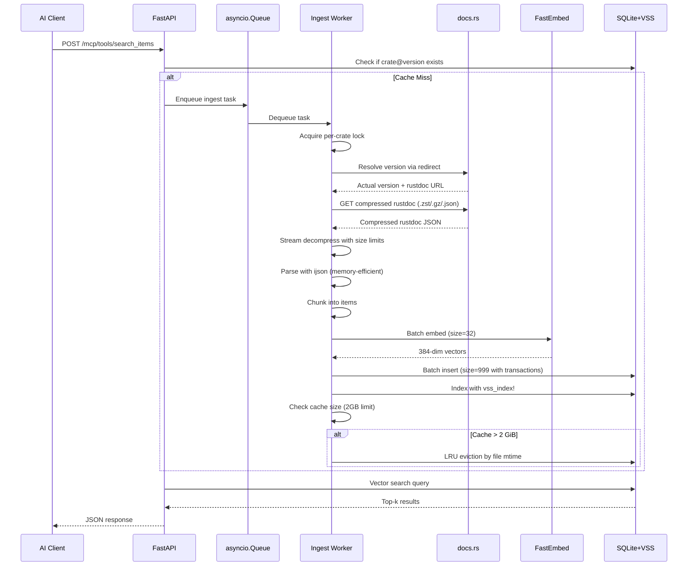
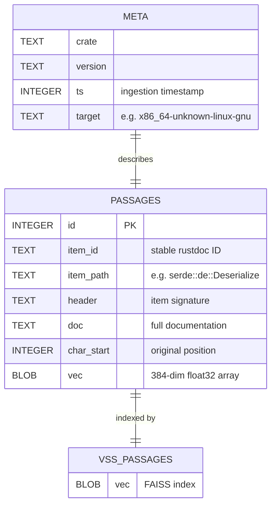
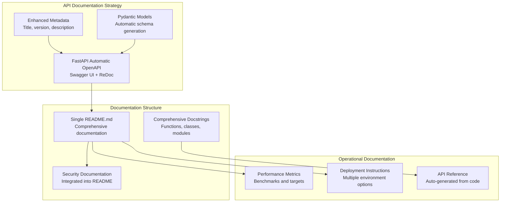
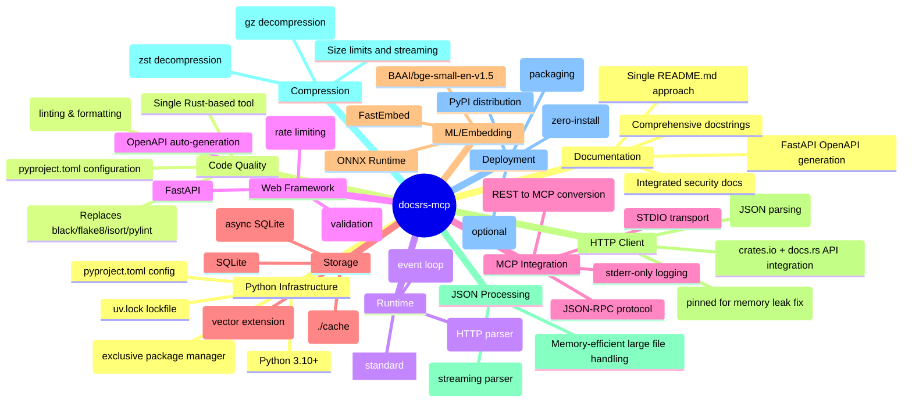
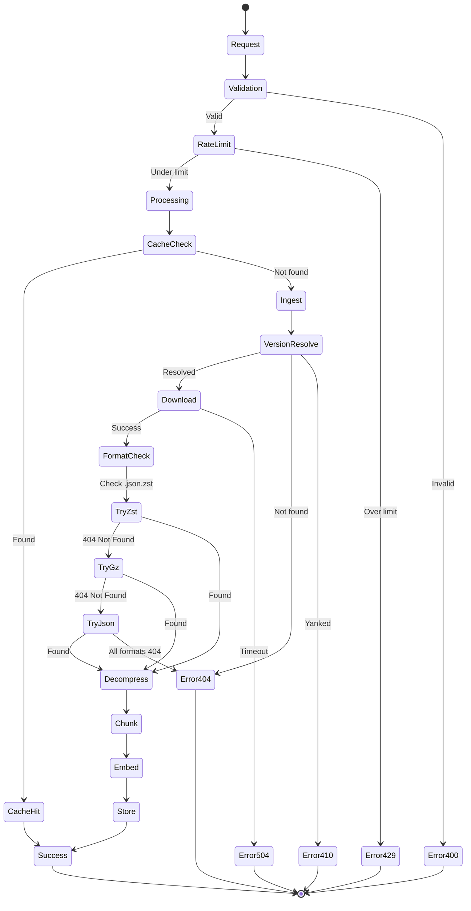
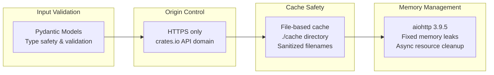
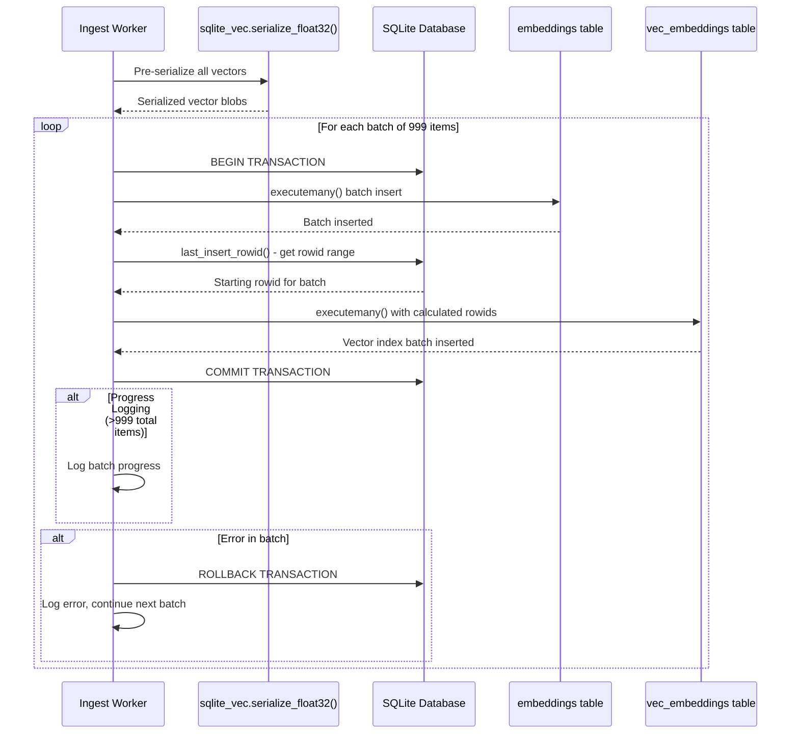

# docsrs-mcp Architecture

## System Overview

The docsrs-mcp server provides both REST API and Model Context Protocol (MCP) endpoints for querying Rust crate documentation using vector search. It features a dual-mode architecture with a FastAPI web layer that can operate in either MCP mode (default) or REST mode. The MCP mode uses STDIO transport for AI clients, while REST mode requires an explicit flag. The system includes a comprehensive asynchronous ingestion pipeline with full rustdoc JSON processing, and a SQLite-based vector storage system with intelligent caching.

## High-Level Architecture

```mermaid
graph TB
    subgraph "AI Clients"
        AI[AI Agent/LLM]
    end
    
    subgraph "Dual-Mode Server"
        CLI[CLI Entry Point<br/>--mode flag]
        API[FastAPI Application]
        MCP[MCP Server Module<br/>FastMCP wrapper]
        RL[Rate Limiter<br/>30 req/s per IP]
        IW[Ingest Worker]
        Queue[asyncio.Queue]
    end
    
    subgraph "External Services"
        DOCS[docs.rs CDN]
    end
    
    subgraph "Storage"
        CACHE[(SQLite + VSS<br/>cache/*.db)]
        META[Metadata<br/>per crate@version]
    end
    
    subgraph "ML Components"
        EMB[FastEmbed<br/>BAAI/bge-small-en-v1.5<br/>384 dimensions]
    end
    
    AI -->|MCP STDIO/REST POST| CLI
    CLI -->|--mode rest| RL
    CLI -->|MCP mode (default)| MCP
    MCP --> API
    RL --> API
    API -->|enqueue| Queue
    Queue -->|dequeue| IW
    IW -->|version resolve + download| DOCS
    IW -->|embed text| EMB
    IW -->|store vectors| CACHE
    API -->|query| CACHE
    CACHE --> META
```

## Component Architecture

```mermaid
graph LR
    subgraph "docsrs_mcp Package"
        subgraph "Web Layer"
            APP[app.py<br/>FastAPI instance<br/>OpenAPI metadata]
            ROUTES[routes.py<br/>MCP endpoints<br/>Comprehensive docstrings]
            MODELS[models.py<br/>Pydantic schemas<br/>Auto-generated docs]
            MW[middleware.py<br/>Rate limiting]
        end
        
        subgraph "Ingestion Layer"
            ING[ingest.py<br/>Full rustdoc pipeline]
            VER[Version Resolution<br/>docs.rs redirects]
            DL[Compression Support<br/>zst, gzip, json]
            PARSE[ijson Parser<br/>Memory-efficient streaming]
            EMBED[FastEmbed<br/>Batch processing]
            LOCK[Per-crate Locks<br/>Prevent duplicates]
        end
        
        subgraph "Storage Layer"
            DB[database.py<br/>SQLite operations]
            VSS[vector_search.py<br/>k-NN queries]
            CACHE[cache_manager.py<br/>LRU eviction]
        end
        
        subgraph "Server Layer"
            MCP_SERVER[mcp_server.py<br/>FastMCP wrapper<br/>STDIO transport<br/>stderr logging]
        end
        
        subgraph "Utilities"
            CLI[cli.py<br/>Entry point<br/>--mode flag (defaults to mcp)<br/>MCP/REST selection]
            CONFIG[config.py<br/>Settings]
            ERRORS[errors.py<br/>Custom exceptions]
        end
    end
    
    APP --> ROUTES
    ROUTES --> MODELS
    APP --> MW
    ROUTES --> ING
    ING --> CHUNK
    CHUNK --> EMBED
    EMBED --> DB
    DB --> VSS
    DB --> CACHE
    CLI --> APP
    CLI --> MCP_SERVER
    MCP_SERVER --> APP
```

## Data Flow



## Database Schema



## Dual-Mode Architecture

```mermaid
graph TB
    subgraph "Client Interface"
        CLI_CLIENT[Claude/AI Client]
        REST_CLIENT[REST API Client]
    end
    
    subgraph "Server Modes"
        CLI_ENTRY[CLI Entry Point<br/>--mode flag]
        
        subgraph "MCP Mode (Default)"
            MCP_SERVER[mcp_server.py<br/>FastMCP wrapper]
            STDIO[STDIO Transport]
            STDERR_LOG[stderr-only logging]
        end
        
        subgraph "REST Mode (--mode rest)"
            FASTAPI[FastAPI Server<br/>HTTP transport]
            STDOUT_LOG[standard logging]
        end
    end
    
    subgraph "Shared Business Logic"
        CORE[Core FastAPI App<br/>Routes, Models, Services]
        INGEST[Ingestion Pipeline]
        STORAGE[Vector Storage]
    end
    
    CLI_CLIENT -->|STDIO| CLI_ENTRY
    REST_CLIENT -->|HTTP| CLI_ENTRY
    
    CLI_ENTRY -->|default/--mode mcp| MCP_SERVER
    CLI_ENTRY -->|--mode rest| FASTAPI
    
    MCP_SERVER --> STDIO
    MCP_SERVER --> STDERR_LOG
    FASTAPI --> STDOUT_LOG
    
    MCP_SERVER -->|FastMCP.from_fastapi()| CORE
    FASTAPI --> CORE
    
    CORE --> INGEST
    CORE --> STORAGE
```

## MCP Tool Endpoints

```mermaid
graph TD
    subgraph "Auto-Generated MCP Tools"
        SEARCH[search_crates<br/>Vector similarity search<br/>Input: query text<br/>Output: ranked crate list]
        INGEST_TOOL[ingest_crate<br/>Manual crate ingestion<br/>Input: crate name/version<br/>Output: ingestion status]
    end
    
    subgraph "MCP Protocol"
        FASTMCP[FastMCP.from_fastapi()<br/>Automatic REST → MCP conversion]
        STDIO_TRANSPORT[STDIO Transport<br/>JSON-RPC messages]
    end
    
    subgraph "Original REST Endpoints"
        REST_SEARCH[POST /search<br/>FastAPI endpoint]
        REST_INGEST[POST /ingest<br/>FastAPI endpoint]
        HEALTH[GET /health<br/>Liveness probe]
    end
    
    FASTMCP --> SEARCH
    FASTMCP --> INGEST_TOOL
    SEARCH -->|converts| REST_SEARCH
    INGEST_TOOL -->|converts| REST_INGEST
    STDIO_TRANSPORT --> FASTMCP
```

## Documentation Architecture



### Documentation Architecture Decisions

**Single-File Approach**
- Consolidated README.md avoids documentation fragmentation
- Reduces maintenance overhead compared to multi-file documentation systems
- Improves discoverability for developers and operators
- Maintains consistency across installation, usage, and deployment sections

**Auto-Generated API Documentation**
- FastAPI's automatic OpenAPI schema generation eliminates manual API documentation
- Pydantic models provide comprehensive request/response schemas
- Enhanced metadata configuration improves API discoverability
- Swagger UI and ReDoc interfaces generated automatically at `/docs` and `/redoc`

**Integrated Security Documentation**
- Security considerations documented within main README for visibility
- Rate limiting, input validation, and data safety covered comprehensively
- Avoids separate security documents that may become outdated

**Performance and Operational Clarity**
- Documented performance targets and benchmarks for operational planning
- Clear deployment options with resource requirements
- Troubleshooting guidance integrated into main documentation flow

## Technology Stack



## Error Handling Flow



## Deployment Architecture

```mermaid
graph TB
    subgraph "Development (uv-native)"
        DEV[uv sync --dev<br/>uv run python -m docsrs_mcp.cli<br/>(MCP mode default)]
        TEST[uvx --from . docsrs-mcp<br/>uvx --from . docsrs-mcp --mode rest]
    end
    
    subgraph "Production Options"
        subgraph "Container (uv-based)"
            DOCKER[Docker Container<br/>FROM python:slim<br/>RUN pip install uv<br/>COPY . .<br/>RUN uv sync --frozen]
        end
        
        subgraph "PaaS"
            FLY[Fly.io]
            RAIL[Railway]
            RENDER[Render]
        end
        
        subgraph "VPS"
            VPS[Any VPS<br/>≥256 MiB RAM<br/>uv-managed]
        end
    end
    
    subgraph "Persistent Storage"
        VOL[Volume Mount<br/>./cache]
    end
    
    DEV --> TEST
    TEST --> DOCKER
    DOCKER --> FLY
    DOCKER --> RAIL
    DOCKER --> RENDER
    DOCKER --> VPS
    
    FLY --> VOL
    RAIL --> VOL
    RENDER --> VOL
    VPS --> VOL
```

## System Components

### Ingestion Layer Details

**Version Resolution System**
- Uses docs.rs redirect mechanism to resolve version strings
- Supports "latest" and specific version identifiers
- Handles version disambiguation and canonicalization
- Constructs proper rustdoc JSON URLs with crate name transformations

**Compression Support**
- **Zstandard (.json.zst)**: Primary format, best compression ratio
- **Gzip (.json.gz)**: Secondary format, universal support
- **Uncompressed (.json)**: Fallback format for compatibility
- Streaming decompression with configurable memory limits
- Automatic format detection and selection

**Per-Crate Locking Mechanism**
- Global asyncio.Lock registry indexed by crate@version
- Prevents duplicate ingestion across concurrent requests
- Maintains lock state throughout application lifetime
- Ensures data consistency during parallel processing

**Memory-Efficient Parsing**
- ijson streaming parser for large rustdoc JSON files
- Two-pass parsing: paths mapping + item extraction
- Filters relevant item types (functions, structs, traits, modules)
- Processes items incrementally without loading full JSON into memory

**LRU Cache Eviction**
- File modification time (mtime) based eviction strategy
- Configurable size limits (default 2GB total cache)
- Automatic cleanup when cache size exceeds limits
- Preserves most recently accessed crate documentation

## Performance Characteristics

| Component | Target | Notes |
|-----------|--------|-------|
| Search latency | < 100ms P95 | Vector search with sqlite-vec MATCH |
| Ingest latency | < 30s | Full rustdoc processing with compression |
| Memory usage | < 512 MiB RSS | Including FastEmbed model and streaming |
| Cache storage | ./cache directory | File-based, LRU eviction |
| Embedding model | BAAI/bge-small-en-v1.5 | 384 dimensions, batch processing |
| Async architecture | aiosqlite + asyncio | Non-blocking I/O with per-crate locks |
| Compression ratio | ~10:1 typical | .zst format for bandwidth efficiency |
| Batch sizes | 32 embed, 999 DB | Optimized for throughput vs memory |

## Security Model



## Dual-Mode Server Implementation

### Architecture Overview

The docsrs-mcp server implements a dual-mode architecture that allows the same FastAPI application to operate in two distinct modes:

**MCP Mode (Default)**
- Model Context Protocol server using STDIO transport
- JSON-RPC messaging over stdin/stdout
- stderr-only logging to prevent protocol corruption
- Automatic tool generation from FastAPI endpoints via FastMCP

**REST Mode (--mode rest)**
- Standard FastAPI HTTP server with uvicorn
- Full HTTP transport with standard logging to stdout/stderr
- Compatible with web browsers, curl, and HTTP clients
- Automatic OpenAPI documentation at `/docs` and `/redoc`

### Key Implementation Details

**CLI Mode Selection**
- `--mode mcp`: Launches MCP server with STDIO transport (default behavior)
- `--mode rest`: Launches HTTP server
- Single entry point in cli.py handles mode dispatch

**FastMCP Integration**
- `FastMCP.from_fastapi()` automatically converts REST endpoints to MCP tools
- No changes required to existing FastAPI route handlers
- Preserves all business logic, validation, and error handling
- Maintains compatibility with existing FastAPI middleware

**Protocol Isolation**
- MCP mode uses stderr exclusively for logging to avoid stdout contamination
- REST mode uses standard logging configuration
- Business logic remains completely unchanged between modes
- Same ingestion pipeline, storage, and search functionality

**Zero Duplication Architecture**
- Single FastAPI application serves both modes
- All route handlers, models, and services shared
- Configuration and error handling unified
- Maintenance overhead minimized through code reuse

## Implementation Decisions

### Key Architectural Choices Made

**Vector Storage: sqlite-vec over sqlite-vss**
- sqlite-vss is deprecated, sqlite-vec is the modern successor
- Better performance and active maintenance
- Native SQLite integration with MATCH operator for similarity search

**HTTP Client: aiohttp 3.9.5 (Pinned)**
- Memory leaks discovered in aiohttp 3.10+ versions
- Version pinning ensures stability in production deployments
- Async architecture maintained with proven stable version

**Embedding Model: FastEmbed + BAAI/bge-small-en-v1.5**
- Optimized for retrieval tasks with 384-dimensional vectors
- Good balance of accuracy and performance for crate descriptions
- ONNX runtime for efficient inference without GPU requirements

**Simple Module Structure with Documentation Integration**
- Five core modules: app.py, config.py, models.py, database.py, ingest.py
- Comprehensive docstrings in all modules for auto-generated documentation
- FastAPI metadata configuration for enhanced API discoverability
- Minimal complexity, easy to understand and maintain
- Direct async/await patterns throughout

**MVP Focus: Crate Descriptions Only**
- Basic ingestion pipeline processes crate metadata from crates.io API
- Embeddings generated from crate descriptions for semantic search
- Future expansion to full documentation planned for v2

**File-Based Caching**
- ./cache directory for persistent storage
- SQLite databases per crate for efficient organization
- Simple filesystem-based cache management

**Documentation Architecture**
- FastAPI automatic OpenAPI documentation for comprehensive API reference
- Enhanced metadata configuration for improved API discoverability
- Single README.md approach chosen over multi-file documentation for simplicity
- Comprehensive docstrings throughout codebase enable auto-generated documentation
- Security documentation integrated into main README to prevent fragmentation
- Performance metrics and benchmarks documented for operational clarity

### Data Flow Architecture

1. **Ingestion**: Client requests → Check cache → Fetch from crates.io API → Generate embeddings → Store in SQLite
2. **Search**: Query → Vector similarity search using sqlite-vec MATCH → Return ranked results
3. **Caching**: Persistent file-based cache in ./cache directory for fast subsequent access

## Technical Implementation Details

### Compression Implementation
- **zstandard**: Uses `zstandard` library with streaming decompression
- **gzip**: Uses standard library `gzip.decompress()` with size checking
- **Size Limits**: 30MB compressed, 100MB decompressed (configurable)
- **Memory Management**: Chunked reading to prevent memory exhaustion

### JSON Processing with ijson
- **Streaming Parser**: Processes large files without full memory load
- **Path Extraction**: First pass builds ID-to-path mapping from "paths" section
- **Item Processing**: Second pass extracts documentation from "index" section
- **Type Filtering**: Focuses on functions, structs, traits, modules, enums, constants
- **Memory Efficiency**: Processes items incrementally, not all at once

### Concurrency Architecture
- **Per-Crate Locks**: Prevents race conditions during ingestion
- **Global Lock Registry**: Maintains locks across async task lifecycle
- **Batch Processing**: Optimizes database operations and embedding generation
- **Resource Management**: Proper cleanup of connections and file handles

### Database Batch Processing

The store_embeddings() function implements efficient batch processing for large datasets:



**Key Implementation Details:**
- **Batch Size**: 999 items per transaction (SQLite parameter limit)
- **Vector Pre-serialization**: All vectors serialized with sqlite_vec.serialize_float32() before processing
- **Two-table Strategy**: Coordinated inserts into embeddings and vec_embeddings tables
- **Transaction Management**: Begin/commit per batch with rollback on errors
- **Rowid Synchronization**: Uses last_insert_rowid() to maintain relationships between tables
- **Memory Optimization**: O(batch_size) memory usage instead of O(total_items)
- **Progress Logging**: Tracks progress for large datasets (>999 items)
- **Error Isolation**: Per-batch error handling prevents complete ingestion failure

### Cache Management Strategy
- **LRU Algorithm**: Based on file system modification time (mtime)
- **Size Monitoring**: Uses `os.walk()` and `os.stat()` for efficient calculation
- **Eviction Process**: Removes oldest files first until under size limit
- **Error Handling**: Graceful handling of file system errors during cleanup

## Future Considerations (Out of Scope v1)

- Cross-crate dependency search capabilities
- GPU acceleration for embedding generation
- Multi-tenant quota management and rate limiting
- Distributed caching with Redis for horizontal scaling
- Real-time incremental updates via docs.rs webhooks
- Advanced search features (semantic similarity, code examples)
- Analytics and usage tracking for optimization
- Authentication and authorization for enterprise deployments