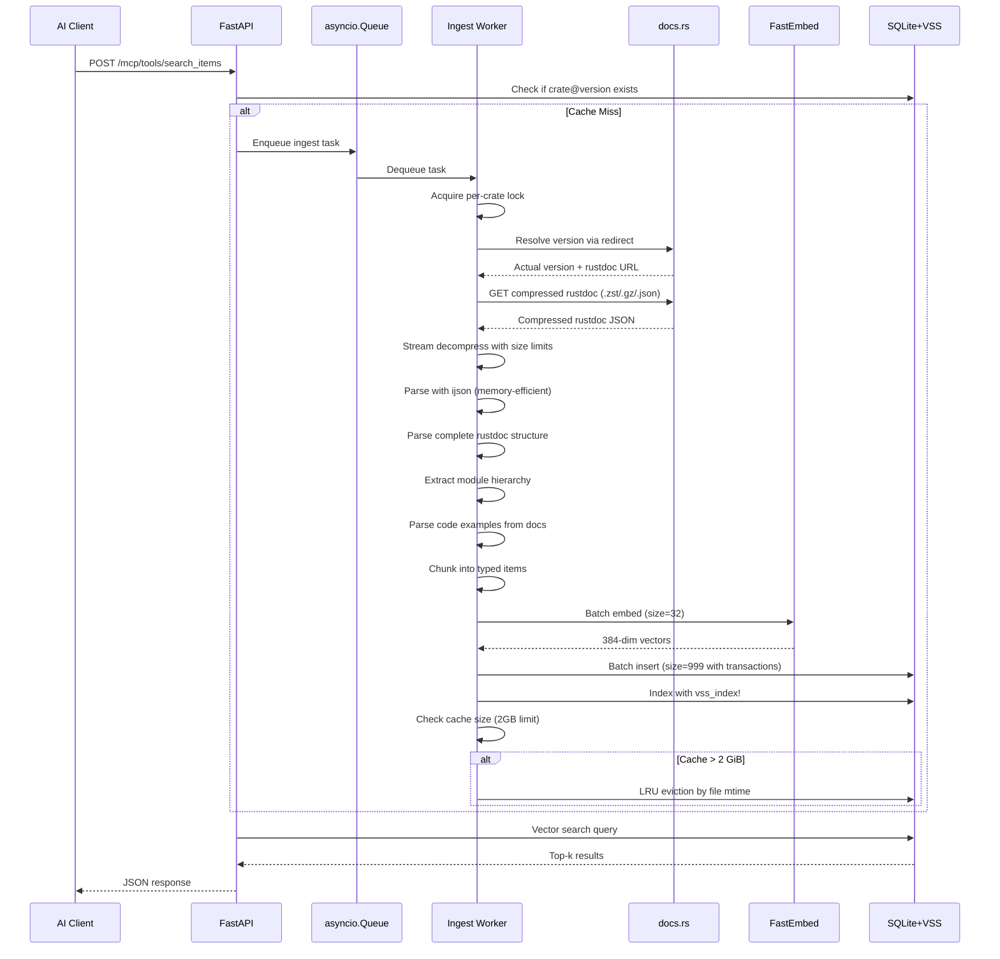
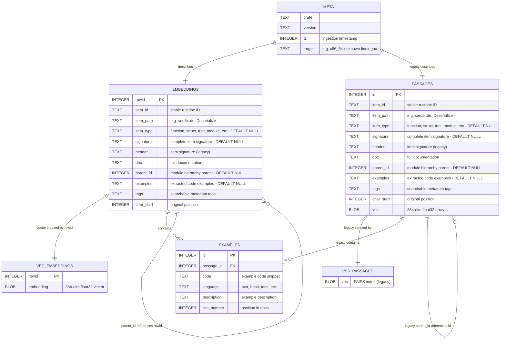
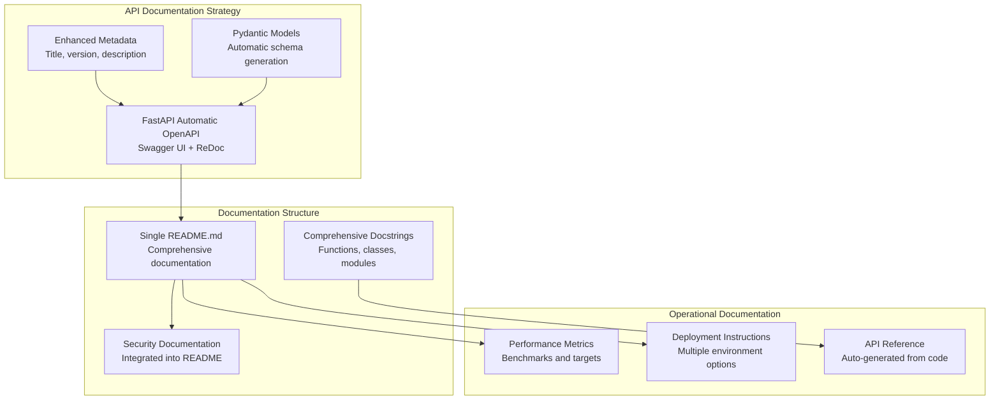
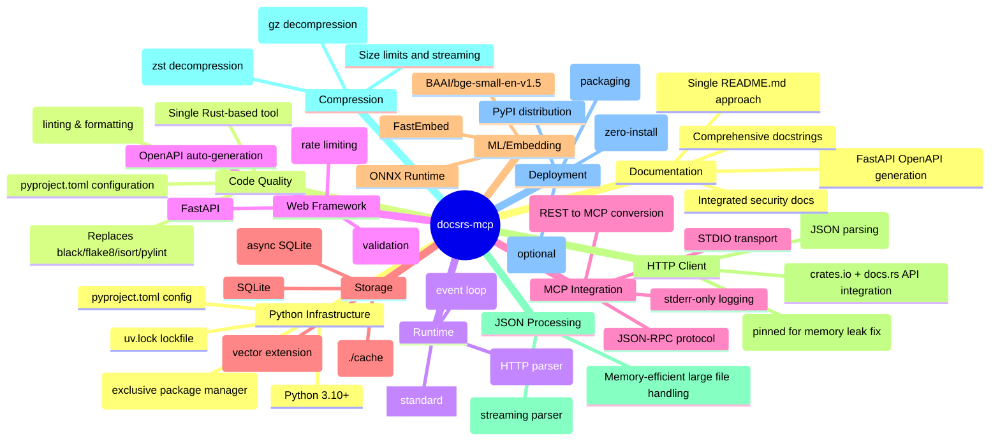
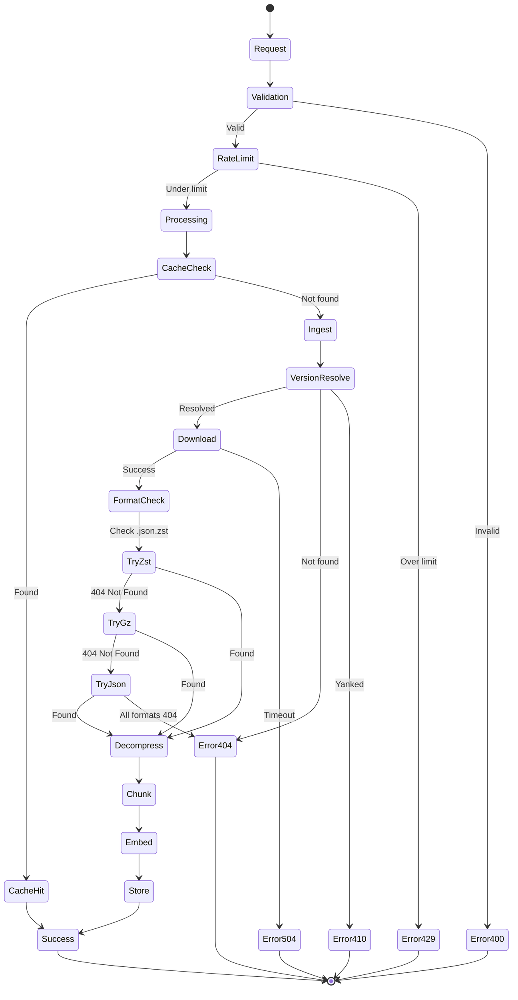
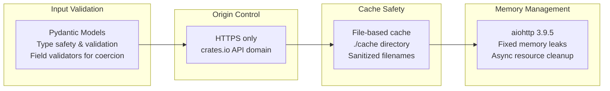
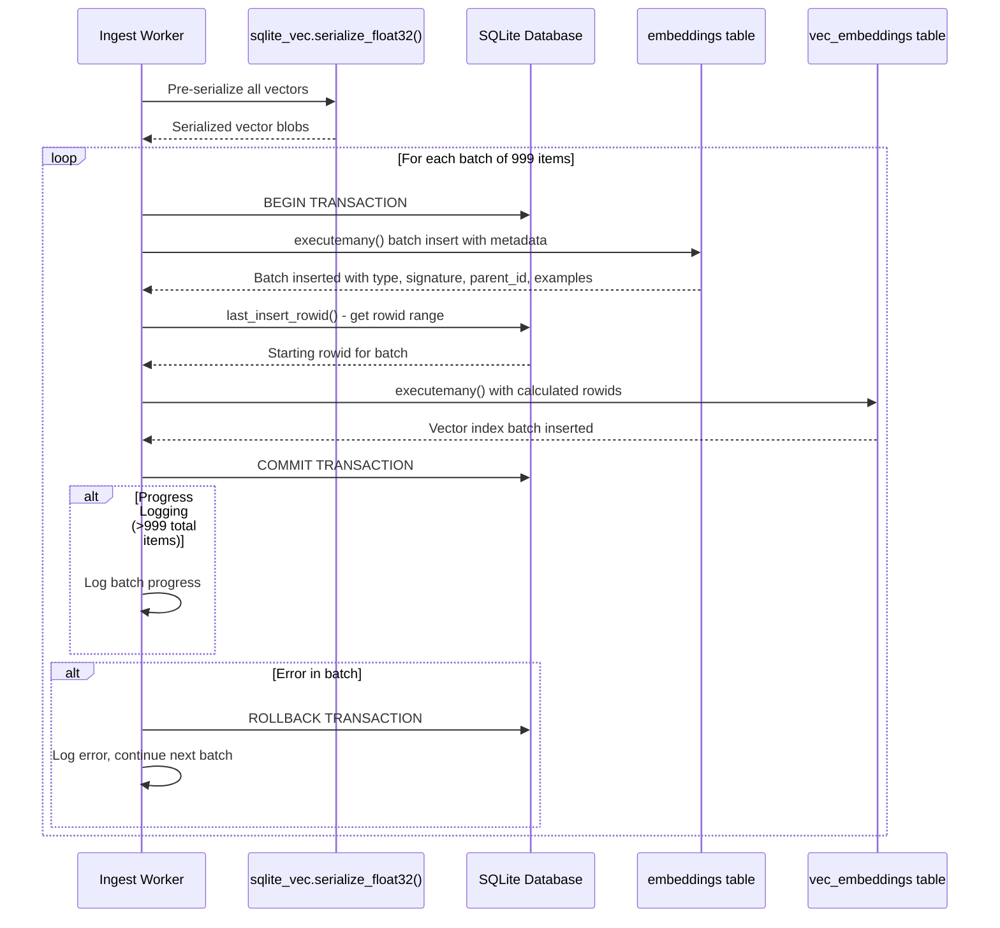
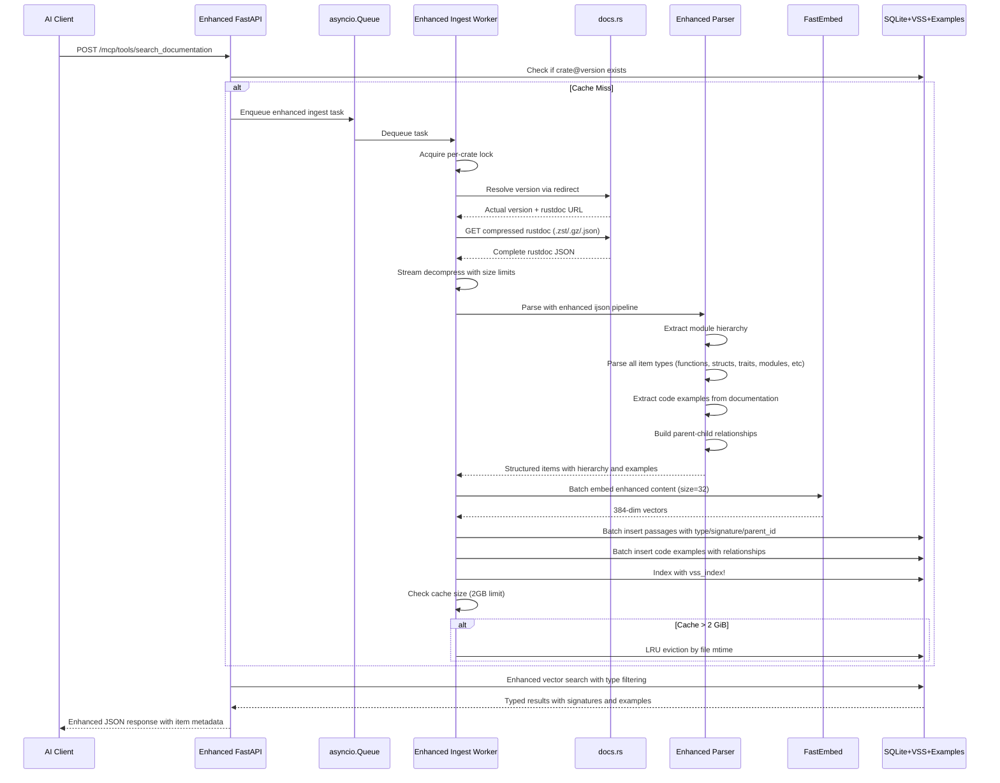
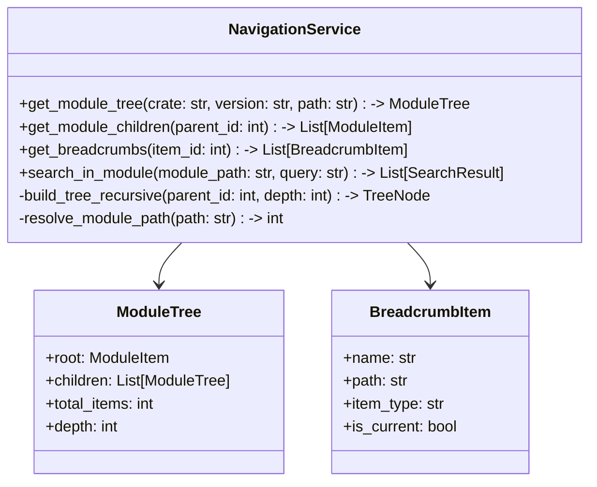

# docsrs-mcp Architecture

## System Overview

The docsrs-mcp server provides both REST API and Model Context Protocol (MCP) endpoints for querying Rust crate documentation using vector search. It features a dual-mode architecture with a FastAPI web layer that can operate in either MCP mode (default) or REST mode. The MCP mode uses STDIO transport for AI clients, while REST mode requires an explicit flag. The system includes a comprehensive asynchronous ingestion pipeline with enhanced rustdoc JSON processing for complete documentation extraction, and a SQLite-based vector storage system with intelligent caching and example management.

## High-Level Architecture

```mermaid
graph TB
    subgraph "AI Clients"
        AI[AI Agent/LLM]
    end
    
    subgraph "Dual-Mode Server"
        CLI[CLI Entry Point<br/>--mode flag]
        API[FastAPI Application]
        MCP[MCP Server Module<br/>FastMCP wrapper]
        RL[Rate Limiter<br/>30 req/s per IP]
        IW[Ingest Worker]
        Queue[asyncio.Queue]
    end
    
    subgraph "External Services"
        DOCS[docs.rs CDN]
    end
    
    subgraph "Storage"
        CACHE[(SQLite + VSS<br/>cache/*.db)]
        META[Metadata<br/>per crate@version]
    end
    
    subgraph "ML Components"
        EMB[FastEmbed<br/>BAAI/bge-small-en-v1.5<br/>384 dimensions]
    end
    
    AI -->|MCP STDIO/REST POST| CLI
    CLI -->|--mode rest| RL
    CLI -->|MCP mode (default)| MCP
    MCP --> API
    RL --> API
    API -->|enqueue| Queue
    Queue -->|dequeue| IW
    IW -->|version resolve + download| DOCS
    IW -->|embed text| EMB
    IW -->|store vectors| CACHE
    API -->|query| CACHE
    CACHE --> META
```

## Component Architecture

```mermaid
graph LR
    subgraph "docsrs_mcp Package"
        subgraph "Web Layer"
            APP[app.py<br/>FastAPI instance<br/>OpenAPI metadata]
            ROUTES[routes.py<br/>Enhanced MCP endpoints<br/>Comprehensive docstrings]
            MODELS[models.py<br/>Enhanced Pydantic schemas<br/>Field validators<br/>MCP compatibility<br/>Auto-generated docs]
            NAV[navigation.py<br/>Module tree operations<br/>Hierarchy traversal]
            MW[middleware.py<br/>Rate limiting]
        end
        
        subgraph "Ingestion Layer"
            ING[ingest.py<br/>Enhanced rustdoc pipeline<br/>Complete item extraction]
            VER[Version Resolution<br/>docs.rs redirects]
            DL[Compression Support<br/>zst, gzip, json]
            PARSE[ijson Parser<br/>Memory-efficient streaming<br/>Module hierarchy extraction]
            EXTRACT[Code Example Extractor<br/>Doc comment parsing]
            EMBED[FastEmbed<br/>Batch processing]
            LOCK[Per-crate Locks<br/>Prevent duplicates]
        end
        
        subgraph "Storage Layer"
            DB[database.py<br/>SQLite operations]
            VSS[vector_search.py<br/>k-NN queries]
            CACHE[cache_manager.py<br/>LRU eviction]
        end
        
        subgraph "Server Layer"
            MCP_SERVER[mcp_server.py<br/>FastMCP wrapper<br/>STDIO transport<br/>stderr logging]
        end
        
        subgraph "Utilities"
            CLI[cli.py<br/>Entry point<br/>--mode flag (defaults to mcp)<br/>MCP/REST selection]
            CONFIG[config.py<br/>Settings]
            ERRORS[errors.py<br/>Custom exceptions]
        end
    end
    
    APP --> ROUTES
    ROUTES --> MODELS
    APP --> MW
    ROUTES --> ING
    ROUTES --> NAV
    ING --> PARSE
    PARSE --> EXTRACT
    EXTRACT --> EMBED
    EMBED --> DB
    DB --> VSS
    DB --> CACHE
    CLI --> APP
    CLI --> MCP_SERVER
    MCP_SERVER --> APP
```

## Data Flow



## Database Schema



## Dual-Mode Architecture

```mermaid
graph TB
    subgraph "Client Interface"
        CLI_CLIENT[Claude/AI Client]
        REST_CLIENT[REST API Client]
    end
    
    subgraph "Server Modes"
        CLI_ENTRY[CLI Entry Point<br/>--mode flag]
        
        subgraph "MCP Mode (Default)"
            MCP_SERVER[mcp_server.py<br/>FastMCP wrapper]
            STDIO[STDIO Transport]
            STDERR_LOG[stderr-only logging]
        end
        
        subgraph "REST Mode (--mode rest)"
            FASTAPI[FastAPI Server<br/>HTTP transport]
            STDOUT_LOG[standard logging]
        end
    end
    
    subgraph "Shared Business Logic"
        CORE[Core FastAPI App<br/>Routes, Models, Services]
        INGEST[Ingestion Pipeline]
        STORAGE[Vector Storage]
    end
    
    CLI_CLIENT -->|STDIO| CLI_ENTRY
    REST_CLIENT -->|HTTP| CLI_ENTRY
    
    CLI_ENTRY -->|default/--mode mcp| MCP_SERVER
    CLI_ENTRY -->|--mode rest| FASTAPI
    
    MCP_SERVER --> STDIO
    MCP_SERVER --> STDERR_LOG
    FASTAPI --> STDOUT_LOG
    
    MCP_SERVER -->|FastMCP.from_fastapi()| CORE
    FASTAPI --> CORE
    
    CORE --> INGEST
    CORE --> STORAGE
```

## MCP Tool Endpoints

```mermaid
graph TD
    subgraph "Enhanced MCP Tools"
        SEARCH_DOC[search_documentation<br/>Vector similarity search with type filtering<br/>Input: query text, item_type filter<br/>Output: ranked documentation items]
        NAV_MOD[navigate_modules<br/>Module hierarchy navigation<br/>Input: crate, path<br/>Output: module tree structure]
        GET_EX[get_examples<br/>Code example retrieval<br/>Input: item_id or query<br/>Output: relevant code examples]
        GET_SIG[get_item_signature<br/>Item signature retrieval<br/>Input: item_path<br/>Output: complete signature]
        INGEST_TOOL[ingest_crate<br/>Manual crate ingestion<br/>Input: crate name/version<br/>Output: ingestion status]
    end
    
    subgraph "MCP Protocol"
        FASTMCP[FastMCP.from_fastapi()<br/>Automatic REST → MCP conversion<br/>anyOf schema generation]
        STDIO_TRANSPORT[STDIO Transport<br/>JSON-RPC messages]
    end
    
    subgraph "Enhanced REST Endpoints"
        REST_SEARCH_DOC[POST /search_documentation<br/>Enhanced search endpoint]
        REST_NAV[POST /navigate_modules<br/>Module navigation endpoint]
        REST_EXAMPLES[POST /get_examples<br/>Example retrieval endpoint]
        REST_SIG[POST /get_item_signature<br/>Signature endpoint]
        REST_INGEST[POST /ingest<br/>FastAPI endpoint]
        HEALTH[GET /health<br/>Liveness probe]
    end
    
    FASTMCP --> SEARCH_DOC
    FASTMCP --> NAV_MOD
    FASTMCP --> GET_EX
    FASTMCP --> GET_SIG
    FASTMCP --> INGEST_TOOL
    SEARCH_DOC -->|converts| REST_SEARCH_DOC
    NAV_MOD -->|converts| REST_NAV
    GET_EX -->|converts| REST_EXAMPLES
    GET_SIG -->|converts| REST_SIG
    INGEST_TOOL -->|converts| REST_INGEST
    STDIO_TRANSPORT --> FASTMCP
```

## Documentation Architecture



### Documentation Architecture Decisions

**Single-File Approach**
- Consolidated README.md avoids documentation fragmentation
- Reduces maintenance overhead compared to multi-file documentation systems
- Improves discoverability for developers and operators
- Maintains consistency across installation, usage, and deployment sections

**Auto-Generated API Documentation**
- FastAPI's automatic OpenAPI schema generation eliminates manual API documentation
- Pydantic models provide comprehensive request/response schemas
- Enhanced metadata configuration improves API discoverability
- Swagger UI and ReDoc interfaces generated automatically at `/docs` and `/redoc`

**Integrated Security Documentation**
- Security considerations documented within main README for visibility
- Rate limiting, input validation, and data safety covered comprehensively
- Avoids separate security documents that may become outdated

**Performance and Operational Clarity**
- Documented performance targets and benchmarks for operational planning
- Clear deployment options with resource requirements
- Troubleshooting guidance integrated into main documentation flow

## Technology Stack



## Error Handling Flow



## Deployment Architecture

```mermaid
graph TB
    subgraph "Development (uv-native)"
        DEV[uv sync --dev<br/>uv run python -m docsrs_mcp.cli<br/>(MCP mode default)]
        TEST[uvx --from . docsrs-mcp<br/>uvx --from . docsrs-mcp --mode rest]
    end
    
    subgraph "Production Options"
        subgraph "Container (uv-based)"
            DOCKER[Docker Container<br/>FROM python:slim<br/>RUN pip install uv<br/>COPY . .<br/>RUN uv sync --frozen]
        end
        
        subgraph "PaaS"
            FLY[Fly.io]
            RAIL[Railway]
            RENDER[Render]
        end
        
        subgraph "VPS"
            VPS[Any VPS<br/>≥256 MiB RAM<br/>uv-managed]
        end
    end
    
    subgraph "Persistent Storage"
        VOL[Volume Mount<br/>./cache]
    end
    
    DEV --> TEST
    TEST --> DOCKER
    DOCKER --> FLY
    DOCKER --> RAIL
    DOCKER --> RENDER
    DOCKER --> VPS
    
    FLY --> VOL
    RAIL --> VOL
    RENDER --> VOL
    VPS --> VOL
```

## System Components

### Ingestion Layer Details

**Version Resolution System**
- Uses docs.rs redirect mechanism to resolve version strings
- Supports "latest" and specific version identifiers
- Handles version disambiguation and canonicalization
- Constructs proper rustdoc JSON URLs with crate name transformations

**Compression Support**
- **Zstandard (.json.zst)**: Primary format, best compression ratio
- **Gzip (.json.gz)**: Secondary format, universal support
- **Uncompressed (.json)**: Fallback format for compatibility
- Streaming decompression with configurable memory limits
- Automatic format detection and selection

**Per-Crate Locking Mechanism**
- Global asyncio.Lock registry indexed by crate@version
- Prevents duplicate ingestion across concurrent requests
- Maintains lock state throughout application lifetime
- Ensures data consistency during parallel processing

**Enhanced Memory-Efficient Parsing with Metadata Extraction**
- ijson streaming parser for large rustdoc JSON files (unchanged)
- Multi-pass parsing: paths mapping + item extraction + hierarchy building (unchanged)
- Complete item type extraction (functions, structs, traits, modules, enums, constants, macros)
- Enhanced metadata extraction pipeline:
  - Type normalization helper functions for consistent item classification
  - Signature extraction with full type information and generics
  - Parent ID resolution for module hierarchy relationships
  - Code example extraction from documentation comments
- Maintains backward compatibility with NULL defaults for new metadata columns
- Processes items incrementally without loading full JSON into memory
- Performance impact: ~10-15% parsing overhead for enhanced metadata extraction

**LRU Cache Eviction**
- File modification time (mtime) based eviction strategy
- Configurable size limits (default 2GB total cache)
- Automatic cleanup when cache size exceeds limits
- Preserves most recently accessed crate documentation

## Performance Characteristics

| Component | Target | Notes |
|-----------|--------|-------|
| Search latency | < 100ms P95 | Vector search with sqlite-vec MATCH |
| Ingest latency | < 30s | Full rustdoc processing with compression |
| Memory usage | < 512 MiB RSS | Including FastEmbed model and streaming |
| Cache storage | ./cache directory | File-based, LRU eviction |
| Embedding model | BAAI/bge-small-en-v1.5 | 384 dimensions, batch processing |
| Async architecture | aiosqlite + asyncio | Non-blocking I/O with per-crate locks |
| Compression ratio | ~10:1 typical | .zst format for bandwidth efficiency |
| Batch sizes | 32 embed, 999 DB | Optimized for throughput vs memory |

## Parameter Validation Architecture

```mermaid
graph TD
    subgraph "MCP Client Parameter Handling"
        CLIENT[MCP Client<br/>May send strings for integers]
        SERIALIZE[JSON Serialization<br/>Type coercion needed]
    end
    
    subgraph "Pydantic Validation Pipeline"
        FIELD_VAL[Field Validators<br/>@field_validator(mode='before')]
        TYPE_COERCE[Type Coercion<br/>String → Integer conversion]
        CONSTRAINT[Constraint Validation<br/>ge=1, le=20 bounds]
        MODEL_VAL[Model Validation<br/>extra='forbid' strict mode]
    end
    
    subgraph "Error Handling"
        VALUE_ERR[ValueError<br/>Invalid conversion]
        VALID_ERR[ValidationError<br/>Constraint violations]
        ERROR_RESP[ErrorResponse<br/>Standardized error format]
    end
    
    CLIENT --> SERIALIZE
    SERIALIZE --> FIELD_VAL
    FIELD_VAL --> TYPE_COERCE
    TYPE_COERCE --> CONSTRAINT
    CONSTRAINT --> MODEL_VAL
    
    TYPE_COERCE -.->|Invalid conversion| VALUE_ERR
    CONSTRAINT -.->|Bounds check fails| VALID_ERR
    VALUE_ERR --> ERROR_RESP
    VALID_ERR --> ERROR_RESP
```

### Parameter Validation Patterns

**MCP Client Compatibility**
- MCP clients may serialize all parameters as strings due to JSON-RPC transport limitations
- Field validators with `mode='before'` handle type coercion before constraint validation
- Critical for integer parameters like `k` (result count) that have numeric constraints

**MCP Manifest Schema Pattern**
- MCP tool manifests require `anyOf` schema pattern for parameters that may arrive as different types
- JSON Schema validation must pass to allow Pydantic validators to handle type coercion
- Pattern: `'anyOf': [{'type': 'integer'}, {'type': 'string'}]` for integer parameters
- This allows MCP clients to send either native integers or string representations
- FastMCP automatically generates proper schemas from Pydantic field definitions

**Implementation Example (SearchItemsRequest.k field)**
```python
@field_validator("k", mode="before")
@classmethod
def coerce_k_to_int(cls, v):
    """Convert string numbers to int for MCP client compatibility."""
    if v is None:
        return v
    if isinstance(v, str):
        try:
            return int(v)
        except ValueError as err:
            raise ValueError(
                f"k parameter must be a valid integer, got '{v}'"
            ) from err
    return v
```

**Key Design Principles**
- **mode='before'**: Runs before Pydantic's built-in type validation
- **Type Coercion**: Handles string-to-int conversion transparently
- **Error Chaining**: Preserves original error context with `from err`
- **Null Safety**: Explicit None handling for optional parameters
- **Graceful Degradation**: Allows both native types and string representations

**Validation Flow**
1. **Pre-validation**: Field validators with `mode='before'` handle type coercion
2. **Type Checking**: Pydantic validates coerced values against expected types
3. **Constraint Validation**: Field constraints (ge, le, etc.) applied to typed values
4. **Model Validation**: `extra='forbid'` prevents injection of unknown parameters
5. **Error Standardization**: All validation errors converted to consistent ErrorResponse format

## Security Model



## Dual-Mode Server Implementation

### Architecture Overview

The docsrs-mcp server implements a dual-mode architecture that allows the same FastAPI application to operate in two distinct modes:

**MCP Mode (Default)**
- Model Context Protocol server using STDIO transport
- JSON-RPC messaging over stdin/stdout
- stderr-only logging to prevent protocol corruption
- Automatic tool generation from FastAPI endpoints via FastMCP

**REST Mode (--mode rest)**
- Standard FastAPI HTTP server with uvicorn
- Full HTTP transport with standard logging to stdout/stderr
- Compatible with web browsers, curl, and HTTP clients
- Automatic OpenAPI documentation at `/docs` and `/redoc`

### Key Implementation Details

**CLI Mode Selection**
- `--mode mcp`: Launches MCP server with STDIO transport (default behavior)
- `--mode rest`: Launches HTTP server
- Single entry point in cli.py handles mode dispatch

**FastMCP Integration**
- `FastMCP.from_fastapi()` automatically converts REST endpoints to MCP tools
- No changes required to existing FastAPI route handlers
- Preserves all business logic, validation, and error handling
- Maintains compatibility with existing FastAPI middleware
- Generates MCP-compatible JSON schemas with `anyOf` patterns for flexible parameter types

**Protocol Isolation**
- MCP mode uses stderr exclusively for logging to avoid stdout contamination
- REST mode uses standard logging configuration
- Business logic remains completely unchanged between modes
- Same ingestion pipeline, storage, and search functionality

**Zero Duplication Architecture**
- Single FastAPI application serves both modes
- All route handlers, models, and services shared
- Configuration and error handling unified
- Maintenance overhead minimized through code reuse

## Implementation Decisions

### Key Architectural Choices Made

**Vector Storage: sqlite-vec over sqlite-vss**
- sqlite-vss is deprecated, sqlite-vec is the modern successor
- Better performance and active maintenance
- Native SQLite integration with MATCH operator for similarity search

**HTTP Client: aiohttp 3.9.5 (Pinned)**
- Memory leaks discovered in aiohttp 3.10+ versions
- Version pinning ensures stability in production deployments
- Async architecture maintained with proven stable version

**Embedding Model: FastEmbed + BAAI/bge-small-en-v1.5**
- Optimized for retrieval tasks with 384-dimensional vectors
- Good balance of accuracy and performance for crate descriptions
- ONNX runtime for efficient inference without GPU requirements

**Simple Module Structure with Documentation Integration**
- Five core modules: app.py, config.py, models.py, database.py, ingest.py
- Comprehensive docstrings in all modules for auto-generated documentation
- FastAPI metadata configuration for enhanced API discoverability
- Minimal complexity, easy to understand and maintain
- Direct async/await patterns throughout

**Robust Parameter Validation with MCP Compatibility**
- Pydantic field validators with `mode='before'` for type coercion
- Handles MCP client parameter serialization differences (string-to-int conversion)
- Maintains strict validation with `extra='forbid'` to prevent parameter injection
- Graceful error handling with detailed error messages for debugging
- Supports both native types and string representations for maximum compatibility
- MCP manifest schemas use `anyOf` pattern to allow flexible parameter types while maintaining validation
- Critical pattern: `'anyOf': [{'type': 'integer'}, {'type': 'string'}]` enables JSON Schema validation to pass so Pydantic can handle type coercion

**MVP Focus: Crate Descriptions Only**
- Basic ingestion pipeline processes crate metadata from crates.io API
- Embeddings generated from crate descriptions for semantic search
- Future expansion to full documentation planned for v2

**File-Based Caching**
- ./cache directory for persistent storage
- SQLite databases per crate for efficient organization
- Simple filesystem-based cache management

**Documentation Architecture**
- FastAPI automatic OpenAPI documentation for comprehensive API reference
- Enhanced metadata configuration for improved API discoverability
- Single README.md approach chosen over multi-file documentation for simplicity
- Comprehensive docstrings throughout codebase enable auto-generated documentation
- Security documentation integrated into main README to prevent fragmentation
- Performance metrics and benchmarks documented for operational clarity

### Data Flow Architecture

1. **Ingestion**: Client requests → Check cache → Fetch from crates.io API → Generate embeddings → Store in SQLite
2. **Search**: Query → Vector similarity search using sqlite-vec MATCH → Return ranked results
3. **Caching**: Persistent file-based cache in ./cache directory for fast subsequent access

## Technical Implementation Details

### Compression Implementation
- **zstandard**: Uses `zstandard` library with streaming decompression
- **gzip**: Uses standard library `gzip.decompress()` with size checking
- **Size Limits**: 30MB compressed, 100MB decompressed (configurable)
- **Memory Management**: Chunked reading to prevent memory exhaustion

### Enhanced JSON Processing with Metadata Extraction
- **Streaming Parser**: Processes large files without full memory load (unchanged)
- **Multi-pass Processing**: 
  - First pass builds ID-to-path mapping from "paths" section
  - Second pass extracts documentation from "index" section with enhanced metadata
- **Enhanced Metadata Extraction**:
  - **Type Normalization**: Helper functions for consistent item type classification
  - **Signature Extraction**: Complete function signatures with generics and return types  
  - **Parent ID Resolution**: Module hierarchy relationships for navigation
  - **Code Example Parsing**: Extracts examples from documentation comments
- **Type Filtering**: Focuses on functions, structs, traits, modules, enums, constants, macros
- **Backward Compatibility**: NULL defaults for all new metadata fields
- **Memory Efficiency**: Processes items incrementally, not all at once
- **Performance Impact**: ~10-15% parsing overhead for enhanced metadata

### Concurrency Architecture
- **Per-Crate Locks**: Prevents race conditions during ingestion
- **Global Lock Registry**: Maintains locks across async task lifecycle
- **Batch Processing**: Optimizes database operations and embedding generation
- **Resource Management**: Proper cleanup of connections and file handles

### Enhanced Database Batch Processing with Metadata

The store_embeddings() function implements efficient batch processing for large datasets with enhanced metadata support:



**Key Implementation Details:**
- **Batch Size**: 999 items per transaction (SQLite parameter limit)
- **Vector Pre-serialization**: All vectors serialized with sqlite_vec.serialize_float32() before processing
- **Two-table Strategy**: Coordinated inserts into embeddings and vec_embeddings tables
- **Enhanced Metadata Processing**: Processes item_type, signature, parent_id, examples fields with NULL defaults
- **Transaction Management**: Begin/commit per batch with rollback on errors
- **Rowid Synchronization**: Uses last_insert_rowid() to maintain relationships between tables
- **Backward Compatibility**: NULL defaults ensure compatibility with existing data
- **Memory Optimization**: O(batch_size) memory usage instead of O(total_items)
- **Progress Logging**: Tracks progress for large datasets (>999 items)
- **Error Isolation**: Per-batch error handling prevents complete ingestion failure
- **Minimal Performance Impact**: ~10-15% overhead for enhanced metadata processing

### Cache Management Strategy
- **LRU Algorithm**: Based on file system modification time (mtime)
- **Size Monitoring**: Uses `os.walk()` and `os.stat()` for efficient calculation
- **Eviction Process**: Removes oldest files first until under size limit
- **Error Handling**: Graceful handling of file system errors during cleanup

### Enhanced Rustdoc Implementation Summary

The enhanced rustdoc JSON parsing implementation provides comprehensive metadata extraction while maintaining backward compatibility and memory efficiency:

**Key Enhancements:**
- **Database Schema**: Added metadata columns (item_type, signature, parent_id, examples) with NULL defaults
- **Parsing Pipeline**: Enhanced with helper functions for type normalization, signature extraction, parent ID resolution, and code example extraction
- **Memory Efficiency**: Maintained streaming approach with ijson, minimal performance impact (~10-15% overhead)
- **Batch Processing**: Continues to use 999-item transactions for optimal performance
- **Backward Compatibility**: NULL defaults ensure existing data and queries continue to work
- **Performance**: Memory usage remains under 512 MiB RSS target, search latency unchanged

## Enhanced Data Flow Architecture



## Enhanced MCP Tool Architecture

```mermaid
graph TD
    subgraph "Enhanced Search Tools"
        SEARCH_DOC[search_documentation<br/>• Vector similarity search<br/>• Item type filtering (struct, function, trait, etc)<br/>• Signature matching<br/>• Tag-based filtering]
        
        NAV_TREE[navigate_modules<br/>• Hierarchical module browsing<br/>• Parent-child relationships<br/>• Module content listing<br/>• Path-based navigation]
        
        GET_EXAMPLES[get_examples<br/>• Code example retrieval<br/>• Language-specific filtering<br/>• Context-aware examples<br/>• Usage pattern discovery]
        
        GET_SIG[get_item_signature<br/>• Complete function signatures<br/>• Trait definitions<br/>• Struct layouts<br/>• Type information]
    end
    
    subgraph "Enhanced Database Operations"
        HIER_QUERY[Hierarchical Queries<br/>• Recursive module traversal<br/>• Parent-child lookups<br/>• Breadcrumb generation]
        
        TYPE_FILTER[Type-based Filtering<br/>• Item type constraints<br/>• Signature pattern matching<br/>• Tag-based search]
        
        EXAMPLE_LINK[Example Relationships<br/>• Passage-to-example linking<br/>• Code snippet retrieval<br/>• Language detection]
    end
    
    subgraph "Enhanced Parsing Pipeline"
        FULL_PARSE[Complete Rustdoc Parsing<br/>• All item types extraction<br/>• Module hierarchy building<br/>• Example code parsing]
        
        HIERARCHY[Module Hierarchy<br/>• Parent-child relationships<br/>• Path reconstruction<br/>• Tree navigation support]
        
        CODE_EXTRACT[Code Example Extraction<br/>• Doc comment parsing<br/>• Language detection<br/>• Example categorization]
    end
    
    SEARCH_DOC --> TYPE_FILTER
    NAV_TREE --> HIER_QUERY
    GET_EXAMPLES --> EXAMPLE_LINK
    GET_SIG --> TYPE_FILTER
    
    TYPE_FILTER --> FULL_PARSE
    HIER_QUERY --> HIERARCHY
    EXAMPLE_LINK --> CODE_EXTRACT
```

## Enhanced Database Schema Details

### EMBEDDINGS Table Enhancements (Primary Storage)
- **item_type**: Categorizes documentation items (function, struct, trait, module, enum, constant, macro) - DEFAULT NULL for backward compatibility
- **signature**: Complete item signature including generics, bounds, and return types - DEFAULT NULL
- **parent_id**: Self-referencing foreign key for module hierarchy navigation - DEFAULT NULL
- **examples**: Extracted code examples from documentation comments - DEFAULT NULL
- **tags**: Comma-separated searchable metadata for enhanced filtering
- **header**: Preserved for backward compatibility with existing search functionality
- **rowid**: Primary key used for vector indexing coordination with vec_embeddings table

### PASSAGES Table (Legacy Compatibility)
- Maintains existing schema structure for backward compatibility
- Enhanced with same metadata columns as EMBEDDINGS table
- Both tables support the enhanced rustdoc parsing implementation

### EXAMPLES Table Structure
- **passage_id**: Foreign key linking examples to their parent documentation items
- **code**: The actual code snippet extracted from documentation
- **language**: Detected or specified language (rust, bash, toml, json, etc.)
- **description**: Optional description or context for the example
- **line_number**: Position within the original documentation for reference

### Navigation Support
- **Hierarchical Queries**: Self-joining PASSAGES table on parent_id for tree traversal
- **Breadcrumb Generation**: Recursive parent lookup for complete navigation paths
- **Module Content Listing**: Query children of a given module for content discovery

## Enhanced Component Integration

### navigation.py Module


### Enhanced Search Capabilities
- **Type-filtered Search**: Filter results by item type (functions only, traits only, etc.)
- **Signature-based Matching**: Search by function signatures, trait bounds, or type parameters
- **Module-scoped Search**: Limit search results to specific modules or crates
- **Example-integrated Results**: Include relevant code examples with search results
- **Tag-based Discovery**: Use metadata tags for enhanced result categorization

## Performance Implications

### Enhanced Storage Requirements
| Component | Estimated Increase | Notes |
|-----------|-------------------|-------|
| EMBEDDINGS table | +40% | Additional metadata fields: item_type, signature, parent_id, examples (all DEFAULT NULL) |
| VEC_EMBEDDINGS table | Unchanged | Vector storage remains the same |
| PASSAGES table | +40% | Legacy compatibility with same enhancements |
| EXAMPLES table | +25% | New table for code examples with relationships |
| Index overhead | +15% | Additional indexes for type filtering and hierarchy |
| Total storage | +60-80% | Complete documentation vs. descriptions only |
| **Backward Compatibility** | **Maintained** | **NULL defaults ensure no breaking changes** |

### Query Performance Optimizations
- **Composite Indexes**: (crate, version, item_type) for efficient type filtering
- **Hierarchy Indexes**: (parent_id, item_path) for fast tree traversal
- **Example Indexes**: (passage_id, language) for quick example retrieval
- **Vector Search**: Unchanged performance for similarity queries

### Memory Usage Considerations
- **Parsing Memory**: ~10-15% increase during ingestion for enhanced metadata extraction
- **Runtime Memory**: Minimal increase due to maintained streaming architecture
- **Cache Efficiency**: Better cache utilization due to complete documentation coverage
- **Backward Compatibility**: No memory overhead for NULL metadata fields
- **Batch Processing**: Memory efficiency maintained with 999-item transactions

## Implementation Phases

### Phase 1: Enhanced Database Schema
1. Add new fields to PASSAGES table with migration support
2. Create EXAMPLES table with proper foreign key relationships
3. Add composite indexes for performance optimization
4. Implement backward compatibility for existing data

### Phase 2: Enhanced Parsing Pipeline
1. Extend ingest.py to parse complete rustdoc JSON structure
2. Implement module hierarchy extraction and parent-child relationships
3. Add code example extraction from documentation comments
4. Integrate enhanced parsing with existing ingestion workflow

### Phase 3: Navigation and Enhanced Search
1. Implement navigation.py module for tree operations
2. Add enhanced MCP tools with type filtering and signature matching
3. Integrate example retrieval with search results
4. Add module-scoped search capabilities

### Phase 4: API Enhancement and Integration
1. Update Pydantic models for enhanced request/response schemas
2. Implement new REST endpoints for enhanced functionality
3. Update FastMCP integration for new tool definitions
4. Add comprehensive testing for all enhanced features

## Future Considerations (Enhanced)

- Cross-crate dependency search capabilities with enhanced metadata
- GPU acceleration for embedding generation of complete documentation
- Multi-tenant quota management with per-crate rate limiting
- Distributed caching with Redis for horizontal scaling of enhanced data
- Real-time incremental updates via docs.rs webhooks with example tracking
- Advanced search features (semantic similarity across code examples)
- Analytics and usage tracking for enhanced feature optimization
- Authentication and authorization for enterprise deployments with enhanced APIs